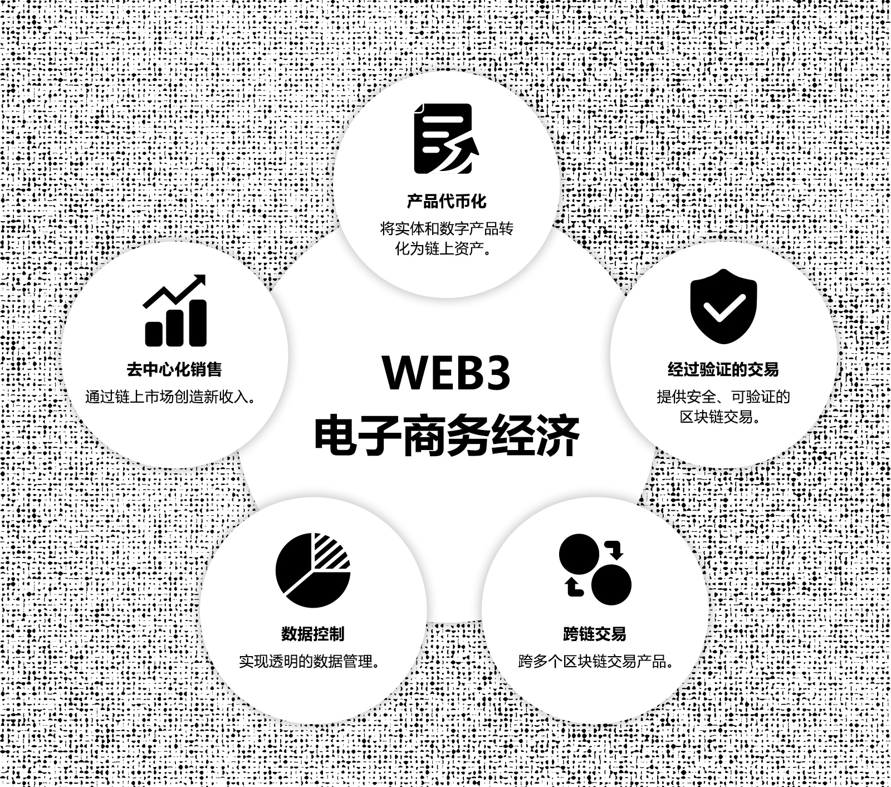
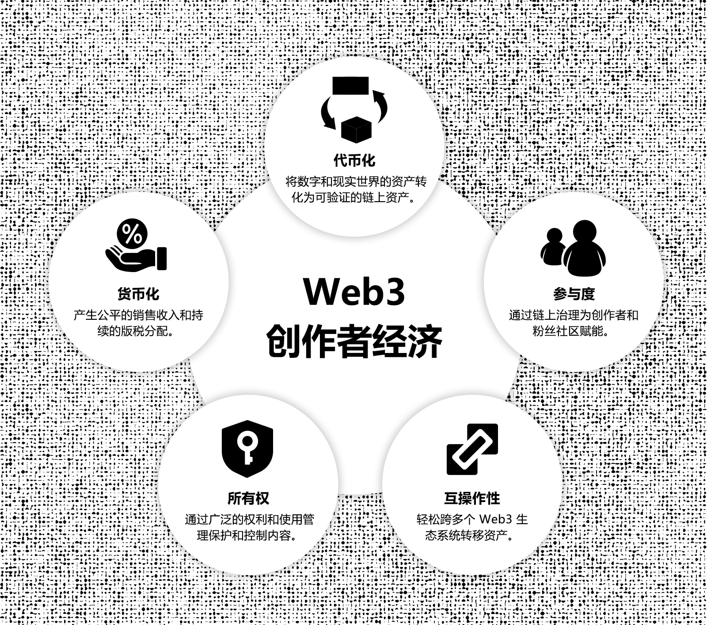
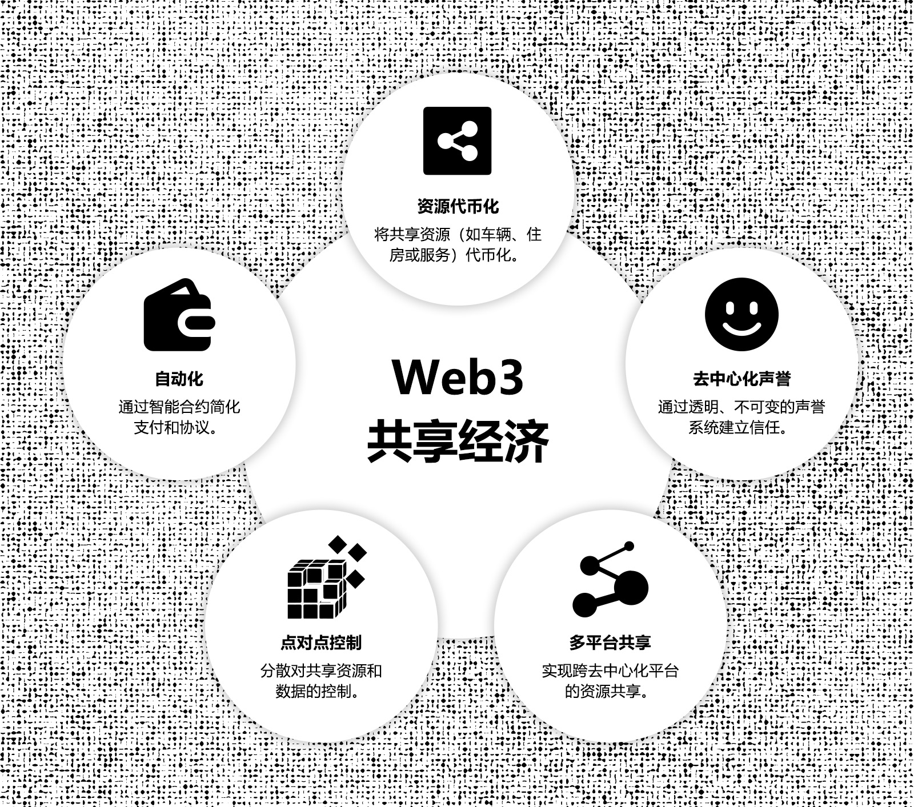
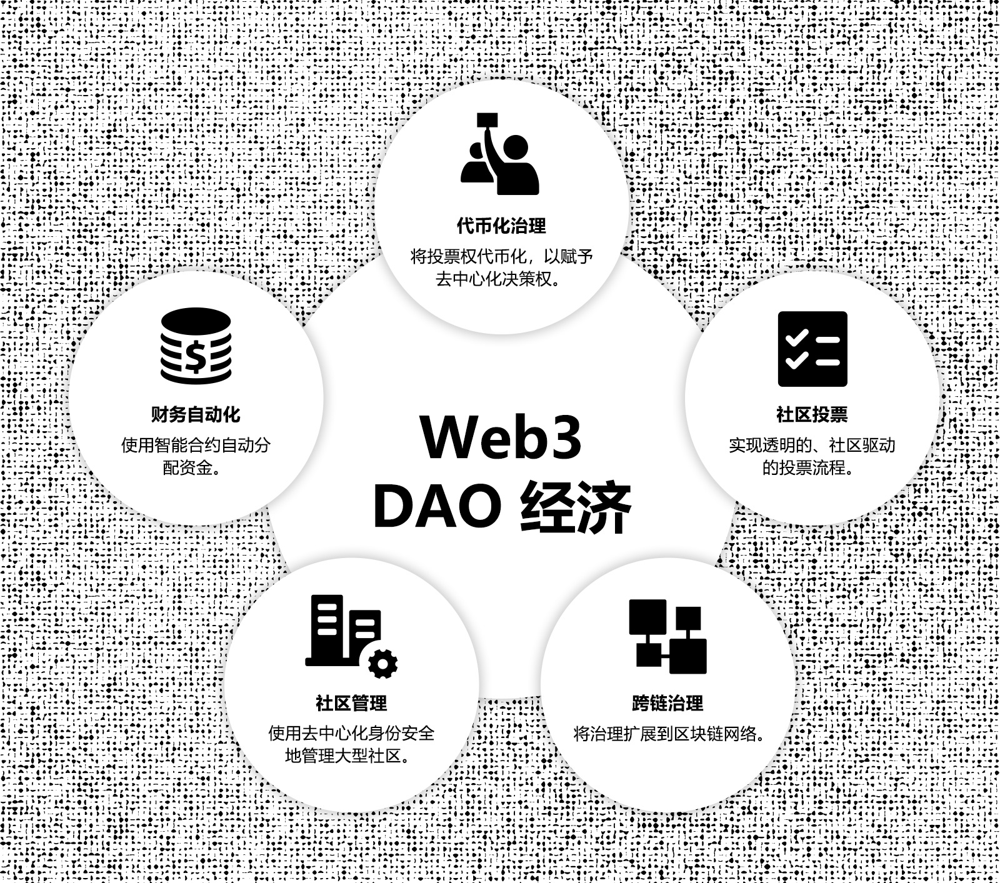
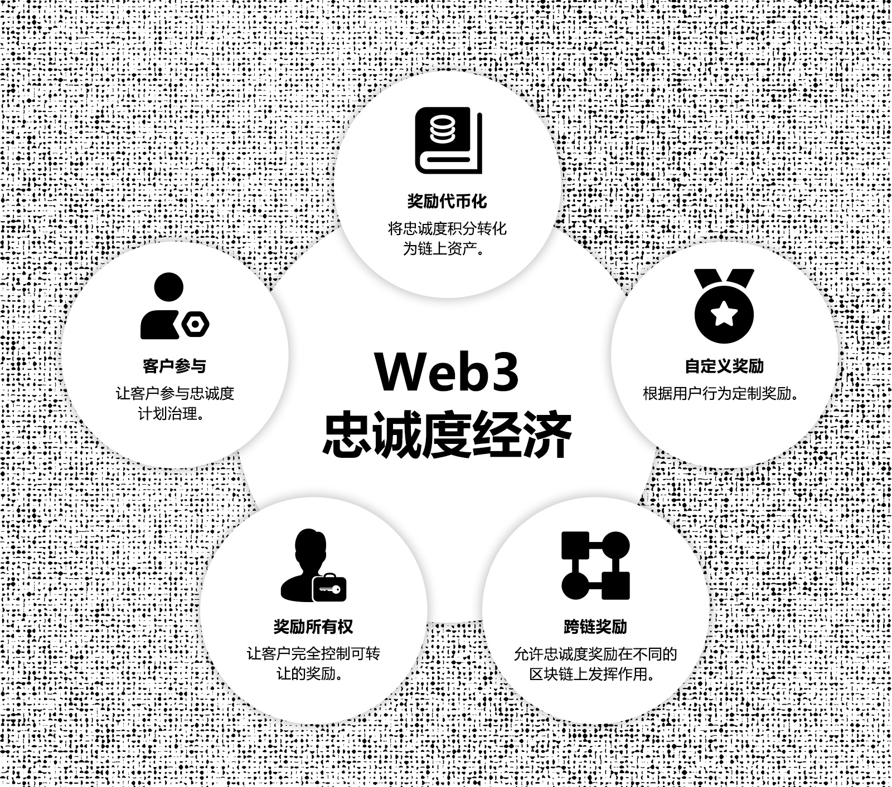

[TOC]

## 1. 摘要

本生态系统发展白皮书是 Uptick Network 白皮书系列的第三部分。前两部分侧重于技术架构和经济模型。通过本部分，我们旨在系统地解释 Uptick 在使命、理念、技术、模型和发展方面的理念与方法论。与之前的论文不同，本文档涵盖的范围更广，并将随着时间的推移而发展。

在第一版中，我们强调了 Uptick 生态系统发展背后的概念和方法论，借鉴了过去三年发表的大量文章。建立明确的方法论是创建可持续生态系统的第一步。凭借在互联网和实体经济领域 20 多年的经验，我们的团队确定了六个关键的 Web3 经济模型。然后，我们概述了如何使用 Uptick 的技术模块来构建这些模型，为实体经济协议层奠定坚实的基础。最后，我们详细介绍了该协议层如何与 Web3 业务逻辑相结合，构成 Uptick 云即服务的基础，该服务直接服务于 Web2 企业和用户。

随着 Uptick 协议和服务层的扩展以及更多生态系统应用程序的开发和采用，本白皮书将以“实时文档”的形式持续更新。我们邀请思想领袖参并塑造这个生态系统，将理论探索与实际实施相结合，构建支持实体经济并实现广泛 Web3 采用的基础设施。

## 2. 简介

本白皮书深入探讨了 Uptick Network 将 Web3 融入实体经济的战略方法。随着传统框架越来越受到效率低下、缺乏透明度和垄断控制的困扰，人们真正需要新的、可持续的创新。Uptick Network 通过提供 Web3 基础设施来支持满足日常需求的相关应用程序，推动有意义且可持续的变革，从而应对这些挑战。

就像互联网彻底改变了通信和商业，云计算改变了企业存储和管理数据的方式一样，Web3 代表了数字世界发展的下一步。虽然之前的转型优化了集中式系统，但 Web3 通过分散控制并将价值转移回用户和社区，从根本上改变了权力平衡。正如云计算简化了基础设施管理一样，Web3 使企业能够在无信任的环境中运营，从而使数字生态系统本质上变得更加安全、透明和自主。

基于这一技术发展，Uptick 的 Web3 基础设施旨在实现新形式的价值创造、治理和社区参与，满足去中心化商业、主权数字资产所有权和点对点网络等现实需求。然而，实现这一愿景需要从根本上重新思考经济模式、个人自主权和协作框架。我们的战略深深植根于一个实用的愿景，旨在扩大符合实体经济需求的生态系统应用，围绕六个关键的 Web3 经济模型构建。这些旨在支持企业和个人顺利过渡到去中心化框架，符合现实需求并开辟大规模采用的道路。

随着全球经济的发展，我们相信 Web3 集成对于实现去中心化所有权的创新商业模式和框架至关重要。Uptick Network 的使命是提供企业和用户充分参与 Web3 经济所需的基础设施和工具，为下一代互联网奠定基础。在这份白皮书中，我们彻底探讨了 Web3 生态系统发展背后的理念、我们建立的各种 Web3 经济模型以及支持它们的基础设施。

## 3. 概述

### 3.1 Web3 思维模式

向 Web3 的过渡需要个人和组织在技术、治理和数字资产处理方式上做出根本性转变。Web3 不仅仅关注技术变革，还代表着一种更广泛的哲学转变，即向去中心化转变，控制权分散在各个网络中。这种方法优先考虑透明度、自主性和用户所有权，彻底重塑了个人管理数据和数字交互的方式。

Web3 引入了一个分散权力的去中心化框架，允许用户拥有自己的数据和资产。它减少了对中央权威机构的需求，并构建了一个无需信任的基础设施，通过开放、安全的协议验证交易和交互。去中心化网络实现了社区驱动的创新，这是 Web3 思维模式的核心。随着各种参与者为新应用程序的开发做出贡献，它创造了一个促进协作和前瞻性思维的环境。年轻一代熟悉重视自主性的数字空间，与这种新兴模式非常契合。

对于企业和开发者来说，Web3 旨在将去中心化、透明度和用户赋权嵌入到其系统的基础中。这需要构建能够实现公正结果并反映不断发展的数字经济的平台。尽管仍处于早期阶段，但 Web3 的发展让人想起了早期的互联网，NFT、RWA、DID、ZKP 等基础技术构成了商业、社交互动和治理新模式的支柱。基于 NFT 的票务或忠诚度计划等实际应用让我们看到了随着基础设施的成熟，未来的可能性。随着 Web3 思维模式的成熟，它将塑造下一波进步，并在全球经济中释放全新的可能性。

### 3.2 Web3 开发的战略方法

Uptick Network 的 Web3 开发方法强调将区块链战略性地分阶段集成到现有系统中。向 Web3 的过渡并不是一刀切的解决方案，而是需要仔细考虑区块链在哪里以及如何增加最大价值。这涉及增强透明度、提高安全性和优化供应链管理和支付等流程，同时还支持从根本上改变相关方之间关系的新业务模式。

为了在不破坏现有系统的情况下有效集成区块链，Uptick Network 提倡采用分层、模块化的方法，以满足每个行业的需求：

* 选择能够与其他网络互操作的 Web3 平台。
* 可扩展的中间件、协议和服务，具有明确的数据迁移策略。
* 行业特定的监管合规性，特别是在数据隐私和安全方面。
* 实施试点项目，在全面部署之前评估可行性并收集反馈。
* 逐步扩大区块链的采用，以限制运营风险和中断。

从一开始就考虑可扩展性，以确认这些新系统可以处理不断增长的交易量和行业需求，但在区块链驱动的实施过程中，可扩展性往往被低估。Uptick Network 从一开始就解决了这个问题，设计了能够处理不断增长的交易量并在网络活动高峰期保持性能的系统。智能合约优化也是优先考虑的，以避免高昂的 gas 费或执行失败等问题，这些问题可能会影响用户体验和运营效率。

随着 Uptick Network 推进其 Web3 基础设施，重点是创建针对特定行业的经济模型。这些模型将模块化领域知识与 Web3 协议相结合，使企业能够通过创新而实用的解决方案过渡到 Web3。这是一种战略性和分层的方法，为实体经济中广泛采用 Web3 奠定了基础，为广泛的行业提供可扩展、可互操作和安全的解决方案。

### 3.3 Web3 对实体经济的影响力和潜力

Web3 融入全球经济代表着价值创造、交换和治理方式的转变。Web3 摆脱了传统的中心化系统，引入了一个分布式透明框架，允许更广泛地参与经济活动。这种方法为个人创作者、小型企业和小众平台在全球范围内有效竞争开辟了新的机会。Web3 最值得注意的承诺之一是它有可能使价值创造民主化。区块链和代币化使以前无法访问或流动性差的资产能够被数字化并在全球范围内交易。这对于现实世界资产 (RWA) 尤其重要，Web3 使这些资产能够被带入去中心化的生态系统。例如，锂和铀等资源的代币化可以改变这些战略资产的管理和交换方式，为代表性不足的地区提供新的机会。

以前受传统金融体系限制的跨境交易和合作结算现在有了新的运作途径。 Web3 为经济发展引入了新的框架，使资源能够更自由、更透明地流动。对房地产或自然资源等资产进行代币化和交易，改变了传统的所有权和交换模式。因此，金融和房地产等行业正在重新构想其结构，从而带来新的增长和创新。

Web3 与实体经济的融合将带来新的机遇和变革性进步。代币化和区块链正在连接数字经济和实体经济，从而带来更高效、更透明的系统，这种转变重塑了全球价值创造和分配，为未来经济指明了新的方向。 Web3 的新经济框架分散了权力结构，促进了透明度并推动了创新，扩大了各行业的经济参与，为更具包容性的全球经济奠定了基础。

### 3.4 开发可持续的 Web3 基础设施和生态系统

开发可持续的 Web3 基础设施需要将技术进步与实际行业需求相结合。这一过程重新定义了数字经济，强调去中心化、数据所有权和社区主导的参与。区块链是这一基础设施的核心，它提供了一个安全透明的系统，无需中介即可记录交易。智能合约可自动化业务流程并简化操作，从而在去中心化系统中建立信任。这些组件共同为能够支持多个行业的去中心化生态系统奠定了基础。

非同质化代币 (NFT) 和代币化的现实世界资产 (RWA) 扩展了 Web3 的范围，提供了与数字和实物资产互动的新方法。房地产或自然资源等资产的代币化带来了新的经济机会，增加了流动性，并以以前在 Web2 系统中难以实现的方式实现了更广泛的参与。Uptick 还专注于泛 RWA，它涵盖了广泛的代币化现实世界资产，例如门票、艺术品、会员资格、音乐等。

为了使 Web3 保持适应性，基础设施必须是模块化和可扩展的。Cosmos-SDK 等技术说明了模块化系统如何使互连的区块链能够独立运行，同时保持跨网络通信。这种灵活性使基础设施能够随着不断变化的行业需求而发展。

构建此基础设施还涉及应对因地区而异的监管挑战。企业需要谨慎驾驭这些监管框架，同时继续在 Web3 领域进行创新，支持可持续发展。成功的 Web3 生态系统建立在开放性、互操作性和资产多样性的基础上。数字世界不断发展，提供有形价值的实用应用将塑造参与 Web3 经济的企业和个人的未来。

## 4. Uptick Web3 经济模型

Web3 经济模型提供了结构化的框架，用于指导去中心化应用程序和平台的开发和运行。这些模型定义了在去中心化生态系统中创造、交换和管理价值的原则和机制。它们的作用与软件架构中的设计模式非常相似，为 Web3 中的常见挑战提供实用的解决方案，推动去中心化系统的一致性和效率。每个 Web3 经济模型都针对特定的行业用例进行了量身定制，为经济的各个部门提供了可适应的蓝图。通过采用这些模型，开发人员和企业可以构建符合核心 Web3 原则（例如透明度、安全性和社区驱动的参与）的去中心化应用程序。

本节概述了 Uptick Network 实施的关键 Web3 经济模型，并探讨了这些模型如何改变传统的经济结构。通过详细研究每个模型，我们重点介绍了它们的实际应用及其在推进去中心化生态系统方面的作用，为 Web3 经济的更广泛增长做出了贡献。

<figure><figcaption></figcaption></figure>

### 4.1 Web3 电子商务经济

**4.1.1 历史背景和演变**&#x20;

在过去二十年中，电子商务行业发生了变化，其推动力是中心化平台重塑了全球零售业。这些平台带来了便利和可访问性，改变了消费者行为和业务运营。然而，中心化系统凸显了数据隐私、高费用和小型参与者压力等问题。

对替代方案的需求不断增长。Web3 将控制权从中心化实体转移到去中心化网络，增强了透明度、安全性和用户自主性。Web3 电子商务的一个定义特征是代币化，将实体产品和服务转变为链上代币化资产 (RWA)。一旦建立，这些资产就可以与去中心化金融系统 (DeFi) 连接，通过单一或多种产品组合实现创新商业模式，并为一级和二级市场创造机会。

**4.1.2 应对核心挑战** 

**数据控制和隐私**&#x20;

中心化平台在没有透明度或同意的情况下收集用户数据，引发隐私问题。 Web3 分散了数据控制，将所有权归还给用户，增强了隐私，重建了信任。链上资产具有真实性和可追溯性等属性，可提供可验证的交易。

**高费用和市场控制**&#x20;

中心化平台收取高额交易费，影响较小的卖家，偏向较大的实体。Web3 通过智能合约实现直接交易，从而降低费用。权利证书（例如交货凭证）可以从二级市场收取股息，从而增强流动性和信任。

**缺乏透明度**&#x20;

不透明的操作，特别是在搜索和定价算法中，可能会破坏对中心化平台的信任。Web3 通过分布式账本引入透明度，交易被公开记录。这建立了信任，确保公平运营并最大限度地减少欺诈活动。

**4.1.3 Uptick Web3模型**

Uptick Network 通过旨在解决现代数字市场面临的核心问题的基础设施重新构想了 Web3 电子商务。 Uptick 利用去中心化协议，为企业和消费者提供更强的数据控制能力、降低交易成本和提高透明度。该基础设施旨在简化运营流程、最大限度地减少对中介机构的依赖，并为数字商务创造更安全、更可信的环境。

<figure><figcaption></figcaption></figure>

**数据管理**&#x20;

有效的数据管理对于电子商务至关重要，因为用户数据、交易历史和产品信息必须得到安全处理。Uptick Network 的基础设施基于 Cosmos-SDK 框架和 EVM 扩展，实现了数据管理的去中心化，保护敏感信息免遭泄露和未经授权的访问。通过集成去中心化存储解决方案，电子商务平台可以访问可靠、透明且防篡改的系统，用于存储交易元数据和产品详细信息。为了进一步增强功能，Uptick 集成了提供实时数据馈送的 Oracle 模块，使平台可以安全地访问有关定价、库存水平和外部市场状况的最新信息。

除了安全的数据管理之外，Uptick Network 的数据服务还增强了电子商务平台分析和访问实时和历史数据的能力。通过提供去中心化数据查询和分析的能力，该服务使企业能够改进客户洞察、优化库存管理并更精确地跟踪交易历史。该系统建立在 Uptick 的安全基础设施之上，允许进行防篡改数据分析，同时通过加密技术保护隐私。通过与链上和跨链生态系统的无缝集成，该服务为平台提供了全面的分析和管理功能。

**智能合约和交易自主性**&#x20;

自动化对于提高电子商务运营效率至关重要。Uptick 支持 EVM 和 WASM 智能合约，为支付、订单履行和争议解决等核心业务逻辑功能提供灵活的自动化。这些合约适用于各种用例，减少了对中介的需求，从而降低了成本并加快了流程。付款可以在交货确认后自动释放，退款可以在没有人工干预的情况下处理，从而带来更高效的用户体验。

Uptick Network 通过集成 EVM 和 WASM 智能合约增强了电子商务，提供了平台互操作性和可扩展性。EVM 合约因其安全性和广泛采用而受到信赖，允许企业使用可靠的 ERC 标准管理数字资产，这对于高价值交易至关重要。 WASM 合约以高效著称，适合需要高性能的资源密集型应用。借助 Uptick 的合约转换器，企业可以在 EVM 和 WASM 环境之间转换，从而灵活地优化不同 Web3 场景中的运营。

**平台管理的去中心化治理**&#x20;

Uptick 基于 DAO 的治理系统改变了电子商务平台的决策流程，将控制权转移到社区。借助 DAO 框架，从商家到客户的参与者可以共同决定关键平台决策，例如费用调整、运营变更和新功能推出。这种参与式治理模式创造了一个透明且可问责的环境，消除了中心化控制，并允许利益相关者直接参与塑造平台。

对于电子商务而言，这种去中心化治理具有重大优势：它建立了信任并促进了用户之间的更深入互动。商家和客户不再按照平台所有者规定的任意规则行事；相反，他们成为决策的积极贡献者。 Uptick DAO 模型的灵活性意味着市场可以快速适应不断变化的需求和市场条件，从而形成一个反映参与者集体利益的不断发展的平台。最终，这将形成一个更加以社区为导向、响应用户需求的市场。

**代币化和可追溯性**&#x20;

代币化是 Uptick 可编程 Web3 基础设施的关键组成部分，为创建客户激励和忠诚度计划提供了一种灵活的方法。商家可以将奖励、折扣和福利代币化，从而改变传统的客户参与模式。这些代币化资产可以通过购买、评论或推荐等活动获得，然后在多个平台上兑换，使其比传统奖励更具通用性和价值。

Uptick 的系统更进一步，将商品和服务锚定到 1:1 数字证书上，通过卖家或受信任机构的信用担保提供透明度和可追溯性。这种结构创造了一个防篡改的环境，现实世界资产 (RWA) 与数字表示安全地绑定在一起，从而在消费者和商家之间建立信任。代币化资产的可追溯性还增强了问责制，允许用户验证商品的真实性和出处，这在奢侈品、供应链甚至可再生能源信贷等高价值或敏感市场中至关重要。

**社交营销和代币激励促进用户发展**&#x20;

为了提供快速、精准和有效的用户获取，Uptick 实现了社交网络营销和多维代币激励模型的整合。Web3 生态系统中的每个用户都可以转变为消费者和销售人员，从而推动增长和长期参与。用户可以通过社交渠道推广平台，并根据他们对社区扩展、内容创建或销售推荐的贡献获得奖励。这种灵活的、以绩效为导向的模型将用户兴趣与平台成功结合起来，形成了一个强大的反馈循环，既能增强用户保留率，又能促进平台发展。

此外，Uptick 的代币激励可以根据特定的用户行为进行定制，奖励推荐、参与治理或持续参与等行为。这些个性化的奖励使用户和平台之间的联系更加紧密，鼓励持续参与并随着时间的推移增强忠诚度。社交网络营销和动态代币激励的结合为平台提供了一种全面、可扩展的增长和社区建设方法。

**互操作性和跨链交易**&#x20;

全球电子商务平台需要高效、安全地进行跨境交易。Uptick 的跨链桥 (UCB) 和 IBC（区块链间通信）协议支持跨各种区块链网络转移数字资产和货币，使平台能够适应多种支付方式并跨多个司法管辖区运营。这种兼容性使企业能够与全球市场互动，而不受地理或区块链特定限制的限制。

为了增强隐私和安全性，Uptick 集成了 ZK 证明 (ZKP)，在保持交易准确性的同时保持交易详细信息的机密性。这种方法可以保护敏感信息，即使交易是在去中心化网络上处理的。这些工具减少了跨境运营中的摩擦，提高了国际销售的流动性，使企业更容易拓展新市场并安全地管理跨地区交易。在支付方式和资产之间转换的能力有助于电子商务平台迎合更广泛的客户群，促进更顺畅、更安全的全球贸易。

**全渠道支付模块**&#x20;

提供灵活、安全的支付选项是当今电子商务领域的关键。Uptick 的全渠道支付模块使平台能够支持多种支付方式，包括加密货币、稳定币、法定货币和中央银行数字货币 (CBDC)，使企业能够为具有不同支付偏好的全球受众提供服务。该模块能够实时切换支付渠道，从而最大限度地降低交易费用并加快处理速度，从而改善整体用户体验。

通过先进的加密技术保护每笔交易，并建立透明的跟踪系统，该模块在买家和卖家之间建立了信任。传统货币和数字货币的整合使电子商务平台能够在全球范围内扩展，从而提高基于 Web3 的市场的效率和安全性。

**4.1.4 结论**

Uptick Network 的基础设施改变了电子商务，解决了数据隐私、交易费用和透明度等关键挑战。去中心化数据管理、智能合约自动化和跨链功能使商家和消费者拥有更大的控制权，减少了中介机构并提供了更高程度的信任。该框架为去中心化经济中更公平、更安全的市场奠定了基础，为全球电子商务的未来提供了可持续的模式。

### 4.2 Web3 创作者经济

**4.2.1 历史背景和演变**

创作者经济在过去十年中不断发展，使个人能够将自己的技能、内容和影响力货币化。YouTube、Instagram 和 Patreon 等中心化平台通过提供全球受众和收入来源的访问权限彻底改变了这一领域。然而，这些平台也带来了挑战：高昂的费用、审查制度以及对内容和受众关系的有限所有权。创作者面临不可预测的算法和政策变化，影响知名度和收入。

随着这些限制变得明显，对赋予创作者更多控制权的模型的需求也随之增长。Web3 改变了创作者经济，使创作者能够完全拥有内容、直接货币化并与没有中介的社区互动。

**4.2.2 应对核心挑战**

**内容所有权和货币化**&#x20;

中心化平台对创作者的内容施加限制性条款，限制货币化和分发。Web3 通过 NFT 和去中心化平台，允许创作者直接拥有和货币化内容。将他们的作品代币化使创作者能够在没有中介的情况下出售、交易或授权作品，从而增加收入并保留对使用和分发的控制权。

**审查和内容控制**&#x20;

传统平台对内容进行审核，通常会导致无缘无故地取消货币化或删除。Web3 平台通过消除中心化控制来降低审查风险。分布式内容存储增强了弹性，保护创作者免于被删除并保障言论自由。

**社区建设和直接参与**&#x20;

中心化平台限制了创作者与受众之间的直接互动。Web3 支持去中心化社区和直接参与。通过社交平台、代币化访问和治理模式，创作者可以加强与支持者的联系。粉丝持有代表会员资格或投票权的代币，为内容方向、访问或收入分享做出贡献。

**可持续性和收入多样化**

传统的创作者收入来源，如广告或平台特定模式，是不稳定的。Web3 通过代币化、版税和去中心化众筹来实现收入多样化。智能合约在内容转售时自动分配版税，确保长期收入。通过去中心化平台进行众筹为创作者提供直接的社区支持，绕过看门人并增强财务独立性。

**4.2.3 Uptick Web3 模型**

Uptick 的 Web3 创作者经济提供了全面的基础设施，旨在满足现代创作者的特定需求。该平台为去中心化生态系统中所有权、货币化和社区参与等常见挑战提供了切实可行的解决方案：

在 Web3 领域，随着 DeFi 的兴起，创作者经济有可能成为关注的焦点，吸引创作者和版权持有者。然而，Web3 尚未在这一领域完全站稳脚跟。一个主要问题是 NFT 经常卷入投机交易，这使其目的转向牟利，而不是真正支持创作者。为了追求流动性，一些平台降低了版税管理的优先级，影响了创作者的收入。缺乏将加密资产锚定到实体作品上的系统也将 NFT 限制在主要的数字创作上。Uptick 的 Web3 创作者经济模型试图改变这一轨迹，建立一个可持续的平台，保护创作者的版税和权利，同时支持创作者经济的真正增长。

Uptick 通过整合现实世界资产 (RWA) 机制，将链上资产与实体作品连接起来，为创作者提供安全代币化和管理版权的工具。该系统使数字和实体作品的创作者受益，增强了他们控制收益和加强生态系统的能力。Uptick 的基础设施使创作者能够管理他们的资产，保护他们的版税，并参与支持创作者、知识产权所有者及其社区的去中心化创作者经济，从而为所有参与者创造一个更具包容性和公平性的生态系统。

<figure><figcaption></figcaption></figure>

**所有权和控制权**&#x20;

在 Web3 创作者经济中，保留内容的完全所有权对于创作者来说至关重要。Uptick 的基础设施支持创建和管理各种 NFT 标准，允许创作者对其作品进行代币化。这些代币化的资产安全地存储在去中心化网络上，为创作者提供了对其知识产权的完全控制权，保护他们的作品不会在未经他们同意的情况下被更改或删除。内容创作者可以直接在 Uptick 的数字资产市场上对数字艺术或音乐进行代币化，NFT 嵌入的所有权在多个平台上保持不变且受到保护。Uptick 还通过去中心化内容存储消除了审查风险。内容可以使用 IPFS 存储在分布式节点上，而不是依赖单个平台的服务器，从而保护创作者的作品免遭任意删除或更改。这种方法直接解决了创作者在传统中心化平台上面临的平台依赖问题。

货币化是创作者经济的另一个核心要素，Uptick 的可编程 NFT 协议允许创作者根据其特定需求设计灵活的收入模式。创作者可以实施智能合约，实现从二级销售中自动分配版税，从而让他们从作品的转售中获益。例如，将自己的艺术品代币化为 NFT 的摄影师可以自动获得每次转售的一定比例，从而提供持续的收入流而无需人工监督。除了简单的销售之外，Uptick 还支持各种货币化模式。创作者可以向代币持有者提供独家内容，建立基于订阅的服务，甚至拍卖限量版内容。该基础设施允许创作者实现收入来源多样化，同时保持其作品的透明度、公平性和不变性。

**权利管理**&#x20;

Uptick Network 的基础设施提供了一个专门的框架，用于在 Web3 创作者经济中管理权利。创作者可以代币化他们的作品，将许可条款和使用权直接嵌入 NFT 中。这种方法提供了精确的所有权跟踪，并允许创作者控制其内容的分发和货币化。例如，视频创作者可以发布带有特定转售条款或未来使用条款的代币化剪辑，从而无需中介。

Uptick 的可编程 NFT 还使创作者能够自动分配版税，使他们能够从二级销售中获利，同时保持对其知识产权的监督。无论是音乐、数字艺术还是其他创意内容，Uptick 上的创作者都可以从透明、防篡改的记录中受益，这些记录无需第三方验证，从而确保对其资产的完全控制。

**社区参与和治理**&#x20;

Uptick 通过 DAO（去中心化自治组织）提供去中心化的社区建设，使创作者能够超越传统平台。借助 DAO，创作者可以让他们的受众参与决策过程，例如确定制作的内容类型、会员福利或平台本身的治理。内容创作者可以推出限量版代币化艺术作品系列，代币持有者可以获得下一个创作方向的投票权，从而让他们拥有独特的主人翁意识，并参与创作过程。音乐家还可以建立一个 DAO，让粉丝投票决定即将推出的项目或独家发行的作品，从而建立更深层次的联系感和社区主人翁意识。这种去中心化的决策模式加强了创作者与社区之间的联系，促进了更公平的价值分配。DAO 治理系统无缝集成到 Uptick 的架构中，为创作者提供了一种直接与观众互动的方式，同时保持完全去中心化和社区驱动。

**跨平台互操作性**&#x20;

能够跨多个平台分发内容对创作者来说是一个重要因素。Uptick 的基础设施利用 Uptick 跨链桥 (UCB) 和跨区块链通信 (IBC) 协议，提供顺畅的跨链互操作性，使创作者能够将其影响力扩展到各种 Web3 生态系统。艺术家可以在一个平台上铸造 NFT，这些 NFT 可以无缝地在其他市场上出售或交易，从而扩大覆盖范围和盈利潜力，而无需额外的技术障碍。这种互操作性还使创作者能够将其内容与各种去中心化平台集成，为合作和货币化开辟了新的机会。无论是将艺术品或数字媒体等实体商品代币化，Uptick 的跨链基础设施都可以确保创作者能够在真正去中心化的全球生态系统中运作。

**4.2.4 结论**

Uptick Network 通过提供去中心化工具重新定义了创作者经济，这些工具让创作者可以完全控制他们的内容、收入和观众参与度。通过其可编程的 NFT、去中心化身份系统和灵活的货币化选项，Uptick 使创作者能够与他们的社区建立可持续的关系，同时保持对其知识产权的所有权。这种方法使创作者能够参与更公平、更去中心化的生态系统。

### 4.3 Web3 票务和粉丝经济

**4.3.1 历史背景和演变**

票务和粉丝参与行业正在经历重大转型，因为中心化平台在透明度、可访问性和价值分配方面面临挑战。由中介控制的传统票务系统导致价格虚高、倒卖和粉丝与艺术家直接联系有限等问题。粉丝参与往往是肤浅的，几乎没有机会进行有意义的参与。Web3 将控制权转移给创作者、粉丝和社区。去中心化网络实现了透明、安全和公平的售票和粉丝互动，重塑了粉丝与他们最喜欢的艺术家、运动员和创作者之间的关系。

**4.3.2 应对核心挑战**

**倒卖和欺诈预防**&#x20;

传统售票在二级市场上面临猖獗的倒卖和欺诈行为，导致价格上涨并危及买家的安全。Web3 通过发行可验证的基于区块链的数字门票作为独特的、不可变的 NFT 来应对这一问题。每张票的来源和所有权都是可追溯的，从而减少了欺诈并实现了透明的二级销售，智能合约强制公平的转售价格和分销。

**缺乏粉丝与创作者的直接联系**&#x20;

传统的粉丝互动通常是交易性的，提供有限的所有权和参与度。Web3 引入了代币化的粉丝经济，允许粉丝通过独特的数字资产直接与创作者互动。创作者可以提供独家内容、访问权限和体验以换取代币，从而实现更深入、更身临其境的粉丝关系。粉丝在生态系统中获得发言权，对活动进行投票或获得特殊访问权限。

**高交易费和集中控制**&#x20;

中心化票务平台收取高额交易费并限制访问，充当看门人。Web3 通过使用智能合约实现销售和分销自动化，消除中介机构，从而降低费用。这使创作者能够控制门票定价和分销，而粉丝则受益于更直接、透明和具有成本效益的体验。

**4.3.3 Uptick Web3 模型**

Uptick Network 直接解决了传统票务和粉丝参与系统的低效率和局限性。通过集成可编程 NFT、去中心化身份管理和跨链互操作性，Uptick 实现了安全、透明和可扩展的解决方案，赋予创作者权力并增强粉丝参与度：

<figure><figcaption></figcaption></figure>

**基于 NFT 的票务和转售控制**&#x20;

Uptick 的基础设施引入了基于 NFT 的票务，利用其可编程的 NFT 协议创建防篡改的数字票证。每张票都以独特的 NFT 铸造，不可更改地存储在区块链上，并使用智能合约进行保护。这意味着可以实时验证门票，防止伪造和未经授权的复制。借助可编程的智能合约，活动组织者可以嵌入转售价格限制、转让限制和基于时间的到期等规则。例如，门票可以自动防止超过原价一定百分比的转售或限制转让，确保门票仅在经批准的平台上转售。

这种对门票属性的精细控制降低了二级市场上倒卖和哄抬价格的风险。此外，NFT 元数据包括所有权历史和门票真实性，所有这些都可以在链上验证，从而消除欺诈并提供从发行到使用的完全透明的门票生命周期。

**跨链互操作性，实现全球可访问性**&#x20;

Uptick 的票务系统由其跨链桥 (UCB) 和 IBC（区块链间通信）协议提供支持，可实现区块链生态系统之间的深层互操作性。借助这些协议，基于 NFT 的票证可以在各种链之间转移，包括与 EVM 兼容的网络，如以太坊和基于 Cosmos 的链。ICS-721 协议进一步增强了跨链 NFT 转移，在不同平台上保持票证元数据、出处和智能合约功能的完全完整性。这种跨链支持可确保票证不会被锁定在单个区块链中，为活动组织者和粉丝提供灵活、可扩展且超越传统边界的解决方案。

借助跨链 NFT 协议，即使在不同的区块链环境之间移动，票证仍保留其功能属性，例如访问权限或限时特权。这使创作者能够吸引全球受众，而不会损害其数字资产的安全性或实用性。

**去中心化身份 (DID) 可增强粉丝安全性**&#x20;

Uptick DID 为粉丝提供了一种参与票务和粉丝体验的方式，而不会泄露个人数据。每个粉丝都被分配一个 DID，从而在生态系统内实现私密、可验证的互动。这些去中心化身份与基于 NFT 的门票相关联，允许安全匿名地访问活动、独家内容或数字体验。粉丝通过加密安全的密钥对系统管理自己的身份，该系统无需暴露敏感信息即可进行身份验证。对于活动组织者来说，这意味着他们可以根据经过验证的 NFT 所有权授予访问权限，同时保持对数据隐私法规的遵守。Uptick 的 DID 系统还支持创建个性化的粉丝体验。例如，与 DID 绑定的 VIP 门票 NFT 可以授予定制特权，例如后台访问或与艺术家的独家互动，所有这些都由粉丝和创作者之间安全直接地管理。

**可编程 NFT，实现动态粉丝参与**&#x20;

Uptick 的可编程 NFT 框架允许创作者为粉丝提供互动的、不断发展的数字资产。这些 NFT 可以根据实时事件、成就或粉丝参与动态更新，并通过集成到 Uptick 平台的 Oracle 服务实现。这使粉丝能够持有随时间推移而发展的数字资产，并在达到里程碑时解锁新内容或特权。例如，运动队可以发行根据比赛结果或球员成就更新的 NFT，让粉丝能够根据特定的比赛结果访问赛后采访或独家商品。这种动态功能由智能合约提供支持，智能合约会对通过 Uptick 的 Oracle 集成提供的链下数据馈送做出反应。可编程 NFT 还可以充当治理代币，使粉丝能够对活动细节进行投票，例如音乐会的曲目列表或未来巡演的地点。这在粉丝和创作者之间建立了一种更具互动性的关系，粉丝成为决策过程的积极参与者。

**自动收入分配**&#x20;

Uptick 的智能合约基础设施可自动分配门票销售、商品和粉丝贡献的收入和奖励。创作者可以设计可定制的智能合约来处理收入分成、版税和粉丝奖励，从而实现透明的自动化交易，无需人工监督。在活动中验证门票后，可以触发智能合约，将一定比例的门票销售额分配给艺术家、场地运营商和利益相关者。这消除了中介机构，减少了运营摩擦，并保证了透明的资金流动。Uptick 的可编程 NFT 还允许创作者发行带有版税的数字资产，使粉丝能够分享流媒体或其他数字内容产生的收入。根据智能合约中嵌入的条款，付款会自动分配给 NFT 持有者，从而简化了版税分配流程。

**去中心化数据管理和粉丝关系系统**&#x20;

Uptick 利用去中心化存储来保护票务和粉丝参与数据的存储。所有元数据（包括票务详情、粉丝互动和所有权记录）都以不可变且透明的方式存储在链上，确保始终保持数据完整性。创作者可以通过 Uptick 的去中心化 CRM 系统管理粉丝关系，该系统允许他们跟踪粉丝在各种活动或内容发布中的行为、互动和忠诚度。该系统通过提供基于粉丝活动的代币化奖励或个性化体验来帮助优化粉丝参与度，同时通过 DID 集成尊重隐私。这种去中心化的数据管理基础设施为创作者提供了强大的工具包，可以与粉丝建立持久的、基于信任的关系，而无需中心化数据控制器。

**4.3.4 结论**

Uptick Network 提供 Web3 基础设施，可解决票务和粉丝经济中透明度、安全性和参与度方面的关键挑战。通过集成可编程 NFT、去中心化身份和跨链互操作性，创作者和活动组织者可以完全控制票务和粉丝参与流程，不受中心化系统的限制。 Uptick 可扩展的跨平台解决方案促进了创作者与其社区之间直接、公平和透明的关系，为长期增长建立了一个去中心化和可持续的框架。

### 4.4 Web3 共享经济

**4.4.1 历史背景和演变**

共享经济重塑了资源和服务的获取方式，Uber 和 Airbnb 等平台改变了互动方式。然而，集中控制带来了效率低下、费用高昂和缺乏透明度。中介机构获得了大量收入，用户面临数据隐私和信任问题。这些结构强化了垄断控制，使参与者处于弱势地位。Web3 分散了控制，创建了一个透明、安全和高效的模型。通过智能合约和去中心化身份消除中介机构并嵌入信任，可以实现真正的点对点交易和更公平的环境。

**4.4.2 应对核心挑战**

**集中控制和高费用**&#x20;

传统的共享平台充当守门人的角色，收取高额费用并控制平台规则、定价和利润。Web3 通过分散的智能合约打破了这种模式，这些合约可以自动化支付和服务交付，减少中介机构和费用。这些合约强制执行预定义的条款，最大限度地减少操纵和不公平定价。

**缺乏信任**&#x20;

中心化平台上的信任依赖于容易产生偏见和操纵的声誉系统，几乎无法保证交易的完整性。Web3 使用去中心化声誉系统，这些系统在区块链上记录不可变，具有透明、可验证的配置文件。用户通过他们的链上声誉建立信任，从而实现安全的点对点交易。

**数据隐私和安全风险**&#x20;

中心化平台存储大量用户数据，使其成为网络攻击和隐私侵犯的目标。Web3 通过去中心化身份系统将数据控制权转移给用户，使他们无需依赖第三方即可安全地管理和共享数据。这降低了数据泄露风险，并赋予用户对其数字身份的更大控制权。

**4.4.3 Uptick Web3 模型**

Uptick Network 提供全面的基础设施，旨在支持去中心化、安全和可扩展的共享经济。Uptick 上的可编程智能合约、去中心化身份管理和声誉系统可实现跨多个平台的高效透明资源共享：

<figure><figcaption></figcaption></figure>

**去中心化资源分配和支付**&#x20;

Uptick 的可编程智能合约简化了资源分配和支付执行，为共享经济提供了量身定制的解决方案。例如，在去中心化的汽车共享平台上，智能合约处理租赁协议，在条款履行时自动支付，并对不合规行为实施处罚。这消除了中介机构管理纠纷或处理付款的需要，使操作更加顺畅，成本降低。此外，Uptick 的全渠道支付系统支持各种加密货币和支付方式，让用户能够灵活地完成交易。这种方法减少了费用和延迟，扩大了共享经济的访问范围。因此，平台可以整合全球用户和资产，同时保持无摩擦和透明的流程。

**去中心化身份**&#x20;

Uptick DID 为用户提供了一种在共享经济中管理身份的安全方法。借助去中心化身份 (DID)，参与者可以验证自己并参与交易，而无需泄露敏感的个人信息，在建立信任的同时保护隐私。该系统还支持定制的用户体验，例如根据经过验证的交互授予对高级服务或独家资源的访问权限。用户获得安全且个性化的体验，增强隐私和信任，而无需依赖集中式机构或第三方数据管理系统。DID 的去中心化特性还允许无摩擦的跨平台身份验证，从而在各种共享经济平台上提供一致性。

**可互操作的跨平台资源共享**&#x20;

Uptick 的跨链桥 (UCB) 和区块链间通信 (IBC) 协议支持跨不同区块链生态系统转移资产，例如租赁协议或共享数字服务。此功能允许用户跨多个平台参与共享经济，从而创建一个互联且适应性强的生态系统。凭借在网络之间移动资产的能力，Uptick 的基础设施使用户能够访问更广泛的服务，同时保持合同和数据的完整性。这种跨链功能扩展了共享经济的灵活性和覆盖范围，帮助用户无缝参与各种区块链环境。

**去中心化客户关系管理 (DCRM)**&#x20;

Uptick 的去中心化客户关系管理 (DCRM) 系统改变了共享经济中客户关系的管理方式，将个人资料管理、交易跟踪和客户反馈等关键功能去中心化。由于所有数据都不可改变地记录在区块链上，服务提供商可以访问透明且可验证的评论和评级，从而在整个平台上促进真实性。这种去中心化的方法使用户可以控制自己的个人数据，通过透明和直接的互动建立信任。在没有集中监督的情况下，Uptick 的 DCRM 系统允许用户在为更公平、更开放的市场做出贡献的同时，保持对数据的控制。该系统还通过可定制的反馈机制和奖励增强了用户参与度，增强了点对点资源共享的可靠性和安全性。这种级别的自主性和用户驱动的数据管理为可扩展且值得信赖的共享经济平台奠定了坚实的基础。

**4.4.4 结论**

Uptick Network 消除了传统中心化共享经济平台的限制，并实现了基于透明度和信任的去中心化模型。借助去中心化身份系统、自动化资源共享的智能合约和跨链互操作性等工具，Uptick 使参与者能够参与更直接、更公平的系统。这种方法为资源优化开辟了新的可能性，为个人提供了更多的控制权和灵活性。

### 4.5 Web3 DAO 经济

**4.5.1 历史背景和演变**

传统决策以中心化治理为主导，将权力集中在少数人手中。这限制了透明度和参与度，扼杀了创新和响应能力。去中心化自治组织 (DAO) 重新定义了治理，实现了包容性和透明的决策。DAO 允许社区在没有中央权威的情况下进行自治，使用智能合约实现治理自动化并实现代币持有者的直接参与。这增强了集体决策、透明度和问责制，解决了中心化治理的挑战。

**4.5.2 应对核心挑战**

**决策不透明**&#x20;

中心化治理结构通常会限制透明度，决策由少数人闭门做出。这种缺乏可见性可能导致激励机制不一致，决策者与更广泛的社区脱节。DAO 分散决策，允许代币持有者对提案进行投票，并直接对组织的方向发表意见。这有助于使决策与社区的利益保持一致，从而实现更透明、更公平的治理模式。

**社区参与有限**&#x20;

在传统组织中，社区成员对决策过程的影响微乎其微。这种排斥可能导致脱离并限制新想法的流动。DAO 提供了一种参与模式，所有代币持有者都能够提出和投票表决倡议。这种参与可以使社区更加活跃和创新，决策可以反映出各种观点。

**治理效率低下**&#x20;

许多组织依靠手动流程进行治理，导致决策缓慢和运营成本高昂。这些低效率阻碍了快速应对不断变化的挑战的能力。DAO 通过智能合约实现治理自动化，简化决策并降低运营成本。这种自动化允许更快、更高效的治理流程，通常使 DAO 能够快速适应不断变化的条件。

**4.5.3 Uptick Web3 模型**

Uptick Network 提供全面的基础设施，专门用于支持广泛应用中的去中心化治理。通过其模块化框架、去中心化管理工具以及与各种区块链生态系统的灵活集成，Uptick 实现了透明的决策，并赋予社区塑造其项目方向的能力。这种基础设施使 DAO 能够以可扩展性和适应性的方式运行，使治理流程具有包容性、高效性并与生态系统不断变化的需求保持一致。

<figure><figcaption></figcaption></figure>

**模块化治理和智能合约基础设施**&#x20;

Uptick 的基础设施旨在支持跨多个部门的复杂治理系统。通过可定制的 DAO 框架，组织可以使用 Uptick 的可编程智能合约设置特定的治理规则。这些合约可自动执行关键流程，例如资金分配、项目资金和协议投票，从而最大限度地减少人工监督的需要。Uptick 与 Cosmos-SDK 的集成使 DAO 能够在保持安全性的同时有效扩展。此外，对 EVM 和 WASM 的支持提供了跨各种应用程序的兼容性，使基础设施能够适应各种去中心化计划。这种模块化设置使 DAO 能够根据其社区的需求发展和演变。

**去中心化资金管理**&#x20;

Uptick 的 DAO 基础设施包括去中心化资金管理工具，可为社区提供透明的资金管理。资金运营在链上得到保护，允许 DAO 根据社区投票的集体决策分配资源。这种结构可以实现资金的公平分配，不受中心化控制。智能合约可以自动化这些流程，通过将资金支出锁定在已通过社区治理批准的提案上，降低错误或滥用的风险。Uptick 的基础设施还支持多重签名钱包，这增加了一层额外的安全性，需要多个密钥持有者批准交易。这种设置可以在社区内建立信任，因为只有在达成集体协议后才能转移资金。通过集成的实时财务分析，DAO 可以跟踪资金流动并监控其资金状况，从而进一步提高资源管理的透明度和问责制。

**可互操作的跨链治理**&#x20;

Uptick 支持的 DAO 内的治理跨多个区块链运行。使用 Uptick 的跨链桥 (UCB) 和 IBC 协议，治理提案和决策可以同时影响各种区块链生态系统。这种跨链功能对于监管不同链上的资产或运营的 DAO 来说非常重要，它允许协调活动和提案，而不受孤立治理系统的限制。它简化了不同环境中的决策、资源管理和政策执行。这种方法使 DAO 能够适应跨链挑战和机遇，使治理结构能够随着更广泛的生态系统而发展。Uptick 的基础设施在全球范围内支持 DAO，管理去中心化活动，而不受孤立治理模式的限制。

**去中心化身份 (DID) 实现安全参与**&#x20;

Uptick DID 允许 DAO 成员验证其身份，同时保持个人数据的隐私。每个身份都以加密方式链接到治理代币，保证只有经过验证的成员才能参与决策。该系统加强了 DAO 的安全性，同时支持匿名参与，降低了与身份暴露相关的风险。除了基本参与之外，DID 还支持更细致入微的治理模式，例如基于声誉的投票，其中每个成员投票的影响都与他们的历史贡献有关。这将创建一个更加负责和透明的系统，其中活跃的贡献者将获得更大的治理决策影响力。安全且私密地管理身份的能力也使来自不同生态系统的新成员更容易加入，促进增长，同时保持 DAO 运营的完整性。

**DAO 特定的投票机制**&#x20;

Uptick 的基础设施包括灵活的投票系统，可根据每个 DAO 的独特需求量身定制。无论治理结构是支持一币一票、二次投票还是基于声誉的系统，Uptick 的模块化治理工具都可以进行调整，以便决策反映社区的优先事项。这种适应性使 DAO 能够选择最符合其组织目标和价值观的投票机制，让他们可以自由地尝试促进公平或激励积极参与的模型。投票系统可以与 DAO 一起发展，允许随着社区的发展或重点转移而进行调整，从而提供长期的灵活性和相关性。

**用于社区参与的去中心化客户关系管理 (DCRM)**&#x20;

DAO 治理不应仅限于投票，管理大型去中心化社区需要的不仅仅是治理工具。Uptick 的去中心化 CRM 系统为 DAO 提供了一种透明、不可变的方式来跟踪成员的参与、贡献和反馈。这种可见性使 DAO 能够与其成员进行有意义的互动，认可个人贡献并加强参与者与社区之间的关系。通过对参与度的详细了解，DAO 可以定制与其最活跃贡献者产生共鸣的计划或奖励，从而创建一个更具响应能力和包容性的生态系统。此 CRM 的去中心化性质可确保数据安全且防篡改，从而促进社区内的信任。

**4.5.4 结论**

Uptick Network 提供高度模块化的框架，旨在支持各种应用程序中的去中心化治理。凭借先进的治理机制、去中心化的资金管理和跨链互操作性，Uptick 使 DAO 能够大规模高效运营，同时保持透明度和问责制。这种基础设施使社区能够在为长期发展而构建的去中心化生态系统中管理项目、分配资源并安全地做出决策。

### 4.6 Web3 忠诚度经济

**4.6.1 历史背景和演变**

忠诚度计划可以追溯到 18 世纪后期，当时美国零售商推出了可兑换未来购买的铜币。随着零售竞争的加剧，企业专注于通过这些奖励来留住客户。随着时间的推移，忠诚度计划从实体代币演变为数字积分，成为现代营销的基础。尽管这些系统取得了成功，但它们仍面临成本、复杂性和欺诈漏洞方面的挑战。借助 Web3，忠诚度计划将迎来转型。通过 NFT 将奖励代币化提供了一种去中心化的替代方案，可增强参与度和所有权。这为客户提供了可验证、可转让的数字资产，这些资产反映了忠诚度，从而为奖励提供了更大的灵活性和独特性。

**4.6.2 应对核心挑战**

**成本和复杂性**&#x20;

传统的忠诚度计划实施和维护成本高昂，费用与开发、培训和管理有关。 Web3 通过智能合约来减少这些开销，这些合约可以自动创建和分配奖励，最大限度地减少中介机构并降低运营成本。这使小型企业和大型企业都能平等参与。

**客户参与**&#x20;

忠诚度计划往往因复杂性和缺乏差异化而苦苦挣扎。Web3 忠诚度经济体引入 NFT 作为奖励，提供独特、可定制的数字资产，以增强参与度。用户获得与品牌里程碑相关的独家 NFT，从而产生归属感并奖励积极参与。

**欺诈和信任**

欺诈是传统忠诚度系统中的一个问题，用户会利用漏洞或人为地增加奖励。Web3 忠诚度计划利用公共账本的透明度和不变性，将所有奖励交易记录在链上，以消除欺诈并建立信任。NFT 具有独特性和可追溯性，可防止重复和未经授权的转移。

**4.6.3 Uptick Web3 模型**

Uptick Network 使用可编程 NFT、去中心化治理和跨链支持简化了忠诚度计划。企业可以根据用户活动提供适应性奖励，而用户则通过去中心化身份控制其数据。Uptick 的平台还允许跨生态系统轻松交易奖励，从而提供灵活性和透明度：

<figure><figcaption></figcaption></figure>

**可编程 NFT 实现忠诚度**&#x20;

Uptick Network 通过使用可编程 NFT 引入了一种独特的忠诚度方法。这些方法允许企业创建高度可定制和动态的忠诚度奖励。例如，企业可以发行分层 NFT，根据客户消费或互动历史解锁不同级别的福利。随着客户积累更多的忠诚度积分，这些 NFT 可能会不断发展，解锁新的福利或奖励，例如折扣、独家产品或活动访问权。这种动态可编程性提供了量身定制的体验，通过将奖励直接与用户行为联系起来，鼓励长期参与。

Uptick 的 NFT 还可以轻松集成到二级市场。这意味着，获得他们不想使用的奖励的客户可以出售或交易他们的 NFT，就像航空里程等传统示例所见的那样，但区块链增加了透明度和安全性。如果客户在周末度假期间获得了 NFT，但更喜欢交易它，他们可以轻松地在 Uptick 的去中心化市场上出售它，让真正欣赏它的人充分实现奖励的价值。

**去中心化数据和隐私**&#x20;

传统的忠诚度计划通常要求用户分享个人信息，这引发了对隐私和安全的担忧。Uptick 的 Web3 模型通过 Uptick DID 和基于 IPFS 的存储使用去中心化身份解决了这个问题，允许客户控制他们的数据并决定分享哪些详细信息。忠诚度计划中的 NFT 可以直接与 DID 绑定，从而提供一种去中心化的方式来验证用户身份，而不会暴露敏感信息。Uptick 的数据服务通过允许企业访问聚合的匿名数据来增强此系统，在不损害隐私的情况下提供对用户行为的洞察。这些技术的集成建立了客户信任，同时仍允许企业根据安全和经过验证的数据提供个性化、有益的体验。

**DAO 驱动的忠诚度**&#x20;

Uptick 忠诚度经济的一个关键区别在于由 DAO 提供支持的去中心化、社区驱动的治理模式。社区（包括客户和商家）可以对忠诚度计划结构的变更进行投票，而不是由企业单方面决定如何分配或更新奖励。例如，参与者可以提议并投票决定调整某些奖励所需的忠诚度积分或为忠诚度计划增加新的福利。这种参与模式使忠诚度计划能够响应社区的需求和偏好，从而增强公平性和参与度。此外，治理决策记录在链上，提供完全的透明度。

**跨链互操作性和多链忠诚度**&#x20;

Uptick 的忠诚度经济跨越多个区块链，利用 Uptick 跨链桥 (UCB) 和 IBC（区块链间通信）协议。这些工具允许忠诚度 NFT 跨不同的区块链生态系统发挥作用，让客户能够灵活地在各种平台上使用或交换他们的奖励。例如，在基于以太坊的零售平台上获得的忠诚度 NFT 可以应用于基于币安智能链构建的市场，帮助企业扩大覆盖范围，同时让客户享受统一的忠诚度体验。Uptick 的跨链架构还支持各种数字货币，包括稳定币，使忠诚度计划能够适应全球受众，使企业能够提供不同地区用户熟悉的支付选项，从而增强其奖励系统的可访问性。

**可编程 RWA/NFT 忠诚度**&#x20;

Uptick Network 使品牌能够利用与现实世界资产 (RWA) 相关联的可编程 NFT 来改变传统的忠诚度计划。借助 Uptick 的基础设施，品牌可以将实体产品或服务代币化为 NFT，NFT 充当代表有形商品或福利的数字证书。例如，品牌可以发行与特定商品绑定的 NFT，客户根据忠诚度指标获得这些 NFT。这些 NFT 集成在链上，提供可验证的所有权并支持直接兑换。这些 NFT 的可编程性质使品牌能够自动化和个性化忠诚度奖励。 Uptick 的 NFT 框架支持分级奖励等功能，当客户达到预先定义的里程碑（例如消费门槛或参与度）时，NFT 会解锁额外福利。这种灵活性使品牌能够根据用户行为创建动态、不断发展的奖励系统，鼓励长期参与。通过将 RWA 与可编程 NFT 相结合，Uptick 为品牌提供了一种结构化解决方案，以构建去中心化的忠诚度系统，提供由现实世界价值支持的安全、可验证和灵活的奖励。

**4.6.4 结论**

Uptick Network 通过使用可编程 NFT、现实世界资产 (RWA) 和可适应的奖励机制重塑忠诚度计划。将忠诚度积分转化为可验证、可交易的 NFT 使品牌能够建立生态系统，让客户奖励具有有形价值。Uptick NFT 框架的灵活性可实现自动化和个性化的忠诚度体验，而与 RWA 的连接可确保这些奖励与实体产品或服务相对应，从而提供更强的客户参与度。Uptick 解决了传统忠诚度系统中成本高、缺乏透明度等关键问题，利用基于区块链的验证进行安全可靠的交易，减少欺诈并增强用户信心。这种基础设施为品牌提供了构建可扩展且以用户为中心的忠诚度生态系统的工具，在数字优先经济中提供有意义的奖励。

## 5. Uptick 生态系统服务

Uptick Network 开发了一套去中心化服务，以支持服务于实体经济的 Web3 应用程序和生态系统。这些服务提供了跨行业构建和扩展去中心化应用程序的基础设施，例如电子商务、票务、医疗保健、数字内容创建等。Uptick 生态系统服务提供了一套软件功能、模块化组件和 API 工具，使开发人员能够在 Uptick 基础设施上快速创建特定于业务的应用程序，使他们能够专注于业务逻辑，而无需管理通用模块或需要区块链特定的专业知识。

Uptick 网络基于具有 EVM 和 WASM 扩展的 Cosmos-SDK 构建，提供可扩展性和跨链兼容性。通过 IBC 和 EVM 集成，该网络可实现跨多个区块链的顺畅交互，Uptick 跨链桥 (UCB) 通过在以太坊、Cosmos 和其他集成网络之间实现安全高效的资产转移，进一步增强了互操作性。

Uptick 的模块化服务使企业能够构建定制的应用程序，而不受僵化系统的限制。这种灵活的架构可适应扩展需求和未来的区块链创新，使企业能够在 Uptick 生态系统中高效地开发、部署和运营应用程序。

<figure><figcaption></figcaption></figure>

### 5.1 忠诚度和权利管理

Uptick Network 中的忠诚度和权利管理模块提供了一种先进的、去中心化的方法来管理 Web3 生态系统中的版权和忠诚度计划。该系统利用区块链的透明度和安全性，允许创作者和权利持有者保留对其知识产权 (IP) 的控制权，而企业可以利用 NFT 和 RWA 等忠诚度奖励来增强用户参与度并提供由现实世界价值支持的奖励。

除了标准的 NFT 铸造之外，Uptick 的基础设施还包括元数据定制，允许企业设计具有动态属性的 NFT，这些属性会根据用户交互而演变，从而提供一种可持续的吸引用户的方式。由智能合约驱动的忠诚度系统允许企业定制奖励，创建复杂的机制，根据用户行为和与品牌的互动自动调整。这包括集成实时分析以完善忠诚度计划，使企业能够更有效地定位客户。企业可以将 RWA 作为其忠诚度系统的一部分发行，这些 RWA 可以与实体商品或服务挂钩，从而实现数字经济与现实世界经济之间的更深层次融合。这为用户提供了更切实的激励，从而可以提高留存率和参与度。

**5.1.1 版权和 IP 管理**

Uptick 的基础设施允许安全地创建、存储和转移数字版权。在 Uptick 上铸造的每项资产都分配有一个唯一标识符，从而能够在多个区块链网络上进行精确跟踪。重要的元数据（例如创建者身份、所有权详细信息和使用权）嵌入在 NFT 中，提供所有权和授权的链上证明。该平台集成了 IPFS 用于去中心化元数据存储和 Uptick 的去中心化标识符 (DID) 系统，增强了跨链资产的安全性和真实性，尤其是在多链环境中管理 IP 时。即使资产在不同的区块链生态系统之间转移，去中心化标识符也有助于维护 IP 所有权。这种 DID 的集成还允许轻松验证所有权，同时保持隐私，因为用户无需依赖中心化身份系统即可控制其个人信息。

Uptick 的版权管理还实现了版税自动执行，允许创作者定义资产使用和许可的确切条款，确保无需中介即可从其作品中获得持续收入。将这些元素整合到跨链环境中，可以实现跨各种区块链网络的版权数据无缝同步，这意味着资产可以在多个平台上使用，而不会损害所有权或数据完整性。这使企业和创作者能够自信地扩大其市场范围，而不必担心知识产权管理不善。

**5.1.2 忠诚度集成**

Uptick 的忠诚度系统允许企业发行 NFT 作为奖励。这些 NFT 可以代表各种激励措施，包括折扣、独家内容或会员资格。可编程 NFT 的灵活性意味着企业可以创建基于客户互动而演变的奖励，从而提供一种与用户保持长期关系的新方法。智能合约根据购买频率或用户参与度等特定条件自动分配忠诚度奖励。通过使用多链数据分析，Uptick 允许企业通过详细洞察用户行为来跟踪和改进忠诚度计划，从而实现实时调整以提高参与度。

该系统还允许企业设置分层奖励结构，其中 NFT 可以随着用户与品牌的更多互动而增加价值或提供更大的好处。这种动态奖励结构可以包括参加独家活动、提前获得产品或随着持续参与而发展的特殊会员福利。Uptick 的忠诚度整合可以通过与各个行业的合作伙伴的合作进一步扩展，为客户提供可以在多个生态系统中兑换的奖励，从而提高忠诚度计划的整体价值。这种跨行业合作潜力通过将忠诚度 NFT 的效用扩展到一个平台之外来提高用户保留率。

**5.1.3 运营用例**

在大型零售环境中，Uptick 的基础设施允许跨国公司在不同地区实施基于 NFT 的动态忠诚度计划，同时保持统一的客户参与系统。通过将实时分析集成到 Uptick 的去中心化数据服务中，企业可以跟踪跨多个平台的客户互动，根据消费行为、位置或产品偏好调整忠诚度奖励。这使品牌能够提供更加个性化的客户体验，其中 NFT 可以解锁独特的区域优惠或随时间推移而变化的跨品牌折扣。跨链兼容性还允许客户在不同地区兑换奖励，从而支持全球互联的忠诚度系统。

在媒体和娱乐行业，Uptick 的版权管理工具提供了一种有效的方式来标记数字内容以进行全球分发。媒体公司可以将许可条款直接嵌入 NFT，从而实现自动版税支付和知识产权的全球跟踪。这些 NFT 可用于跨平台分发电影、音乐或其他数字媒体，智能合约根据预定义的规则执行版税分割。跨链架构允许这些资产在多个平台上进行交易或流式传输，同时保持安全、防篡改的使用记录，确保创作者保留控制权并获得准确的报酬，而无需依赖中心化中介。

### 5.2 去中心化数据服务

Uptick Network 的去中心化数据服务 (UDS) 提供了一个关键的基础设施层，用于在 Web3 应用程序中安全、大规模地管理实时和历史数据。UDS 集成了隐私、透明度和用户控制，允许以去中心化的方式安全地管理数据，从而降低与中心化系统相关的风险。此服务对于需要安全共享敏感数据的应用程序特别有用，例如医疗保健，其中个人信息必须受到保护但授权方可以访问。利用 UDS 的去中心化特性，企业可以使用 IPFS 在链下存储敏感数据，同时允许用户通过加密密钥保留对其数据的控制权。这使应用程序能够在不依赖中央服务器的情况下管理数据，从而降低数据泄露或黑客攻击的风险。

除了医疗保健，该系统还可应用于金融和供应链管理等行业，隐私、安全和透明度至关重要。去中心化预言机的集成允许检索实时链下数据，从而确保业务运营和决策过程准确可信。UDS 针对可扩展性进行了优化，使企业能够处理大量交易和查询而不会降低性能。这使其成为需要一致且可靠的数据访问的大型 Web3 应用程序的关键组件。

**5.2.1 数据隐私和可扩展性**

UDS 采用加密技术和权限控制来保护数据隐私，使开发人员能够共享和管理数据而不会泄露敏感信息。通过在多个节点上分散工作负载，系统的可扩展性得到了改善，从而减少了瓶颈并保持了高性能，即使在高负荷使用期间也是如此。使用加密权限可以实现基于角色的访问，只允许授权的个人或系统访问特定数据集，这对于法律服务或政府系统等保密性至关重要的行业至关重要。 UDS 的分布式存储分布在各个节点上，具有抗中断能力，即使网络的某个部分发生故障，数据仍可访问。这种抗中断能力对于无法承受停机的企业（例如金融机构或应急服务）至关重要。

**5.2.2 互操作性和数据查询**

UDS 支持跨不同区块链管理和索引数据的标准化方法，使企业和开发人员可以轻松访问和分析来自多个链的数据。这可以实现顺畅的跨链数据处理和查询执行，使应用程序能够在多链环境中轻松运行。采用跨链索引协议，UDS 可使关键数据（例如 NFT 所有权、交易和元数据）在各种区块链之间保持一致和可验证。这简化了互操作性，使开发人员能够构建可以在不同生态系统之间流畅运行的去中心化应用程序。UDS 还允许进行高级、高效的数据查询，实时从多个链中提取相关数据，为企业提供有关用户交互、交易历史记录和资产转移的可操作见解。这种跨链查询功能对于需要跨不同网络统一查看链上活动的 Web3 应用程序至关重要。

**5.2.3 运营用例**

Uptick 的去中心化数据服务 (UDS) 为医疗保健等行业提供了变革潜力，在这些行业中，对敏感数据的安全和受控访问至关重要。医疗机构可以利用 UDS 通过 IPFS 安全地将患者记录存储在链下，仅允许授权专业人员通过加密密钥进行访问。这为医院或诊所之间共享患者数据创建了一个简化的流程，在不牺牲隐私或安全性的情况下改善了协调。在紧急情况下，医疗保健提供者可以立即访问准确的患者信息，这可以直接改善治疗效果。

在金融服务中，UDS 提供了一个安全的框架来管理敏感的交易历史。DeFi 平台可以集成 UDS 来处理大量跨链交易数据，从而在各种区块链之间提供一致性和准确性。通过去中心化预言机提供的实时更新，该平台可以自动执行交易策略或风险管理协议。UDS 能够处理高频交易而不会降低性能，这为即使是数据最密集的金融应用程序也能提供高效、可扩展的解决方案。

### 5.3 绿色科技服务

Uptick Network 中的绿色科技服务提供了一种全面的、去中心化的方法来支持可持续实践、碳追踪和环境责任。随着低碳计划和可持续发展工作透明度的重要性日益提高，该服务利用 Uptick 的基础设施为企业和个人创建可验证的去中心化解决方案。这包括但不限于代币化的碳信用额、激励低碳生活方式以及支持社区驱动的可持续发展项目，所有这些都由 Uptick 先进的去中心化基础设施提供安全、透明的数据支持。

**5.3.1 代币化的碳信用额**

绿色科技服务的一个核心功能是能够将碳信用额代币化。企业和个人可以追踪他们的碳补偿贡献，这些贡献通过 Uptick 的可编程 NFT 模块被代币化为可编程 NFT。这些 NFT 代表经过验证的碳排放量减少，可以在去中心化市场中交易或作为可持续发展投资组合的一部分持有。使用 Uptick Oracle，可以捕获和验证实时数据，从而提供准确的减排量。此过程可验证碳信用的合法性，而 Uptick DID 可保护用户身份和贡献记录，为绿色经济的所有参与者提供透明度和安全性。

**5.3.2 低碳生活方式跟踪和激励**

Greentech 服务使个人能够跟踪和参与低碳活动，通过代币化奖励激励环保行为。用户可以记录节能、回收工作或采用可再生能源等行动，这些行动通过 Uptick Oracle 进行验证，并通过 Uptick DID 进行保护。然后，这些活动将获得代币化资产或 NFT 奖励，从而创建一个由 Uptick 的可编程 NFT 模块提供支持的去中心化奖励系统。这激励用户养成和保持可持续的习惯，同时为更广泛的绿色生态系统做出贡献。Uptick 的基础设施使个人可持续发展努力的跟踪和奖励变得精简和透明。

**5.3.3 企业贡献**

Greentech 还支持企业层面对可持续发展的贡献，为企业提供一种跟踪、报告和验证其碳减排举措的方法。使用 Uptick 的去中心化数据服务，企业可以安全地存储和报告其可持续发展指标，例如减排、提高能源效率或使用可再生资源。这些数据是不可变的，提供了急需的透明度和问责制。Uptick DAO 还可用于创建去中心化治理模型，利益相关者和社区成员可对企业可持续发展计划进行投票。这种治理结构使企业能够将其努力与社区目标保持一致，从而提高利益相关者的信任和参与度。

**5.3.4 信任数据测量**

准确、可验证的数据对于建立可持续发展工作的信任至关重要，Greentech Service 利用 Uptick Oracle 提供可靠的实时环境数据。这包括碳排放、能源消耗和污染水平等测量数据，所有这些都在链下进行验证并在链上记录以确保透明度。Uptick 的去中心化数据服务使数据能够安全存储、防篡改和可追溯，为企业和个人的可持续发展计划提供值得信赖的基础。这种基础设施保证所有环境主张都有可靠、不可变的数据支持。

**5.3.5 社区驱动的可持续发展项目**

绿色科技服务通过去中心化决策，使社区能够采取集体行动实现可持续发展目标。使用 Uptick DAO，当地社区可以提出、投票和资助绿色计划，例如重新造林项目、可再生能源设施或碳补偿计划。这些项目可以透明地管理，资源在链上透明地跟踪并通过 Uptick Oracle 进行验证。Uptick DID 的集成确保只有经过验证的参与者才能参与治理，从而实现安全和公平的决策。

**5.3.6 运营用例**

在可再生能源领域，Uptick 的绿色科技服务可用于将太阳能信用代币化。产生过剩太阳能的房主可以将其过剩能源代币化为碳信用，然后在去中心化的能源市场中进行交易。这些信用额度通过 Uptick Oracle 进行记录和验证，从而可以透明地跟踪能源生产和消费。企业可以购买这些代币来抵消其碳足迹，从而创建一个去中心化的市场，在完全透明和安全的系统中将个体能源生产商与企业买家联系起来。

Uptick 的基础设施还支持去中心化的社区驱动型农业可持续发展项目。例如，农业合作社可以使用 Uptick Oracle 进行实时数据收集，跟踪用水量、土壤健康和可持续实践。这些数据可以通过去中心化的平台与利益相关者共享，在该平台上，有关资源分配和可持续实践的决策使用 Uptick DAO 进行投票。这种透明度为所有参与者提供了信任，确保可持续发展指标准确无误，农业实践符合环境目标。

### 5.4 去中心化跨链 NFT 互操作性和可用性引擎

Uptick 的去中心化跨链 NFT 互操作性和可用性引擎克服了现有 NFT 平台的核心限制，允许跨各种区块链生态系统进行顺畅的交互和资产转换。该引擎使 NFT 能够跨不同的区块链环境运行，无论是结构统一还是多样化。它支持多个网络之间的转移，在保持可扩展性的同时增强了资产流动性，使其高度适应复杂的多链系统。这一创新推动了 NFT 技术的发展，为跨链功能和灵活性设定了更高的基准。

**5.4.1 链间传输协议 | UCB 和 IBC 支持**

基于 ICS-721 标准的链间传输协议实现了通过区块链间通信 (IBC) 协议连接的区块链之间的互操作性。这使得 NFT 可以在 Cosmos 生态系统中包含的链之间无缝移动。IBC 协议在不同链之间保留了 NFT 的关键方面，例如所有权、出处和元数据。这使得 NFT 能够无论在哪个平台都能保持其身份和功能，从而在多个区块链环境中创建统一而高效的 NFT 生态系统。

此外，Uptick 跨链桥 (UCB) 允许在广泛的区块链生态系统之间转移 NFT 资产，包括基于 Cosmos 的网络和以太坊、Polygon 和币安智能链等外部平台。与主要关注 Cosmos 的区块链间通信 (IBC) 协议不同，UCB 旨在与多个与 EVM 兼容的链连接，从而扩大其在不同生态系统中的适用性。这种扩展的范围使 UCB 成为实现 NFT 流动性和跨不同区块链环境交互的关键工具。UCB 还使用 zk-SNARK 执行链下计算，降低 gas 成本并提高交易速度。这种设计有助于扩展系统以有效管理大量交易，同时保持速度和成本效益。

**5.4.2 跨链 NFT 相互转换**

该引擎的一个关键特性是它能够在基于 EVM 和 CosmWasm 的智能合约之间转换 NFT，从而允许资产在 ERC-721 和 CW-721 标准之间顺利转换。此功能使 NFT 能够在具有不同技术基础设施的生态系统中保持完全运行。合约层的转换支持各种应用程序，包括游戏、DeFi 和市场，这些应用程序依赖于跨链的一致 NFT 功能。此功能保留了跨不同区块链的资产可用性，同时维护了所有权、历史记录和交易完整性的标准化元数据。

**5.4.3 增强可用性**

除了跨链转移之外，该引擎还支持增强 NFT 可用性的高级功能。开发人员可以设计具有动态属性的 NFT，这些属性会根据用户交互或事件而变化，从而允许在各种情况下灵活使用。这对于游戏、数字艺术和 DeFi 等行业尤其有价值，因为这些行业中的适应性和跨平台交互是宝贵的元素。该引擎与 Uptick 更广泛的去中心化数据服务和互操作性框架集成，允许开发人员和企业创建可在多条链上无缝运行的 NFT。这种灵活性使用户能够充分利用 NFT 在去中心化、多链世界中的潜力，无论资产位于哪个区块链上，都能保持其功能性和价值。

**5.4.4 操作用例**

Uptick 的去中心化跨链 NFT 互操作性和可用性引擎为跨多个区块链生态系统运营的 NFT 市场提供支持。使用 IBC 协议以及 Uptick 的跨链桥 (UCB)，NFT 资产可以在以太坊、Cosmos、Arbitrum 等平台之间交换。该引擎在 ERC-721 和 CW-721 标准之间转换资产，允许集合在基于 EVM 和 CosmWasm 的生态系统中保持其功能。这意味着 NFT 能够在更广泛的市场中互动，增加流动性并创造更多的交易机会。Uptick 的 zk-SNARKs 集成还支持链下计算以降低 gas 费用，同时保持高交易量的效率和安全性。

在游戏和 DeFi 的背景下，引擎处理跨链资产的能力为具有动态、交互属性的 NFT 带来了额外的灵活性。开发人员可以创建基于用户交互而演变的 NFT，例如游戏中的成就或 DeFi 投资组合的变化。该引擎允许这些 NFT 保留其实用性，无论它们被转移到哪个区块链生态系统，从而使游戏玩家和 DeFi 用户能够在不同平台之间转移资产而不会失去功能。这种适应性对于需要响应式和交互式数字资产的行业来说非常重要，可以实现各种应用程序之间的更广泛集成和创新。

### 5.5 去中心化客户关系管理 (DCRM) 和Uptick社交DAO

Uptick Network 中的去中心化 CRM 和 Uptick社交DAO模块为Web3 生态系统中的客户关系管理和社区治理提供了创新的去中心化解决方案。利用基于 EVM 和 WASM 的智能合约、去中心化身份 (DID) 系统和星际文件系统 (IPFS) 等去中心化存储协议，这些模块提供了安全、透明的环境，用户可以完全控制自己的个人数据。组织可以通过无需信任的交互、自主智能合约执行和链上治理机制吸引客户和社区，所有这些都增强了生态系统内的安全性、隐私性和参与度。

**5.5.1 去中心化客户关系管理 (DCRM)，实现安全的客户交互**

Uptick Network 的去中心化客户关系管理 (CRM) 系统通过无需信任的透明环境改变客户交互。该系统利用星际文件系统 (IPFS) 等去中心化存储协议安全地存储客户数据，使其保持不可变并通过加密技术进行保护，从而防止未经授权的访问，同时让客户完全控制其个人信息。这种去中心化方法消除了对中心化服务器的需求，大大降低了数据泄露和未经授权访问的风险。

用户保留其数据的所有权，智能合约自主管理互动和参与，在所有客户接触点提供透明度和安全性。业务流程通过智能合约实现自动化，从而可以高效管理客户参与度。当满足某些条件（例如达到购买门槛或参加特定活动）时，忠诚度奖励可以以 NFT 的形式发放。这些代表各种客户利益的 NFT 记录在链上，消除了欺诈风险并简化了兑换流程。链上可验证性使客户可以直接与这些 NFT 互动，同时还使他们能够在二级市场内交易或出售这些资产。这有效地将 DeFi 元素整合到忠诚度系统中，为客户奖励计划增加了经济价值。

**5.5.2 通过Uptick社交DAO实现社区驱动的治理**

Uptick社交DAO提供了一种去中心化的治理结构，使社区和组织能够参与集体决策。基于智能合约的投票保证决策是安全、透明且不可更改的。 DAO 的成员被分配了治理代币，这些代币反映了他们的投票权，并根据他们在社区中的贡献或利益进行分配。Uptick去中心化社区自治DAO 允许组织创建根据社区规模和复杂性扩展的治理模型。这些治理模型可以管理忠诚度计划、社区项目或其他计划，智能合约可以自主执行决策，而无需中介机构。

为了确保参与治理，Uptick 集成了去中心化标识符 (DID) 技术，该技术可以验证参与者的身份，同时保护他们的隐私。该系统确保只有经过验证的用户才能参与决策过程，保护投票系统的完整性。每项决策，无论是涉及忠诚度计划的变更还是社区驱动项目的批准，都会在链上不可改变地记录下来。这提供了透明度，并防止事后对结果进行任何更改，从而促进了社区内的信任。DAO 的去中心化性质鼓励积极参与，让成员直接参与塑造生态系统。

**5.5.3 运营用例**

Uptick 的去中心化 CRM 为企业提供了一种安全有效的方法来管理客户关系，同时尊重隐私。例如，零售平台可以利用此系统将客户偏好和交易历史记录安全地存储在 IPFS 上。当客户达到特定里程碑（例如一定数量的购买）时，平台可以自动发行 NFT 作为忠诚度奖励。这些 NFT 可以带来特殊折扣或参加独家活动等福利，客户可以在 Uptick 的二级市场上交易它们，从而创造附加值。这改变了传统的忠诚度计划，从而创造了一个更加动态的客户参与环境。

Uptick DAO 允许企业分散决策，使社区能够塑造平台的方向。音乐流媒体平台可以让其用户对新功能推出或播放列表策划等决策进行投票。根据用户贡献授予的治理代币可以激励积极参与。这种去中心化的治理模式鼓励社区更深入地参与，因为用户可以直接参与平台决策，从而促进长期信任和参与。DID 还保证治理过程的安全进行，保护社区驱动决策的完整性。

### 5.6 全支付和钱包服务

Uptick Network 的全支付和钱包服务提供了一种多功能解决方案，用于管理数字资产并实现跨去中心化生态系统的多链支付。该服务支持多种支付方式，包括数字代币、稳定币和法定资产，允许企业跨多个区块链进行支付，而无需为每个链设置单独的钱包。这种统一的支付基础设施简化了资产管理和交易流程，帮助企业在去中心化环境中处理支付和数字投资组合。

借助这种基础设施，企业可以轻松管理跨多种货币的支付。例如，零售商可以接受来自欧洲客户的稳定币支付，而日本的另一位客户则使用法定资产。两笔交易都通过同一支付系统处理，避免了处理多个钱包或依赖转换服务的复杂性。这使企业能够有效地管理跨境交易并在不同的生态系统中运营而不会增加摩擦。

**5.6.1 多币种和多链支持**

Uptick 的基础设施支持跨生态系统（如 Cosmos、以太坊和币安智能链）的跨链交易，并对 ERC-20、BEP-20 和基于 Cosmos 的资产等代币提供原生支持。灵活的架构允许企业集成自己的自定义钱包或利用 Uptick 的统一钱包界面来管理跨链资产。这消除了对外部转换服务的需求，简化了多链支付和资产转移。

**5.6.2 非托管控制**

Uptick 的钱包服务通过去中心化密钥管理专注于安全性，允许用户在非托管环境中完全控制其私钥。该系统使用多重签名授权，对敏感操作需要多次批准，从而降低了未经授权访问的风险。此外，该平台采用高级加密方法来保护交易数据。通过加密技术增强隐私性，这些技术既保护个人信息，又保持去中心化生态系统的透明度，在隐私和开放之间取得平衡。

**5.6.3 与 Uptick 生态系统集成**

Uptick 的钱包服务是 Uptick 生态系统中的核心组件，允许企业和用户与各种去中心化应用程序无缝交互。钱包与支持跨链兼容性和高级安全协议的关键基础设施层相连，使用户能够管理资产，而无需在不同平台之间移动。

对于需要量身定制解决方案的企业，钱包的可定制功能可以满足各种运营需求，从处理跨多个区块链的交易到实施特定的安全措施，如多重签名验证。钱包的集成还简化了对生态系统内 Web3 服务的访问，例如治理平台和市场，提供了用于管理资产和支付的简化界面。这种集成为在去中心化环境中扩展业务运营提供了灵活而安全的基础，帮助企业保持资产控制并优化与更广泛的 Web3 环境的交互。

**5.6.4 运营用例**

Uptick 的全支付和钱包服务简化了多币种和多链支付，为企业提供了处理数字交易的统一方法。例如，去中心化市场可以利用此服务支持多种货币支付，让买家和卖家在价值交换方式上拥有更大的灵活性。无论客户使用稳定币、法定支持的代币还是其他加密货币，所有交易都通过同一系统处理，从而降低了复杂性并提高了企业管理跨境支付的效率。

对于游戏行业，Uptick 的基础设施允许玩家轻松购买不同生态系统中的游戏内资产（例如 NFT 或代币），而无需在多个钱包之间切换。这为用户提供了简化的体验，消除了技术摩擦，同时使开发人员能够专注于改善游戏玩法和用户参与度。通过高级加密和去中心化密钥管理来保护每次交易中的数字资产，它还可以最大限度地降低未经授权访问或违规的风险。这种安全框架意味着玩家的 NFT 和代币即使在跨链转移期间仍处于他们的控制之下，从而增强了对平台的信任，同时允许跨多个区块链生态系统进行无摩擦的资产管理。

### 5.7 资产保险库和交易服务

Uptick Network 的资产保险库和交易服务为跨多个生态系统的数字资产的安全存储和去中心化交易提供了基础设施。此服务允许管理各种资产，包括 NFT、代币化的现实世界资产和加密货币。它支持跨链交易，为用户在 Web3 中提供灵活性和对其资产的控制。

**5.7.1 用于安全存储的资产保险库**

资产保险库作为去中心化存储解决方案运行，通过 IPFS 等分布式技术增强安全性。此设置降低了与集中式服务器相关的风险，保护资产免受数据泄露或丢失。用户通过非托管密钥管理保持对其数字资产的完全所有权和控制权，无需中介机构。该保险库可容纳各种资产类型，包括 NFT、数字代币和现实世界资产表示。智能合约有助于实现流程自动化，使用户能够高效访问其资产，同时最大限度地减少人工监督。

**5.7.2 跨链交易和灵活性**

交易服务支持跨链交易，支持以太坊、币安智能链和 Cosmos 等区块链生态系统之间的资产转移。跨链协议在整个转移过程中保持资产完整性和所有权记录完整，为企业和用户提供去中心化的资产管理方法。除了基本的交易功能外，该服务还允许可定制的交易场景，例如拍卖、即时交易和点对点交易，满足不同企业的不同需求。DeFi 功能的加入，例如质押和抵押，也提升了 Uptick 生态系统内存储和交易的资产的价值。

**5.7.3 运营用例**

从事代币化房地产或其他 RWA 交易的企业可以利用 Uptick 的 Asset Vault 安全地存储和管理代表实物资产的数字证书。这种设置允许企业在没有中介的情况下自动进行交易和所有权转让，从而减少交易时间和成本。通过集成 EVM 和基于 WASM 的智能合约，可以以最少的人工干预执行房地产销售、租赁协议或资产抵押，从而创建一个交易透明且可在链上验证的环境。

DeFi 平台还可以从 Uptick 交易服务提供的跨链交易功能中受益。这种基础设施使 DeFi 用户能够跨多个区块链生态系统交易 NFT 或代币化商品等资产，为原本孤立的资产创造流动性。该系统支持高级交易功能，例如将 NFT 抵押以获得贷款或参与多链套利，为寻求多元化投资组合同时保持高安全性和透明度标准的 DeFi 投资者提供更大的灵活性。

### 5.8 厚协议和服务、薄应用的理念

Uptick Network 的设计理念围绕厚协议和服务、薄应用的原则，以创建一个适应性强且可扩展的 Web3 生态系统。这种方法非常重视在协议级别开发全面的基础设施，核心功能就驻留在该级别，同时允许应用程序保持轻量级、模块化和易于定制。

**5.8.1 共享数据和开放访问**

Uptick 的去中心化基础设施通过提供关键的共享服务（例如数据管理、跨链交易和通过可互操作协议进行的资产标记化）来支持广泛的去中心化应用程序。这个共享数据层大大降低了应用程序开发人员的进入门槛，使他们能够在 Uptick 全面的去中心化基础设施之上进行构建，而无需重新创建身份管理、跨链传输或去中心化存储等基本组件。在这种模式下，应用程序保持“薄”，因为它们依赖“厚”协议层来处理繁重的工作，例如共识、安全性和数据完整性。

**5.8.2 协议层激励**

这一理念的另一个核心方面是协议层和应用层之间的动态关系。Uptick Network 通过集成 NFT 互操作性、忠诚度计划管理和去中心化 CRM 等关键服务来激励协议层的创新，从而推动生态系统的采用。这些服务增强了底层基础设施，并为应用层项目的蓬勃发展奠定了坚实的基础。

**5.8.3 协议融合**

Uptick 的方法还强调了跨应用程序可组合性的价值。基于 Uptick 服务构建的应用程序间接促进了协议本身的成功。例如，随着越来越多的 dApp 使用 Uptick 的去中心化资产管理或 NFT 交易引擎，网络效应增强，吸引了更多的应用程序和开发人员。这个相互依赖的应用程序生态系统通过共享功能齐全、可靠的协议层而蓬勃发展，形成了一个推动协议和应用程序价值向前发展的正反馈循环。

**5.8.4 厚协议**

厚协议的概念是指开发可在各种行业中利用的全面、多层区块链服务。Uptick Network 专注于构建可扩展的去中心化服务，包括安全资产管理、跨链互操作性、去中心化身份 (DID) 和智能合约自动化。这些基础服务充当生态系统的骨干，使企业无需重新发明轮子即可构建和扩展应用程序。将可编程 NFT、多链支持和去中心化治理工具等高级功能直接嵌入到基础设施中，Uptick 可以在协议层处理复杂的流程。这种方法减轻了应用程序开发人员的工作量，他们可以利用这些预构建的服务实现更快、更安全的部署。这些协议以可扩展性和互操作性为核心要素，使企业能够以最小的摩擦无缝地在多个区块链生态系统中扩展其产品。

**5.8.5 瘦应用程序**

相比之下，瘦应用程序被设计为轻量级、专业化，并专注于特定用例或用户需求。利用广泛的底层协议，开发人员可以构建高效且适应性强的应用程序，而无需复杂的基础设施开发。这允许一种灵活的以用户为中心的方法，应用程序可以轻松地与生态系统的核心服务集成和交互。例如，基于 Uptick 构建的电子商务平台可以专注于用户体验、产品列表和市场功能，同时依赖 Uptick 的预构建协议进行支付、NFT 代币化和跨境资产转移。这种关注点分离使开发人员能够在应用层上进行创新，而协议层则处理安全性、可扩展性和互操作性的复杂性。这种理念为长期增长奠定了基础，协议层的强大功能为各种去中心化应用程序奠定了基础，推动了 Web3 在实体经济中的大规模采用。通过这种“厚协议、薄应用”的方法，Uptick 确保其生态系统保持可扩展性、灵活性，并能够支持各种未来用例。

## 6. Uptick 协议和服务路线图

### 6.1 未来发展

**6.1.1 对新资产标准的支持**

Uptick Network 正在扩大对各种 NFT 和 RWA（现实世界资产）标准的支持，以满足 Web3 领域日益增长的需求。其中包括半同质化代币 (SFT)，它结合了同质化和不可同质化资产的属性，为游戏资产、限量版商品和活动门票等用例提供了灵活性。可编程 NFT 也正在集成，允许资产根据用户交互、智能合约触发器或现实世界数据更改属性。例如，与音乐会相关联的代币可以根据某些条件授予后台访问权限或解锁其他体验。

Uptick 还将支持灵魂绑定 NFT (SBT)，它们是与个人身份绑定的不可转让代币，可以作为可验证凭证或会员权利。此功能增强了 Uptick 生态系统中的用户声誉系统，使用户可以收集与其数字身份唯一关联的成就或认证。租赁 NFT 是另一个补充，可以临时访问数字资产或实物商品，这对于租赁模式、短期资产使用和许可安排特别有价值。这些新标准正在开发中，以集成到 Uptick 市场中，这是一个去中心化的平台，将支持各种 Web3 资产。主要功能将包括资产浏览、分类过滤器、透明的所有权历史记录和高效的点对点交易机制。这项计划中的功能旨在使市场对消费者和企业都直观且实用，支持去中心化的资产管理和交换。

这些资产标准的纳入增强了灵活性，并为创新的去中心化商业模式创造了机会。开发人员将拥有一个用于资产创建和货币化的多功能工具包，从而实现更动态的数字体验。同时，用户将能够访问更广泛的资产选择，以满足他们的需求，所有这些都在一个透明的生态系统中，并忠于 Web3 原则。

**6.1.2 降低 Web3 采用的入门门槛**

Uptick 的核心目标之一是让可能不熟悉区块链的主流用户更容易接触 Web3。该策略的核心是简化用户体验，同时不损害 Web3 的去中心化价值。Upward 钱包应用的成功证明了直观设计对用户采用的影响，证明了简单、用户友好的界面可以推动参与。在此基础上，Uptick 旨在引入社交登录，允许用户通过电子邮件、社交媒体或第三方服务创建帐户。这种方法旨在使入职更容易，并消除传统上与私钥或种子短语管理相关的挑战。

Uptick 还计划在其市场中直接纳入教育途径，提供分步指南和全面的资源。此功能旨在使用户能够更自信地浏览生态系统，无论是创建钱包、交易资产还是探索治理机制。目的是在用户参与 Web3 时为他们提供支持，缩短学习曲线并增强他们的整体体验。降低准入门槛可扩大 Uptick 的覆盖范围，让其覆盖更广泛的受众，并帮助传统 Web2 用户顺利过渡到 Web3 领域。对于企业而言，这意味着有机会接触到更大的用户群，这些用户愿意在去中心化环境中进行交易、互动和参与，最终推动生态系统的发展。

**6.1.3 提供法定货币支付渠道**

对于许多新用户来说，访问加密货币是进入 Web3 生态系统的一大障碍。虽然 Uptick 市场已经支持多种代币支付选项——例如 UPTICK、ETH、USDC、ATOM 和 IRIS，但对于不熟悉加密货币交易所的人来说，获取这些代币可能令人望而生畏。为了解决这个问题，Uptick 将整合法定货币支付网关和信用卡选项，使用户能够直接使用当地货币购买数字资产。这种无缝转换为受支持的代币旨在提高可访问性并创造更用户友好的体验。

为了进一步提高全球可用性，该平台将支持广泛的支付方式和货币。透明的费用结构、优化的交易处理和高效的代币获取将有助于简化整个流程。这些措施旨在让用户无论对数字资产的熟悉程度如何，都能轻松浏览市场。纳入法定支付渠道可减少主流用户在获取数字资产时经常遇到的摩擦，支持用户增长，并允许企业引入 Web3 功能，而无需指导客户完成复杂的加密货币获取过程。

**6.1.4 为垂直行业推出生态应用**

Uptick 生态系统定位为跨关键垂直行业各种专业 Web3 应用的基础平台。Uptick 将与合作伙伴和开发人员合作，试行并创建定制解决方案，以满足这些行业的需求。

计划中的应用包括：

* **电子票务**

NFT 将被用作安全的数字门票，为音乐会、体育比赛和会议等活动提供透明度、防欺诈和可验证所有权等好处。这种与粉丝和高效二级市场的直接联系使艺术家和组织者能够获得更公平的收入份额。

* **体育慈善**

捐款和纪念品将被代币化，以提供透明度和粉丝参与慈善事业的新方式。代币化保留了价值并确保了可追溯性，增强了捐款的整体影响力。

* **绿色旅行**

奖励系统将激励环保旅行行为，用户可以通过减少碳足迹、选择可持续交通或参与绿色计划等行动赚取和兑换代币。

* **商业房地产 RWA**

商业地产资产代币化将实现部分所有权，为房地产市场带来流动性，并提供透明的资产管理。

* **资产抵押和数据安全**

将开发一个平台，以使用代币化资产作为 DeFi 借贷的抵押品。数据安全功能将允许安全存储和管理敏感信息，并使用去中心化的身份机制来保护用户隐私。

每个垂直行业都将获得 Uptick 的开发支持和资源，加速其增长，同时为整个生态系统的价值做出贡献。这种以行业为中心的方法使 Uptick 能够满足特定的市场需求，并抓住 Web3 领域的新兴机遇。针对垂直行业的实际用例将促进 Web3 技术的有意义的应用，使企业能够获得量身定制的去中心化解决方案，并为不同行业的用户提供更具吸引力和透明度的体验。

### 6.2 协议和服务的时间表

Uptick Network 的发展路线图分为三个关键阶段，以支持战略性和灵活性的增长。

**6.2.1 第 1 阶段：近期目标 | Uptick 市场业务革新**

此阶段强调增强核心市场功能，以确保坚实的基础：

* **支持新资产标准**

推出的产品包括半同质化代币 (SFT)、可编程 NFT、灵魂绑定代币 (SBT) 和租赁 NFT。这些新资产标准将可供用户和开发人员使用，允许创建资产、进行实验和开发新用例。

* **降低准入门槛**

通过社交登录和直观的钱包创建流程简化用户旅程，让新手更容易加入并在 Web3 生态系统内互动。

* **法定支付渠道**

结合法定网关和信用卡选项，实现无缝代币获取。这样可以快速转换为支持的代币，让用户更方便地参与 Uptick 生态系统。

* **业务需求开发**

与业务合作伙伴合作，探索实际用例，并使平台适应新兴行业模式。这种协作方法意味着平台不断发展以满足现实世界的需求，并为企业提供多功能工具包。

**6.2.2 第二阶段：中期目标 | 形成生态应用矩阵**

在基础市场能力到位后，重点转向实现更广泛的生态系统增长和应用多样化：

* **垂直行业应用**

推出针对电子商务、娱乐、房地产和金融等关键行业的专用应用。这些垂直解决方案将包括开发人员支持，以构建定制体验并鼓励用户在这些不同行业采用。

* **生态系统服务增强**

开发和引入增强生态系统的服务，例如分散式客户关系管理 (CRM)、高级数据分析和治理系统。这些服务旨在构建一个自给自足的生态系统，为所有参与者（从用户到开发人员再到业务合作伙伴）提供价值。

**6.2.3 第三阶段：长期愿景 | 建立现实世界的 Web3 生态系统**

最后阶段专注于创建一个深度集成的 Web3 生态系统，该生态系统自然地与日常生活相交并推动全球采用：

* **社区驱动的发展**

通过积极参与和去中心化治理，使社区成员和开发人员能够塑造平台的未来。这种协作方法使平台能够根据实际用户需求和创新进行发展。

* **全球访问和与现实世界系统的集成**

在数字资产与其物理应用程序之间架起桥梁，以实现顺畅的交互。这包括智能城市集成、针对服务不足社区的去中心化金融 (DeFi) 计划以及旨在支持社会进步和包容性的治理框架。

* **构建 Web3 未来**

总体目标是创建一个全球生态系统，让去中心化技术提升日常体验。这一愿景包括更高的透明度、增强的个人和经济自由以及改善跨不同社区和行业的机会获取。

这个不断发展的路线图旨在让 Uptick Network 开发出连接数字和物理资产的实用解决方案。这些集成将使用户、企业和社区能够在去中心化的框架内参与，实现可持续增长并支持 Web3 在实体经济中的广泛采用。随着 Uptick Network 的不断发展，未来的发展将侧重于增强其生态系统，以支持 Web3 在实体全球经济中的持续增长。这些发展将与 Uptick 的战略目标保持一致，即推动去中心化采用并完善其基础设施的可扩展性和效率，以在现实世界的应用中提供有形价值。

## 7. 结论

Uptick Network 正在创建一个强大的框架，Web3 可以自然地与现实世界的应用程序连接，解决传统系统的局限性。中心化系统带来的挑战，例如效率低下、缺乏透明度和过度控制，正在通过支持实际经济需求的实用、可扩展的解决方案来解决。Uptick 的 Web3 经济模型都为转型关键行业提供了可行的蓝图。这些模型旨在服务于现实世界的应用，提供去中心化治理、代币化机制和自动化智能合约系统，使企业能够释放新的效率。从内容创作和电子商务到资源共享和粉丝参与，Uptick 的基础设施提供适应性解决方案，旨在与全球经济的需求同步发展。

更广泛的愿景是创建一个可持续的生态系统，创新由技术进步及其为用户和行业带来的有形价值驱动，重点是构建可增强各个部门日常生活和业务互动的系统。Uptick 的生态系统支持去中心化的未来，用户重新获得控制权，企业运营更加自由，全球经济对所有参与者来说都变得更加互联、透明和高效。随着我们走向由去中心化塑造的未来，核心原则仍然很明确：赋予个人、企业和社区自主运营的权力，摆脱中心化系统的低效率和限制。

Uptick Network 的基础设施连接了 Web3 和实体经济，重塑了价值的创造、交换和治理方式。最终，这种去中心化生态系统的力量来自于重新分配决策权，为创新和进步提供新的可能性。这就是 Uptick 正在塑造的未来，控制权将回归参与者。

_**“预测未来的最好方法就是创造未来”**_ _**—** Alan Kay_

## 8. 参考文献

* Uptick Network (2024, August 28). _Just DAO It: Decentralizing Decision-Making_. [Medium](https://medium.com/uptick-network/just-dao-it-decentralizing-decision-making-f4b4f630abf9)
* Uptick Network (2024, July 30). _Insights from the OffChain Global Panel: A Q\&A with Brian Xin, Founder of Uptick Network_. [Medium](https://uptickproject.medium.com/insights-from-the-offchain-global-panel-a-q-a-with-brian-xin-founder-of-uptick-network-6c910522d658)
* Uptick Network (2024, July 26). _Transforming the Sharing Economy with Web3_. [Medium](https://medium.com/uptick-network/transforming-the-sharing-economy-with-web3-af4b85e11f08)
* Uptick Network (2024, July 19). _The Power of $UPTICK_. [Medium](https://medium.com/uptick-network/the-power-of-uptick-bf4b4f029def)
* Uptick Network (2024, June 25). _Empowering Web3 Applications with DID and ZK Proofs_. [Medium](https://medium.com/uptick-network/empowering-web3-applications-with-did-and-zk-proofs-ed2240b5b310)
* Uptick Network (2024, May 31). _Uptick Data Service (UDS 1.0) Launched: Transforming On-chain Data Access & Analytics Solutions for Web3 Devs_. [Medium](https://blog.uptickproject.com/uptick-data-service-uds-1-0-0c384738562d)
* Uptick Network (2024, May 31). _Uptick Interchain NFT Ecosystem: Uptick Cross-Chain Bridge_. [Medium](https://blog.uptickproject.com/uptick-data-service-uds-1-0-0c384738562d)
* Uptick Network (2024, May 28). _10 Ways NFTs are Transforming the Fan Economy_. [Medium](https://blog.uptickproject.com/10-ways-nfts-are-transforming-the-fan-economy-eb74d4ddb4be)
* Uptick Network (2024, May 17). _Uptick Web3 Series: Building a Sustainable Web3.0 Infrastructure and Ecosystem_. [Medium](https://blog.uptickproject.com/uptick-web3-series-building-a-sustainable-web3-0-infrastructure-and-ecosystem-04f5202e7bbf)
* Uptick Network (2024, May 7). _Uptick Web3 Series: The Impact and Opportunities of Web3.0 on the Real Economy_. [Medium](https://blog.uptickproject.com/uptick-web3-series-the-impact-and-opportunities-of-web3-0-on-the-real-economy-143ed8468cf2)
* Uptick Network (2024, April 22). _Transitioning to the Web3 Mindset_. [Medium](https://blog.uptickproject.com/uptick-network-transitioning-to-the-web3-mindset-4f98171fbd22)
* Uptick Network (2023, November 27). _Uptick Cross-chain Bridge (UCB) 1.8 Launches: Expanding our Interchain Ecosystem_. [Medium](https://medium.com/uptick-network/uptick-cross-chain-bridge-ucb-1-8-launches-expanding-our-interchain-ecosystem-31b5c1cb937a)
* Uptick Network (2023, November 14). _RWA: Bridging the Tangible and Intangible_. [Medium](https://medium.com/uptick-network/rwa-bridging-the-tangible-and-intangible-f053bf720c9f)
* Uptick Network (2023, June 22). _NFT Loyalty: Reinventing the Game_. [Medium](https://medium.com/uptick-network/nft-loyalty-reinventing-the-game-f889c8bd2ad0)
* Uptick Network (2023, April 11). _Uptick Network Technical Whitepaper_. [GitHub](https://github.com/UptickNetwork/Uptick-KB/blob/main/WHITEPAPER\_Technical.md)
* Uptick Network (2023, April 7). _Uptick Network Tokenomics Whitepaper_. [GitHub](https://github.com/UptickNetwork/Uptick-KB/blob/main/WHITEPAPER\_Technical.md)
* Uptick Network (2019, May 1). _The Next Generation of Ticketing dApps_. [Medium](https://uptickproject.medium.com/the-next-generation-of-ticketing-dapps-part-3b15566ccad6)
