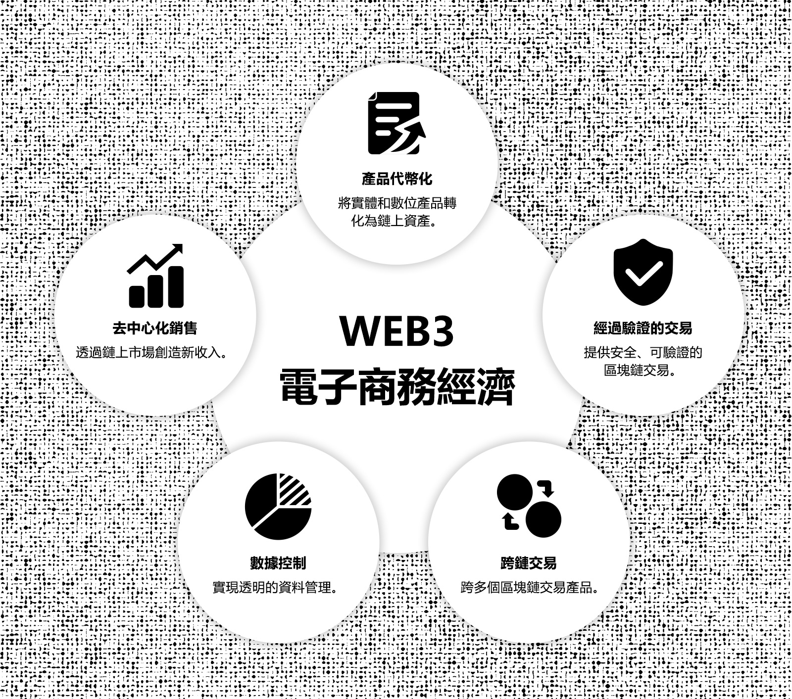
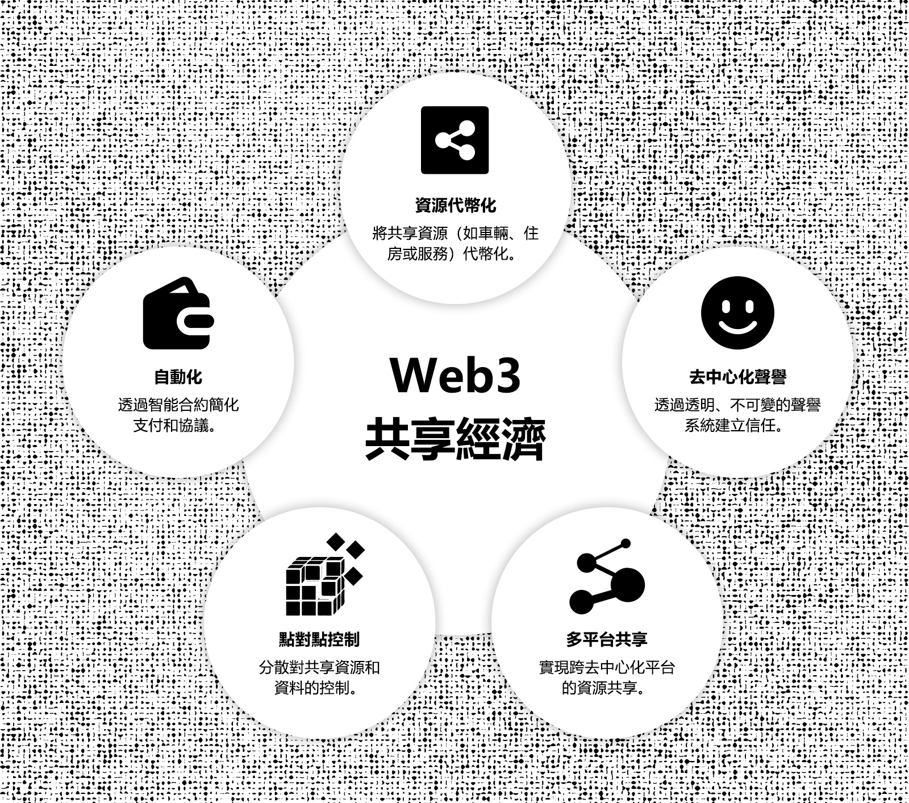
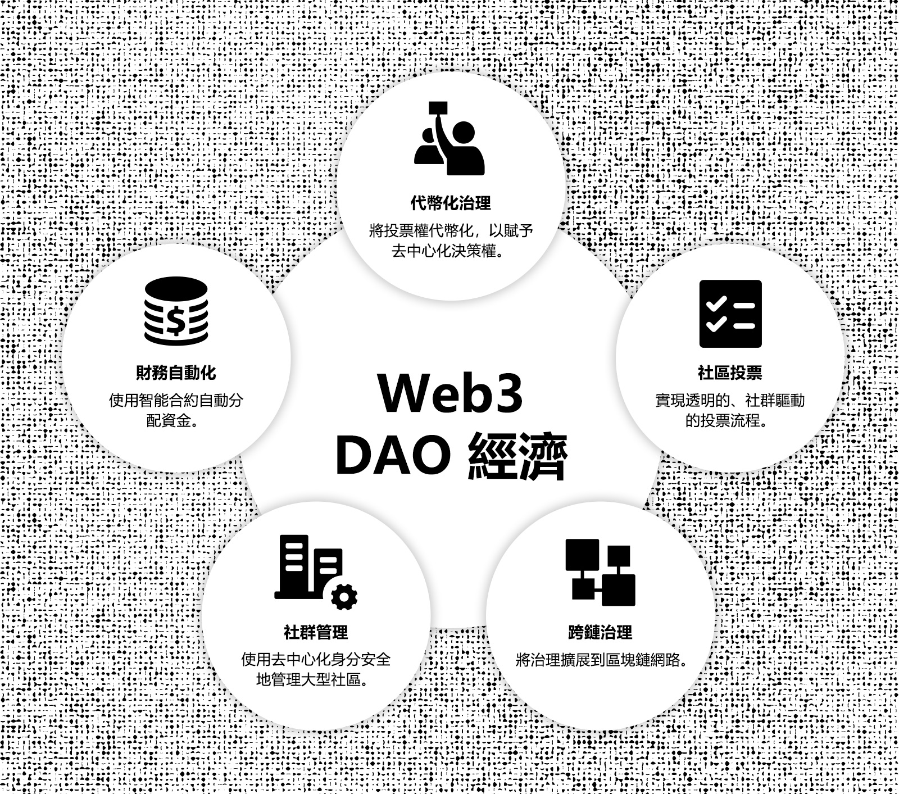
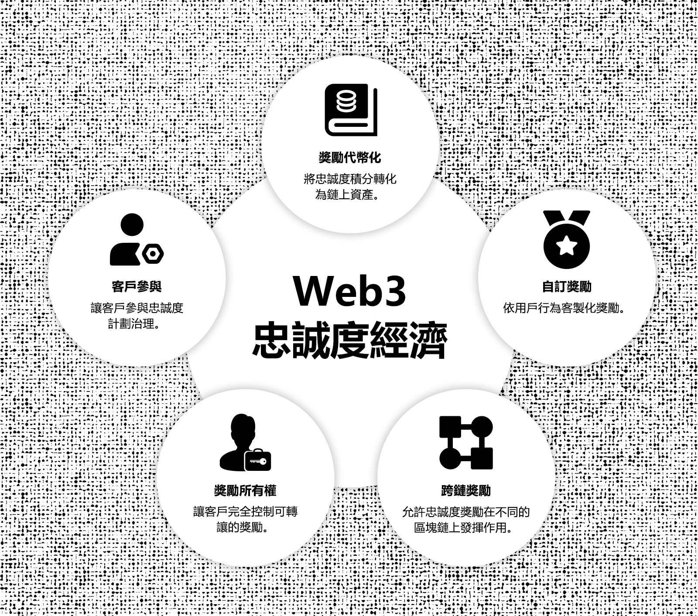

[TOC]

## 1. 摘要

本生態系發展白皮書是 Uptick Network 白皮書系列的第三篇。前兩部分則著重於技術架構和經濟模型。透過本部分，我們旨在系統地解釋 Uptick 在使命、理念、技術、模型和發展方面的理念與方法論。與先前的論文不同，本文檔涵蓋的範圍更廣，並將隨著時間的推移而發展。

在第一版中，我們強調了 Uptick 生態系統發展背後的概念和方法論，並借鑒了過去三年發表的大量文章。建立明確的方法論是創建永續生態系統的第一步。憑藉在網路和實體經濟領域 20 多年的經驗，我們的團隊確定了六個關鍵的 Web3 經濟模型。然後，我們概述如何使用 Uptick 的技術模組來建立這些模型，為實體經濟協議層奠定堅實的基礎。最後，我們詳細介紹了此協定層如何與 Web3 業務邏輯結合，構成 Uptick 雲端即服務的基礎，該服務直接服務於 Web2 企業和使用者。

隨著 Uptick 協定和服務層的擴展以及更多生態系統應用程式的開發和採用，本白皮書將以「即時文件」的形式持續更新。我們邀請思想領袖參並塑造這個生態系統，將理論探索與實際實施相結合，建構支持實體經濟並實現廣泛 Web3 採用的基礎設施。

## 2. 簡介

本白皮書深入探討了 Uptick Network 將 Web3 融入實體經濟的策略方法。隨著傳統框架越來越受到效率低下、缺乏透明度和壟斷控制的困擾，人們真正需要新的、可持續的創新。 Uptick Network 透過提供 Web3 基礎架構來支援滿足日常需求的相關應用程序，推動有意義且可持續的變革，從而應對這些挑戰。

就像網路徹底改變了通訊和商業，雲端運算改變了企業儲存和管理資料的方式一樣，Web3 代表了數位世界發展的下一步。雖然先前的轉型優化了集中式系統，但 Web3 透過分散控制並將價值轉移回用戶和社區，從根本上改變了權力平衡。正如雲端運算簡化了基礎設施管理一樣，Web3 使企業能夠在無信任的環境中運營，從而使數位生態系統本質上變得更加安全、透明和自主。

基於這項技術發展，Uptick 的 Web3 基礎設施旨在實現新形式的價值創造、治理和社區參與，滿足去中心化商業、主權數位資產所有權和點對點網路等現實需求。然而，實現這個願景需要從根本上重新思考經濟模式、個人自主權和協作框架。我們的策略深植於一個實用的願景，旨在擴大符合實體經濟需求的生態系統應用，並圍繞著六個關鍵的 Web3 經濟模型建構。這些旨在支持企業和個人順利過渡到去中心化框架，符合現實需求並開闢大規模採用的道路。

隨著全球經濟的發展，我們相信 Web3 整合對於實現去中心化所有權的創新商業模式和框架至關重要。 Uptick Network 的使命是提供企業和使用者充分參與 Web3 經濟所需的基礎設施和工具，為下一代網路奠定基礎。在這份白皮書中，我們徹底探討了 Web3 生態系統發展背後的理念、我們建立的各種 Web3 經濟模型以及支持它們的基礎設施。

## 3. 概述

### 3.1 Web3 思維模式

向 Web3 的過渡需要個人和組織在技術、治理和數位資產處理方式上做出根本性轉變。 Web3 不僅僅關注技術變革，也代表著一種更廣泛的哲學轉變，即向去中心化轉變，控制權分散在各個網絡中。這種方法優先考慮透明度、自主性和使用者所有權，徹底重塑了個人管理資料和數位互動的方式。

Web3 引入了一個分散權力的去中心化框架，讓使用者擁有自己的資料和資產。它減少了對中央權威機構的需求，並建立了一個無需信任的基礎設施，透過開放、安全的協議驗證交易和互動。去中心化網路實現了社群驅動的創新，這是 Web3 思維模式的核心。隨著各種參與者為新應用程式的開發做出貢獻，它創造了一個促進協作和前瞻性思維的環境。年輕一代熟悉重視自主性的數位空間，與這種新興模式非常契合。

對於企業和開發者來說，Web3 旨在將去中心化、透明度和使用者賦權嵌入到其係統的基礎中。這需要建立能夠實現公正結果並反映不斷發展的數位經濟的平台。儘管仍處於早期階段，但 Web3 的發展讓人想起了早期的互聯網，NFT、RWA、DID、ZKP 等基礎技術構成了商業、社交互動和治理新模式的支柱。基於 NFT 的票務或忠誠度計劃等實際應用讓我們看到了隨著基礎設施的成熟，未來的可能性。隨著 Web3 思維模式的成熟，它將塑造下一波進步，並在全球經濟中釋放全新的可能性。

### 3.2 Web3 開發的策略方法

Uptick Network 的 Web3 開發方法強調將區塊鏈策略性地分階段整合到現有系統中。向 Web3 的過渡並不是一刀切的解決方案，而是需要仔細考慮區塊鏈在哪裡以及如何增加最大價值。這涉及增強透明度、提高安全性和優化供應鏈管理和支付等流程，同時也支援從根本上改變相關方之間關係的新業務模式。

為了在不破壞現有系統的情況下有效整合區塊鏈，Uptick Network 提倡採用分層、模組化的方法，以滿足每個產業的需求：

* 選擇能夠與其他網路互通的 Web3 平台。
* 可擴展的中間件、協定和服務，具有明確的資料遷移策略。
* 行業特定的監管合規性，特別是在資料隱私和安全方面。
* 實施試點項目，在全面部署之前評估可行性並收集回饋。
* 逐步擴大區塊鏈的採用，以限制營運風險和中斷。

從一開始就考慮可擴展性，以確認這些新系統可以處理不斷增長的交易量和行業需求，但在區塊鏈驅動的實施過程中，可擴展性往往被低估。 Uptick Network 從一開始就解決了這個問題，設計了一個能夠處理不斷增長的交易量並在網路活動高峰期保持效能的系統。智慧合約優化也是優先考慮的，以避免高昂的 gas 費或執行失敗等問題，這些問題可能會影響使用者體驗和營運效率。

隨著 Uptick Network 推動其 Web3 基礎設施，重點是創建針對特定行業的經濟模型。這些模型將模組化領域知識與 Web3 協定結合，使企業能夠透過創新而實用的解決方案過渡到 Web3。這是一種策略性和分層的方法，為實體經濟中廣泛採用 Web3 奠定了基礎，為廣泛的行業提供可擴展、可互通和安全的解決方案。

### 3.3 Web3 對實體經濟的影響力與潛力

Web3 融入全球經濟代表著價值創造、交換和治理方式的轉變。 Web3 擺脫了傳統的中心化系統，引入了一個分散式透明框架，允許更廣泛地參與經濟活動。這種方法為個人創作者、小型企業和小眾平台在全球範圍內有效競爭開闢了新的機會。 Web3 最值得注意的承諾之一是它有可能使價值創造民主化。區塊鏈和代幣化使以前無法訪問或流動性差的資產能夠被數位化並在全球範圍內交易。這對於現實世界資產 (RWA) 尤其重要，Web3 使這些資產能夠被帶入去中心化的生態系統。例如，鋰和鈾等資源的代幣化可以改變這些戰略資產的管理和交換方式，為代表性不足的地區提供新的機會。

以前受傳統金融體系限制的跨國交易和合作結算現在有了新的運作途徑。 Web3 為經濟發展引入了新的框架，使資源能夠更自由、更透明地流動。對房地產或自然資源等資產進行代幣化和交易，改變了傳統的所有權和交換模式。因此，金融和房地產等行業正在重新構想其結構，從而帶來新的成長和創新。

Web3 與實體經濟的融合將帶來新的機會和變革性進步。代幣化和區塊鏈正在連接數位經濟和實體經濟，從而帶來更有效率、更透明的系統，這種轉變重塑了全球價值創造和分配，為未來經濟指明了新的方向。 Web3 的新經濟框架分散了權力結構，促進了透明度並推動了創新，擴大了各行業的經濟參與，為更具包容性的全球經濟奠定了基礎。

### 3.4 開發可持續的 Web3 基礎設施和生態系統

開發可持續的 Web3 基礎設施需要將技術進步與實際產業需求結合。這個過程重新定義了數位經濟，強調去中心化、數據所有權和社區主導的參與。區塊鏈是這項基礎設施的核心，它提供了一個安全透明的系統，無需中介即可記錄交易。智慧合約可自動化業務流程並簡化操作，從而在去中心化系統中建立信任。這些組件共同為能夠支援多個產業的去中心化生態系統奠定了基礎。

非同質化代幣 (NFT) 和代幣化的現實世界資產 (RWA) 擴展了 Web3 的範圍，提供了與數位和實體資產互動的新方法。房地產或自然資源等資產的代幣化帶來了新的經濟機會，增加了流動性，並以以前在 Web2 系統中難以實現的方式實現了更廣泛的參與。 Uptick 也專注於泛 RWA，它涵蓋了廣泛的代幣化現實世界資產，例如門票、藝術品、會員資格、音樂等。

為了使 Web3 保持適應性，基礎設施必須是模組化和可擴展的。 Cosmos-SDK 等技術說明了模組化系統如何使互連的區塊鏈能夠獨立運行，同時保持跨網路通訊。這種靈活性使基礎設施能夠隨著不斷變化的行業需求而發展。

建構此基礎設施還涉及應對因地區而異的監管挑戰。企業需要謹慎駕馭這些監管框架，同時繼續在 Web3 領域進行創新，以支持永續發展。成功的 Web3 生態系統建立在開放性、互通性和資產多樣性的基礎上。數位世界不斷發展，提供有形價值的實用應用將塑造參與 Web3 經濟的企業和個人的未來。

## 4. Uptick Web3 經濟模型

Web3 經濟模型提供了結構化的框架，用於指導去中心化應用程式和平台的開發和運作。這些模型定義了在去中心化生態系統中創造、交換和管理價值的原則和機制。它們的作用與軟體架構中的設計模式非常相似，為 Web3 中的常見挑戰提供實用的解決方案，推動去中心化系統的一致性和效率。每個 Web3 經濟模型都針對特定的行業用例進行了量身定制，為經濟的各個部門提供了可適應的藍圖。透過採用這些模型，開發人員和企業可以建立符合核心 Web3 原則（例如透明度、安全性和社群驅動的參與）的去中心化應用程式。

本節概述了 Uptick Network 實施的關鍵 Web3 經濟模型，並探討了這些模型如何改變傳統的經濟結構。透過詳細研究每個模型，我們重點介紹了它們的實際應用及其在推進去中心化生態系統方面的作用，為 Web3 經濟的更廣泛增長做出了貢獻。

<figure><figcaption></figcaption></figure>

### 4.1 Web3 電子商務經濟

**4.1.1 歷史背景與演變**&#x20;

在過去二十年中，電子商務產業發生了變化，其推動力是中心化平台重塑了全球零售業。這些平台帶來了便利和可訪問性，改變了消費者行為和業務運作。然而，中心化系統凸顯了資料隱私、高費用和小型參與者壓力等問題。

對替代方案的需求不斷增長。 Web3 將控制權從中心化實體轉移到去中心化網絡，增強了透明度、安全性和使用者自主性。 Web3 電子商務的一個定義特徵是代幣化，將實體產品和服務轉變為鏈上代幣化資產 (RWA)。一旦建立，這些資產就可以與去中心化金融系統 (DeFi) 連接，透過單一或多種產品組合實現創新商業模式，並為一級和二級市場創造機會。

**4.1.2 應對核心挑戰**

**資料控制與隱私**&#x20;

中心化平台在沒有透明度或同意的情況下收集用戶數據，引發隱私問題。 Web3 分散了資料控制，將所有權歸還給用戶，增強了隱私，重建了信任。鏈上資產具有真實性和可追溯性等屬性，可提供可驗證的交易。

**高費用和市場控制**&#x20;

中心化平台收取高額交易費，影響較小的賣家，偏向較大的實體。 Web3 透過智能合約實現直接交易，進而降低費用。權利證書（例如交貨憑證）可以從二級市場收取股息，從而增強流動性和信任。

**缺乏透明度**&#x20;

不透明的操作，特別是在搜尋和定價演算法中，可能會破壞對中心化平台的信任。 Web3 透過分散式帳本引入透明度，交易被公開記錄。這建立了信任，確保公平運作並最大限度地減少詐欺活動。

**4.1.3 Uptick Web3模型**

Uptick Network 透過旨在解決現代數位市場面臨的核心問題的基礎架構重新構想了 Web3 電子商務。 Uptick 利用去中心化協議，為企業和消費者提供更強的資料控制能力、降低交易成本和提高透明度。該基礎設施旨在簡化營運流程、最大限度地減少對中介機構的依賴，並為數位商務創造更安全、更可信的環境。

<figure><figcaption></figcaption></figure>

**資料管理**&#x20;

有效的資料管理對於電子商務至關重要，因為用戶資料、交易歷史和產品資訊必須安全處理。 Uptick Network 的基礎架構基於 Cosmos-SDK 框架和 EVM 擴展，實現了資料管理的去中心化，保護敏感資訊免遭洩露和未經授權的存取。透過整合去中心化儲存解決方案，電子商務平台可以存取可靠、透明且防篡改的系統，用於儲存交易元資料和產品詳細資訊。為了進一步增強功能，Uptick 整合了提供即時資料饋送的 Oracle 模組，使平台可以安全地存取有關定價、庫存水準和外部市場狀況的最新資訊。

除了安全的資料管理之外，Uptick Network 的資料服務還增強了電子商務平台分析和存取即時和歷史資料的能力。透過提供去中心化資料查詢和分析的能力，該服務使企業能夠改進客戶洞察、優化庫存管理並更精確地追蹤交易歷史。該系統建立在 Uptick 的安全基礎設施之上，允許進行防篡改資料分析，同時透過加密技術保護隱私。透過與鏈上和跨鏈生態系統的無縫集成，該服務為平台提供了全面的分析和管理功能。

**智能合約與交易自主性**&#x20;

自動化對於提高電子商務營運效率至關重要。 Uptick 支援 EVM 和 WASM 智慧合約，為支付、訂單履行和爭議解決等核心業務邏輯功能提供靈活的自動化。這些合約適用於各種用例，減少了對中介的需求，從而降低了成本並加快了流程。付款可以在交貨確認後自動釋放，退款可以在沒有人工幹預的情況下處理，從而帶來更有效率的用戶體驗。

Uptick Network 透過整合 EVM 和 WASM 智慧合約增強了電子商務，提供了平台互通性和可擴充性。 EVM 合約因其安全性和廣泛採用而受到信賴，允許企業使用可靠的 ERC 標準管理數位資產，這對於高價值交易至關重要。 WASM 合約以高效著稱，適合需要高效能的資源密集應用。透過 Uptick 的合約轉換器，企業可以在 EVM 和 WASM 環境之間轉換，從而靈活地優化不同 Web3 場景中的營運。

**平台管理的去中心化治理**&#x20;

Uptick 基於 DAO 的治理系統改變了電子商務平台的決策流程，將控制權轉移到社群。借助 DAO 框架，從商家到客戶的參與者可以共同決定關鍵平台決策，例如費用調整、營運變更和新功能推出。這種參與式治理模式創造了一個透明且可問責的環境，消除了中心化控制，並允許利害關係人直接參與塑造平台。

對於電子商務而言，這種去中心化治理具有重大優勢：它建立了信任並促進了使用者之間的更深入互動。商家和客戶不再按照平台所有者規定的任意規則行事；相反，他們成為決策的積極貢獻者。 Uptick DAO 模式的靈活性意味著市場可以快速適應不斷變化的需求和市場條件，從而形成一個反映參與者集體利益的不斷發展的平台。最終，這將形成一個更以社區為導向、響應用戶需求的市場。

**代幣化與可追溯性**&#x20;

代幣化是 Uptick 可編程 Web3 基礎設施的關鍵組成部分，為創建客戶激勵和忠誠度計劃提供了一種靈活的方法。商家可以將獎勵、折扣和福利代幣化，從而改變傳統的客戶參與模式。這些代幣化資產可以透過購買、評論或推薦等活動獲得，然後在多個平台上兌換，使其比傳統獎勵更具通用性和價值。

Uptick 的系統更進一步，將商品和服務錨定到 1:1 數位憑證上，透過賣家或受信任機構的信用擔保提供透明度和可追溯性。這種結構創造了一個防篡改的環境，現實世界資產 (RWA) 與數位表示安全地綁定在一起，從而在消費者和商家之間建立信任。代幣化資產的可追溯性也增強了問責制，允許用戶驗證商品的真實性和出處，這在奢侈品、供應鏈甚至再生能源信貸等高價值或敏感市場中至關重要。

**社群行銷與代幣激勵促進用戶發展**&#x20;

為了提供快速、精準和有效的用戶獲取，Uptick 實現了社交網路行銷和多維代幣激勵模型的整合。 Web3 生態系統中的每個使用者都可以轉變為消費者和銷售人員，從而推動成長和長期參與。用戶可以透過社群管道推廣平台，並根據他們對社群擴展、內容創建或銷售推薦的貢獻獲得獎勵。這種靈活的、以績效為導向的模型將使用者興趣與平台成功結合起來，形成了一個強大的回饋循環，既能增強用戶保留率，又能促進平台發展。

此外，Uptick 的代幣激勵可以根據特定的用戶行為進行定制，獎勵推薦、參與治理或持續參與等行為。這些個人化的獎勵使用戶和平台之間的聯繫更加緊密，鼓勵持續參與並隨著時間的推移增強忠誠度。社交網路行銷和動態代幣激勵的結合為平台提供了一種全面、可擴展的成長和社群建立方法。

**互通性與跨鏈交易**&#x20;

全球電子商務平台需要有效率、安全地進行跨境交易。 Uptick 的跨鏈橋 (UCB) 和 IBC（區塊鏈間通訊）協議支援跨各種區塊鏈網路轉移數位資產和貨幣，使平台能夠適應多種支付方式並跨多個司法管轄區運作。這種相容性使企業能夠與全球市場互動，而不受地理或區塊鏈特定限制的限制。

為了增強隱私和安全性，Uptick 整合了 ZK 證明 (ZKP)，在保持交易準確性的同時保持交易詳細資訊的機密性。這種方法可以保護敏感訊息，即使交易是在去中心化網路上處理的。這些工具減少了跨國營運中的摩擦，提高了國際銷售的流動性，使企業更容易拓展新市場並安全地管理跨區域交易。在支付方式和資產之間轉換的能力有助於電子商務平台迎合更廣泛的客戶群，促進更順暢、更安全的全球貿易。

**全渠道支付模組**&#x20;

提供靈活、安全的支付選項是當今電子商務領域的關鍵。 Uptick 的全通路支付模組使平台能夠支援多種支付方式，包括加密貨幣、穩定幣、法定貨幣和中央銀行數位貨幣 (CBDC)，使企業能夠為具有不同支付偏好的全球受眾提供服務。此模組能夠即時切換支付管道，從而最大限度地降低交易費用並加快處理速度，從而改善整體用戶體驗。

透過先進的加密技術保護每筆交易，並建立透明的追蹤系統，該模組在買家和賣家之間建立了信任。傳統貨幣和數位貨幣的整合使電子商務平台能夠在全球範圍內擴展，從而提高基於 Web3 的市場的效率和安全性。

**4.1.4 結論**

Uptick Network 的基礎架構改變了電子商務，解決了資料隱私、交易費用和透明度等關鍵挑戰。去中心化資料管理、智慧合約自動化和跨鏈功能使商家和消費者擁有更大的控制權，減少了中介機構並提供了更高程度的信任。該框架為去中心化經濟中更公平、更安全的市場奠定了基礎，為全球電子商務的未來提供了一個永續的模式。

### 4.2 Web3 創作者經濟

**4.2.1 歷史背景與演變**

創作者經濟在過去十年中不斷發展，使個人能夠將自己的技能、內容和影響力貨幣化。 YouTube、Instagram 和 Patreon 等中心化平台透過提供全球受眾和收入來源的存取權限徹底改變了這一領域。然而，這些平台也帶來了挑戰：高昂的費用、審查制度以及對內容和受眾關係的有限所有權。創作者面臨不可預測的演算法和政策變化，影響知名度和收入。

隨著這些限制變得明顯，對賦予創作者更多控制權的模型的需求也隨之增長。 Web3 改變了創作者經濟，使創作者能夠完全擁有內容、直接貨幣化並與沒有中介的社群互動。

**4.2.2 應對核心挑戰**

**內容所有權與貨幣化**&#x20;

中心化平台對創作者的內容施加限制性條款，限制貨幣化和分發。 Web3 透過 NFT 和去中心化平台，讓創作者直接擁有和貨幣化內容。將他們的作品代幣化使創作者能夠在沒有中介的情況下出售、交易或授權作品，從而增加收入並保留對使用和分發的控制權。

**審查與內容控制**&#x20;

傳統平台對內容進行審核，通常會導致無緣無故地取消貨幣化或刪除。 Web3 平台透過消除中心化控制來降低審查風險。分散式內容儲存增強了彈性，保護創作者免於被刪除並保障言論自由。

**社區營造與直接參與**&#x20;

中心化平台限制了創作者與受眾之間的直接互動。 Web3 支援去中心化社群和直接參與。透過社群平台、代幣化存取和治理模式，創作者可以加強與支持者的聯繫。粉絲持有代表會員資格或投票權的代幣，為內容方向、存取或收入分享做出貢獻。

**永續性和收入多樣化**

傳統的創作者收入來源，如廣告或平台特定模式，是不穩定的。 Web3 透過代幣化、版稅和去中心化眾籌來實現收入多樣化。智能合約在內容轉售時自動分配版稅，確保長期收入。透過去中心化平台進行群眾募資為創作者提供直接的社群支持，繞過看門人並增強財務獨立性。

**4.2.3 Uptick Web3 模型**

Uptick 的 Web3 創作者經濟提供了全面的基礎設施，旨在滿足現代創作者的特定需求。該平台為去中心化生態系統中所有權、貨幣化和社區參與等常見挑戰提供了切實可行的解決方案：

在 Web3 領域，隨著 DeFi 的興起，創作者經濟有可能成為關注的焦點，吸引創作者和版權持有者。然而，Web3 尚未在這一領域完全站穩腳跟。一個主要問題是 NFT 經常捲入投機交易，這使其目的轉向牟利，而不是真正支持創作者。為了追求流動性，一些平台降低了版稅管理的優先級，影響了創作者的收入。缺乏將加密資產錨定到實體作品上的系統也將 NFT 限制在主要的數位創作上。 Uptick 的 Web3 創作者經濟模型試圖改變這一軌跡，建立一個可持續的平台，保護創作者的版稅和權利，同時支持創作者經濟的真正成長。

Uptick 透過整合現實世界資產 (RWA) 機制，將鏈上資產與實體作品連結起來，為創作者提供安全代幣化和管理版權的工具。該系統使數位和實體作品的創作者受益，增強了他們控制收益和加強生態系統的能力。 Uptick 的基礎設施使創作者能夠管理他們的資產，保護他們的版稅，並參與支持創作者、智慧財產權所有者及其社區的去中心化創作者經濟，從而為所有參與者創造一個更具包容性和公平性的生態系。

<figure><figcaption></figcaption></figure>

**所有權與控制權**&#x20;

在 Web3 創作者經濟中，保留內容的完全所有權對於創作者來說至關重要。 Uptick 的基礎設施支援創建和管理各種 NFT 標準，讓創作者對其作品進行代幣化。這些代幣化的資產安全地儲存在去中心化網路上，為創作者提供了對其智慧財產權的完全控制權，保護他們的作品不會在未經他們同意的情況下被更改或刪除。內容創作者可以直接在 Uptick 的數位資產市場上對數位藝術或音樂進行代幣化，NFT 嵌入的所有權在多個平台上保持不變且受到保護。 Uptick 也透過去中心化內容儲存消除了審查風險。內容可以使用 IPFS 儲存在分散式節點上，而不是依賴單一平台的伺服器，從而保護創作者的作品免於任意刪除或更改。這種方法直接解決了創作者在傳統中心化平台上所面臨的平台依賴問題。

貨幣化是創作者經濟的另一個核心要素，Uptick 的可程式 NFT 協議允許創作者根據其特定需求設計靈活的收入模式。創作者可以實施智能合約，實現從二級銷售中自動分配版稅，從而讓他們從作品的轉售中獲益。例如，將自己的藝術品代幣化為 NFT 的攝影師可以自動獲得每次轉售的一定比例，從而提供持續的收入流而無需人工監督。除了簡單的銷售之外，Uptick 還支援各種貨幣化模式。創作者可以向代幣持有者提供獨家內容，建立基於訂閱的服務，甚至拍賣限量版內容。該基礎設施允許創作者實現收入來源多樣化，同時保持其作品的透明度、公平性和不變性。

**權利管理**&#x20;

Uptick Network 的基礎架構提供了一個專門的框架，用於在 Web3 創作者經濟中管理權利。創作者可以代幣化他們的作品，將授權條款和使用權直接嵌入 NFT 中。這種方法提供了精確的所有權跟踪，並允許創作者控制其內容的分發和貨幣化。例如，影片創作者可以發布帶有特定轉售條款或未來使用條款的代幣化剪輯，從而無需中介。

Uptick 的可程式 NFT 還使創作者能夠自動分配版稅，使他們能夠從二級銷售中獲利，同時保持對其智慧財產權的監督。無論是音樂、數位藝術或其他創意內容，Uptick 上的創作者都可以從透明、防篡改的記錄中受益，這些記錄無需第三方驗證，從而確保對其資產的完全控制。

**社區參與與治理**&#x20;

Uptick 透過 DAO（去中心化自治組織）提供去中心化的社區建設，使創作者能夠超越傳統平台。借助 DAO，創作者可以讓他們的受眾參與決策過程，例如確定製作的內容類型、會員福利或平臺本身的治理。內容創作者可以推出限量版代幣化藝術作品系列，代幣持有者可以獲得下一個創作方向的投票權，讓他們擁有獨特的主人翁意識，並參與創作過程。音樂家還可以建立一個 DAO，讓粉絲投票決定即將推出的項目或獨家發行的作品，從而建立更深層的聯繫感和社區主人翁意識。這種去中心化的決策模式加強了創作者與社群之間的聯繫，促進了更公平的價值分配。 DAO 治理系統無縫整合到 Uptick 的架構中，為創作者提供了一種直接與觀眾互動的方式，同時保持完全去中心化和社群驅動。

**跨平台互通性**&#x20;

能夠在多個平台上分發內容對創作者來說是一個重要因素。 Uptick 的基礎設施利用 Uptick 跨鏈橋 (UCB) 和跨區塊鏈通訊 (IBC) 協議，提供順暢的跨鏈互通性，使創作者能夠將其影響力擴展到各種 Web3 生態系統。藝術家可以在一個平台上鑄造 NFT，這些 NFT 可以無縫地在其他市場上出售或交易，從而擴大覆蓋範圍和盈利潛力，而無需額外的技術障礙。這種互通性也使創作者能夠將其內容與各種去中心化平台集成，為合作和貨幣化開闢了新的機會。無論是將藝術品或數位媒體等實體商品代幣化，Uptick 的跨鏈基礎設施都可以確保創作者能夠在真正去中心化的全球生態系統中運作。

**4.2.4 結論**

Uptick Network 透過提供去中心化工具重新定義了創作者經濟，這些工具讓創作者可以完全控制他們的內容、收入和觀眾參與。透過其可編程的 NFT、去中心化身分系統和靈活的貨幣化選項，Uptick 使創作者能夠與他們的社區建立可持續的關係，同時保持對其智慧財產權的所有權。這種方法使創作者能夠參與更公平、更去中心化的生態系統。

### 4.3 Web3 票務與粉絲經濟

**4.3.1 歷史背景與演變**

票務和粉絲參與產業正在經歷重大轉型，因為中心化平台在透明度、可近性和價值分配方面面臨挑戰。由中介控制的傳統票務系統導致價格虛高、倒賣和粉絲與藝術家直接聯繫有限等問題。粉絲參與往往是膚淺的，幾乎沒有機會進行有意義的參與。 Web3 將控制權轉移給創作者、粉絲和社群。去中心化網絡實現了透明、安全和公平的售票和粉絲互動，重塑了粉絲與他們最喜歡的藝術家、運動員和創作者之間的關係。

**4.3.2 應對核心挑戰**

**倒賣與詐欺防制**&#x20;

傳統售票在二級市場上面臨猖獗的倒賣和詐欺行為，導致價格上漲並危及買家的安全。 Web3 透過發行可驗證的基於區塊鏈的數位門票作為獨特的、不可變的 NFT 來應對這一問題。每張票的來源和所有權都是可追溯的，從而減少了欺詐並實現了透明的二級銷售，智能合約強制公平的轉售價格和分銷。

**缺乏粉絲與創作者的直接聯繫**&#x20;

傳統的粉絲互動通常是交易性的，提供有限的所有權和參與。 Web3 引入了代幣化的粉絲經濟，允許粉絲透過獨特的數位資產直接與創作者互動。創作者可以提供獨家內容、訪問權限和體驗以換取代幣，從而實現更深入、更身臨其境的粉絲關係。粉絲在生態系統中獲得發言權，對活動進行投票或獲得特殊訪問權限。

**高交易費與集中控制**&#x20;

中心化票務平台收取高額交易費並限制訪問，充當看門人。 Web3 透過使用智慧合約實現銷售和分銷自動化，消除中介機構，從而降低費用。這使創作者能夠控制門票定價和分銷，而粉絲則受益於更直接、透明和具有成本效益的體驗。

**4.3.3 Uptick Web3 模型**

Uptick Network 直接解決了傳統票務和粉絲參與系統的低效率和限制。透過整合可程式 NFT、去中心化身分管理和跨鏈互通性，Uptick 實現了安全、透明和可擴展的解決方案，賦予創作者權力並增強粉絲參與度：

<figure><figcaption></figcaption></figure>

**基於 NFT 的票務和轉售控制**&#x20;

Uptick 的基礎設施引入了基於 NFT 的票務，利用其可編程的 NFT 協議創建防篡改的數位票證。每張票都以獨特的 NFT 鑄造，不可更改地儲存在區塊鏈上，並使用智慧合約進行保護。這意味著可以即時驗證門票，防止偽造和未經授權的複製。借助可編程的智能合約，活動組織者可以嵌入轉售價格限制、轉讓限制和基於時間的到期等規則。例如，門票可以自動防止超過原價一定百分比的轉售或限制轉讓，確保門票僅在經批准的平台上轉售。

這種對門票屬性的精細控制降低了二級市場上倒賣和哄抬價格的風險。此外，NFT 元數據包括所有權歷史和門票真實性，所有這些都可以在鏈上驗證，從而消除詐欺並提供從發行到使用的完全透明的門票生命週期。

**跨鏈互通性，實現全球可訪問性**&#x20;

Uptick 的票務系統由其跨鏈橋 (UCB) 和 IBC（區塊鏈間通訊）協議提供支持，可實現區塊鏈生態系統之間的深層互通性。借助這些協議，基於 NFT 的票證可以在各種鏈之間轉移，包括與 EVM 相容的網絡，如以太坊和基於 Cosmos 的鏈。 ICS-721 協定進一步增強了跨鏈 NFT 轉移，在不同平台上維持票證元資料、出處和智慧合約功能的完全完整性。這種跨鏈支援可確保票證不會被鎖定在單一區塊鏈中，為活動組織者和粉絲提供靈活、可擴展且超越傳統邊界的解決方案。

借助跨鏈 NFT 協議，即使在不同的區塊鏈環境之間移動，票證仍保留其功能屬性，例如存取權限或限時特權。這使創作者能夠吸引全球受眾，而不會損害其數位資產的安全性或實用性。

**去中心化身分 (DID) 可增強粉絲安全性**&#x20;

Uptick DID 為粉絲提供了一種參與票務和粉絲體驗的方式，而不會洩露個人資料。每個粉絲都被分配一個 DID，從而在生態系統內實現私密、可驗證的互動。這些去中心化身分與基於 NFT 的門票相關聯，允許安全匿名地存取活動、獨家內容或數位體驗。粉絲透過加密安全的金鑰對系統管理自己的身份，該系統無需暴露敏感資訊即可進行身份驗證。對於活動組織者來說，這意味著他們可以根據經過驗證的 NFT 所有權授予存取權限，同時保持對資料隱私法規的遵守。 Uptick 的 DID 系統還支援創建個人化的粉絲體驗。例如，與 DID 綁定的 VIP 門票 NFT 可以授予自訂特權，例如後台訪問或與藝術家的獨家互動，所有這些都由粉絲和創作者之間安全直接地管理。

**可程式 NFT，實現動態粉絲參與**&#x20;

Uptick 的可編程 NFT 框架允許創作者為粉絲提供互動的、不斷發展的數位資產。這些 NFT 可以根據即時事件、成就或粉絲參與動態更新，並透過整合到 Uptick 平台的 Oracle 服務實現。這使粉絲能夠持有隨時間推移而發展的數位資產，並在達到里程碑時解鎖新內容或特權。例如，運動隊可以發行根據比賽結果或球員成就更新的 NFT，讓粉絲能夠根據特定的比賽結果訪問賽後採訪或獨家商品。這種動態功能由智能合約提供支持，智能合約對透過 Uptick 的 Oracle 整合提供的鏈下資料饋送做出反應。可編程 NFT 還可以充當治理代幣，使粉絲能夠對活動細節進行投票，例如音樂會的曲目列表或未來巡迴演出的地點。這在粉絲和創作者之間建立了更具互動性的關係，粉絲成為決策過程的積極參與者。

**自動所得分配**&#x20;

Uptick 的智慧合約基礎設施可自動分配門票銷售、商品和粉絲貢獻的收入和獎勵。創作者可以設計可自訂的智慧合約來處理收入分成、版稅和粉絲獎勵，從而實現透明的自動化交易，無需手動監督。在活動中驗證門票後，可以觸發智能合約，將一定比例的門票銷售額分配給藝術家、場地經營者和利害關係人。這消除了中介機構，減少了營運摩擦，並確保了透明的資金流動。 Uptick 的可編程 NFT 還允許創作者發行帶有版稅的數位資產，使粉絲能夠分享串流媒體或其他數位內容產生的收入。根據智慧合約中嵌入的條款，付款會自動分配給 NFT 持有者，從而簡化了版稅分配流程。

**去中心化資料管理與粉絲關係系統**&#x20;

Uptick 利用去中心化儲存來保護票務和粉絲參與資料的儲存。所有元資料（包括票務細節、粉絲互動和所有權記錄）都以不可變且透明的方式儲存在鏈上，確保始終保持資料完整性。創作者可以透過 Uptick 的去中心化 CRM 系統管理粉絲關係，該系統允許他們追蹤粉絲在各種活動或內容發布中的行為、互動和忠誠度。該系統透過提供基於粉絲活動的代幣化獎勵或個人化體驗來幫助優化粉絲參與度，同時透過 DID 整合尊重隱私。這種去中心化的資料管理基礎設施為創作者提供了強大的工具包，可以與粉絲建立持久的、基於信任的關係，而無需中心化資料控制器。

**4.3.4 結論**

Uptick Network 提供 Web3 基礎設施，可解決票務和粉絲經濟中透明度、安全性和參與度的關鍵挑戰。透過整合可程式 NFT、去中心化身分和跨鏈互通性，創作者和活動組織者可以完全控制票務和粉絲參與流程，不受中心化系統的限制。 Uptick 可擴展的跨平台解決方案促進了創作者與其社區之間直接、公平和透明的關係，為長期成長建立了一個去中心化和永續的框架。

### 4.4 Web3 共享經濟

**4.4.1 歷史背景與演變**

共享經濟重塑了資源和服務的取得方式，Uber 和 Airbnb 等平台改變了互動方式。然而，集中控制帶來了效率低下、費用高昂和缺乏透明度。中介機構獲得了大量收入，用戶面臨資料隱私和信任問題。這些結構強化了壟斷控制，使參與者處於弱勢。 Web3 分散了控制，創建了一個透明、安全和高效的模型。透過智慧合約和去中心化身分消除中介機構並嵌入信任，可以實現真正的點對點交易和更公平的環境。

**4.4.2 應對核心挑戰**

**集中控制和高費用**&#x20;

傳統的共享平台充當守門人的角色，收取高額費用並控制平台規則、定價和利潤。 Web3 透過分散的智慧合約打破了這種模式，這些合約可以自動化支付和服務交付，減少中介機構和費用。這些合約強制執行預先定義的條款，最大限度地減少操縱和不公平定價。

**缺乏信任**&#x20;

中心化平台上的信任依賴於容易產生偏見和操縱的聲譽系統，幾乎無法保證交易的完整性。 Web3 使用去中心化聲譽系統，這些系統在區塊鏈上記錄不可變，具有透明、可驗證的設定檔。用戶透過他們的鏈上聲譽建立信任，從而實現安全的點對點交易。

**資料隱私與安全風險**&#x20;

中心化平台儲存大量用戶數據，使其成為網路攻擊和隱私侵犯的目標。 Web3 透過去中心化身分系統將資料控制權轉移給用戶，使他們無需依賴第三方即可安全地管理和共享資料。這降低了資料外洩風險，並賦予用戶對其數位身分的更大控制權。

**4.4.3 Uptick Web3 模型**

Uptick Network 提供全面的基礎設施，旨在支援去中心化、安全和可擴展的共享經濟。 Uptick 上的可程式智慧合約、去中心化身分管理和聲譽系統可實現跨多個平台的高效透明資源共享：

<figure><figcaption></figcaption></figure>

**去中心化資源分配與支付**&#x20;

Uptick 的可程式智慧合約簡化了資源分配和支付執行，為共享經濟提供了量身定制的解決方案。例如，在去中心化的汽車共享平台上，智慧合約處理租賃協議，在條款履行時自動支付，並對不合規行為實施處罰。這消除了中介機構管理糾紛或處理付款的需要，使操作更加順暢，成本降低。此外，Uptick 的全通路支付系統支援各種加密貨幣和支付方式，讓用戶能夠靈活地完成交易。這種方法減少了費用和延遲，擴大了共享經濟的訪問範圍。因此，平台可以整合全球用戶和資產，同時保持無摩擦和透明的流程。

**去中心化身分**&#x20;

Uptick DID 為使用者提供了一種在共享經濟中管理身分的安全方法。借助去中心化身分 (DID)，參與者可以驗證自己並參與交易，而無需洩露敏感的個人信息，在建立信任的同時保護隱私。該系統還支援客製化的使用者體驗，例如根據經過驗證的互動授予對高級服務或獨家資源的存取權限。使用者獲得安全且個人化的體驗，增強隱私和信任，而無需依賴集中式機構或第三方資料管理系統。 DID 的去中心化特性還允許無摩擦的跨平台身份驗證，從而在各種共享經濟平台上提供一致性。

**可互通的跨平台資源共享**&#x20;

Uptick 的跨鏈橋 (UCB) 和區塊鏈間通訊 (IBC) 協議支援跨不同區塊鏈生態系統轉移資產，例如租賃協議或共享數位服務。此功能允許用戶跨多個平台參與共享經濟，從而創建一個互聯且適應性強的生態系統。憑藉在網路之間移動資產的能力，Uptick 的基礎設施使用戶能夠存取更廣泛的服務，同時保持合約和資料的完整性。這種跨鏈功能擴展了共享經濟的靈活性和覆蓋範圍，幫助用戶無縫參與各種區塊鏈環境。

**去中心化客戶關係管理 (DCRM)**&#x20;

Uptick 的去中心化客戶關係管理 (DCRM) 系統改變了共享經濟中客戶關係的管理方式，將個人資料管理、交易追蹤和客戶回饋等關鍵功能去中心化。由於所有數據都不可改變地記錄在區塊鏈上，服務提供者可以存取透明且可驗證的評論和評級，從而在整個平台上促進真實性。這種去中心化的方法使用戶可以控制自己的個人數據，透過透明和直接的互動建立信任。在沒有集中監督的情況下，Uptick 的 DCRM 系統允許使用者在為更公平、更開放的市場做出貢獻的同時，保持對資料的控制。該系統還透過可自訂的回饋機制和獎勵增強了用戶參與度，增強了點對點資源共享的可靠性和安全性。這種級別的自主性和用戶驅動的數據管理為可擴展且值得信賴的共享經濟平台奠定了堅實的基礎。

**4.4.4 結論**

Uptick Network 消除了傳統中心化共享經濟平台的限制，並實現了基於透明度和信任的去中心化模式。借助去中心化身分系統、自動化資源共享的智慧合約和跨鏈互通性等工具，Uptick 使參與者能夠參與更直接、更公平的系統。這種方法為資源優化開啟了新的可能性，為個人提供了更多的控制權和靈活性。

### 4.5 Web3 DAO 經濟

**4.5.1 歷史背景與演變**

傳統決策以中心化治理為主導，將權力集中在少數人手中。這限制了透明度和參與度，扼殺了創新和回應能力。去中心化自治組織 (DAO) 重新定義了治理，實現了包容性和透明的決策。 DAO 允許社群在沒有中央權威的情況下進行自治，使用智慧合約實現治理自動化並實現代幣持有者的直接參與。這增強了集體決策、透明度和問責制，解決了中心化治理的挑戰。

**4.5.2 應對核心挑戰**

**決策不透明**&#x20;

中心化治理結構通常會限制透明度，決策由少數人閉門做出。這種缺乏可見性可能導致激勵機制不一致，決策者與更廣泛的社區脫節。 DAO 分散決策，允許代幣持有者對提案進行投票，並直接對組織的方向發表意見。這有助於使決策與社區的利益保持一致，從而實現更透明、更公平的治理模式。

**社區參與有限**&#x20;

在傳統組織中，社群成員對決策過程的影響微乎其微。這種排斥可能導致脫離並限制新想法的流動。 DAO 提供了一種參與模式，所有代幣持有者都能夠提出和投票表決倡議。這種參與可以使社區更加活躍和創新，決策可以反映出各種觀點。

**治理效率低落**&#x20;

許多組織依賴手動流程進行治理，導致決策緩慢和營運成本高昂。這些低效率阻礙了快速應對不斷變化的挑戰的能力。 DAO 透過智慧合約實現治理自動化，簡化決策並降低營運成本。這種自動化允許更快、更有效率的治理流程，通常使 DAO 能夠快速適應不斷變化的條件。

**4.5.3 Uptick Web3 模型**

Uptick Network 提供全面的基礎設施，專門用於支援廣泛應用中的去中心化治理。透過其模組化框架、去中心化管理工具以及與各種區塊鏈生態系統的靈活集成，Uptick 實現了透明的決策，並賦予社區塑造其專案方向的能力。這種基礎設施使 DAO 能夠以可擴展性和適應性的方式運行，使治理流程具有包容性、高效性並與生態系統不斷變化的需求保持一致。

<figure><figcaption></figcaption></figure>

**模組化治理與智慧合約基礎設施**&#x20;

Uptick 的基礎設施旨在支援跨多個部門的複雜治理系統。透過可自訂的 DAO 框架，組織可以使用 Uptick 的可程式智慧合約來設定特定的治理規則。這些合約可自動執行關鍵流程，例如資金分配、專案資金和協議投票，從而最大限度地減少人工監督的需要。 Uptick 與 Cosmos-SDK 的整合使 DAO 能夠在保持安全性的同時有效擴展。此外，對 EVM 和 WASM 的支援提供了跨各種應用程式的兼容性，使基礎設施能夠適應各種去中心化計劃。這種模組化設置使 DAO 能夠根據其社區的需求發展和演變。

**去中心化資金管理**&#x20;

Uptick 的 DAO 基礎設施包括去中心化資金管理工具，可為社區提供透明的資金管理。資金運作在鏈上得到保護，允許 DAO 根據社區投票的集體決策分配資源。這種結構可以實現資金的公平分配，不受中心化控制。智慧合約可以自動化這些流程，透過將資金支出鎖定在已通過社區治理批准的提案上，降低錯誤或濫用的風險。 Uptick 的基礎設施還支援多重簽章錢包，這增加了一層額外的安全性，需要多個金鑰持有者批准交易。這種設置可以在社區內建立信任，因為只有在達成集體協議後才能轉移資金。透過整合的即時財務分析，DAO 可以追蹤資金流動並監控其資金狀況，從而進一步提高資源管理的透明度和問責制。

**可互通的跨鏈治理**&#x20;

Uptick 支援的 DAO 內的治理跨多個區塊鏈運行。使用 Uptick 的跨鏈橋 (UCB) 和 IBC 協議，治理提案和決策可以同時影響各種區塊鏈生態系統。這種跨鏈功能對於監管不同鏈上的資產或營運的 DAO 來說非常重要，它允許協調活動和提案，而不受孤立治理系統的限制。它簡化了不同環境中的決策、資源管理和政策執行。這種方法使 DAO 能夠適應跨鏈挑戰和機遇，使治理結構能夠隨著更廣泛的生態系統而發展。 Uptick 的基礎設施在全球範圍內支援 DAO，管理去中心化活動，而不受孤立治理模式的限制。

**去中心化身分 (DID) 實現安全參與**&#x20;

Uptick DID 允許 DAO 成員驗證其身份，同時保持個人資料的隱私。每個身分都以加密方式連結到治理代幣，保證只有經過驗證的成員才能參與決策。該系統加強了 DAO 的安全性，同時支持匿名參與，降低了與身分暴露相關的風險。除了基本參與之外，DID 還支持更細緻入微的治理模式，例如基於聲譽的投票，其中每個成員投票的影響都與他們的歷史貢獻有關。這將創建一個更負責和透明的系統，其中活躍的貢獻者將獲得更大的治理決策影響力。安全且私密地管理身分的能力也使來自不同生態系統的新成員更容易加入，促進成長，同時保持 DAO 營運的完整性。

**DAO 特定的投票機制**&#x20;

Uptick 的基礎設施包括靈活的投票系統，可根據每個 DAO 的獨特需求量身定制。無論治理結構是支援一幣一票、二次投票還是基於聲譽的系統，Uptick 的模組化治理工具都可以進行調整，以便決策反映社區的優先事項。這種適應性使 DAO 能夠選擇最符合其組織目標和價值觀的投票機制，讓他們可以自由地嘗試促進公平或激勵積極參與的模式。投票系統可以與 DAO 一起發展，允許隨著社區的發展或重點轉移而進行調整，從而提供長期的靈活性和相關性。

**用於社區參與的去中心化客戶關係管理 (DCRM)**&#x20;

DAO 治理不應僅限於投票，管理大型去中心化社群需要的不僅僅是治理工具。 Uptick 的去中心化 CRM 系統為 DAO 提供了一種透明、不可變的方式來追蹤成員的參與、貢獻和回饋。這種可見性使 DAO 能夠與其成員進行有意義的互動，認可個人貢獻並加強參與者與社區之間的關係。透過對參與度的詳細了解，DAO 可以客製化與其最活躍貢獻者產生共鳴的計劃或獎勵，從而創建一個更具響應能力和包容性的生態系統。此 CRM 的去中心化性質可確保資料安全且防篡改，從而促進社群內的信任。

**4.5.4 結論**

Uptick Network 提供高度模組化的框架，旨在支援各種應用程式中的去中心化治理。憑藉先進的治理機制、去中心化的資金管理和跨鏈互通性，Uptick 使 DAO 能夠大規模高效運營，同時保持透明度和問責制。這種基礎設施使社區能夠在為長期發展而建構的去中心化生態系統中管理專案、分配資源並安全地做出決策。

### 4.6 Web3 忠誠度經濟

**4.6.1 歷史背景與演變**

忠誠度計劃可以追溯到 18 世紀後期，當時美國零售商推出了可兌換未來購買的銅幣。隨著零售競爭的加劇，企業專注於透過這些獎勵來留住客戶。隨著時間的推移，忠誠度計劃從實體代幣演變為數位積分，成為現代行銷的基礎。儘管這些系統取得了成功，但它們仍面臨成本、複雜性和詐欺漏洞的挑戰。透過 Web3，忠誠度計畫將迎來轉型。透過 NFT 將獎勵代幣化提供了一種去中心化的替代方案，可增強參與度和所有權。這為客戶提供了可驗證、可轉讓的數位資產，這些資產反映了忠誠度，從而為獎勵提供了更大的靈活性和獨特性。

**4.6.2 應對核心挑戰**

**成本與複雜性**&#x20;

傳統的忠誠度計畫實施和維護成本高昂，費用與開發、培訓和管理有關。 Web3 透過智慧合約來減少這些開銷，這些合約可以自動建立和分配獎勵，最大限度地減少中介機構並降低營運成本。這使小型企業和大型企業都能平等參與。

**客戶參與**&#x20;

忠誠度計劃往往因複雜性和缺乏差異化而苦苦掙扎。 Web3 忠誠度經濟體引入 NFT 作為獎勵，提供獨特、可自訂的數位資產，以增強參與度。用戶獲得與品牌里程碑相關的獨家 NFT，從而產生歸屬感並獎勵積極參與。

**詐欺和信任**

欺詐是傳統忠誠度系統中的一個問題，用戶會利用漏洞或人為增加獎勵。 Web3 忠誠度計畫利用公共帳本的透明度和不變性，將所有獎勵交易記錄在鏈上，以消除詐欺並建立信任。 NFT 具有獨特性和可追溯性，可防止重複和未經授權的轉移。

**4.6.3 Uptick Web3 模型**

Uptick Network 使用可程式 NFT、去中心化治理和跨鏈支援簡化了忠誠度計劃。企業可以根據使用者活動提供適應性獎勵，而使用者則透過去中心化身分控制其資料。 Uptick 的平台還允許跨生態系統輕鬆交易獎勵，從而提供靈活性和透明度：

<figure><figcaption></figcaption></figure>

**可编程 NFT 实现忠诚度**&#x20;

Uptick Network 通过使用可编程 NFT 引入了一种独特的忠诚度方法。这些方法允许企业创建高度可定制和动态的忠诚度奖励。例如，企业可以发行分层 NFT，根据客户消费或互动历史解锁不同级别的福利。随着客户积累更多的忠诚度积分，这些 NFT 可能会不断发展，解锁新的福利或奖励，例如折扣、独家产品或活动访问权。这种动态可编程性提供了量身定制的体验，通过将奖励直接与用户行为联系起来，鼓励长期参与。

Uptick 的 NFT 还可以轻松集成到二级市场。这意味着，获得他们不想使用的奖励的客户可以出售或交易他们的 NFT，就像航空里程等传统示例所见的那样，但区块链增加了透明度和安全性。如果客户在周末度假期间获得了 NFT，但更喜欢交易它，他们可以轻松地在 Uptick 的去中心化市场上出售它，让真正欣赏它的人充分实现奖励的价值。

**去中心化数据和隐私**&#x20;

传统的忠诚度计划通常要求用户分享个人信息，这引发了对隐私和安全的担忧。Uptick 的 Web3 模型通过 Uptick DID 和基于 IPFS 的存储使用去中心化身份解决了这个问题，允许客户控制他们的数据并决定分享哪些详细信息。忠诚度计划中的 NFT 可以直接与 DID 绑定，从而提供一种去中心化的方式来验证用户身份，而不会暴露敏感信息。Uptick 的数据服务通过允许企业访问聚合的匿名数据来增强此系统，在不损害隐私的情况下提供对用户行为的洞察。这些技术的集成建立了客户信任，同时仍允许企业根据安全和经过验证的数据提供个性化、有益的体验。

**DAO 驱动的忠诚度**&#x20;

Uptick 忠诚度经济的一个关键区别在于由 DAO 提供支持的去中心化、社区驱动的治理模式。社区（包括客户和商家）可以对忠诚度计划结构的变更进行投票，而不是由企业单方面决定如何分配或更新奖励。例如，参与者可以提议并投票决定调整某些奖励所需的忠诚度积分或为忠诚度计划增加新的福利。这种参与模式使忠诚度计划能够响应社区的需求和偏好，从而增强公平性和参与度。此外，治理决策记录在链上，提供完全的透明度。

**跨链互操作性和多链忠诚度**&#x20;

Uptick 的忠诚度经济跨越多个区块链，利用 Uptick 跨链桥 (UCB) 和 IBC（区块链间通信）协议。这些工具允许忠诚度 NFT 跨不同的区块链生态系统发挥作用，让客户能够灵活地在各种平台上使用或交换他们的奖励。例如，在基于以太坊的零售平台上获得的忠诚度 NFT 可以应用于基于币安智能链构建的市场，帮助企业扩大覆盖范围，同时让客户享受统一的忠诚度体验。Uptick 的跨链架构还支持各种数字货币，包括稳定币，使忠诚度计划能够适应全球受众，使企业能够提供不同地区用户熟悉的支付选项，从而增强其奖励系统的可访问性。

**可编程 RWA/NFT 忠诚度**&#x20;

Uptick Network 使品牌能够利用与现实世界资产 (RWA) 相关联的可编程 NFT 来改变传统的忠诚度计划。借助 Uptick 的基础设施，品牌可以将实体产品或服务代币化为 NFT，NFT 充当代表有形商品或福利的数字证书。例如，品牌可以发行与特定商品绑定的 NFT，客户根据忠诚度指标获得这些 NFT。这些 NFT 集成在链上，提供可验证的所有权并支持直接兑换。这些 NFT 的可编程性质使品牌能够自动化和个性化忠诚度奖励。 Uptick 的 NFT 框架支持分级奖励等功能，当客户达到预先定义的里程碑（例如消费门槛或参与度）时，NFT 会解锁额外福利。这种灵活性使品牌能够根据用户行为创建动态、不断发展的奖励系统，鼓励长期参与。通过将 RWA 与可编程 NFT 相结合，Uptick 为品牌提供了一种结构化解决方案，以构建去中心化的忠诚度系统，提供由现实世界价值支持的安全、可验证和灵活的奖励。

**4.6.4 结论**

Uptick Network 通过使用可编程 NFT、现实世界资产 (RWA) 和可适应的奖励机制重塑忠诚度计划。将忠诚度积分转化为可验证、可交易的 NFT 使品牌能够建立生态系统，让客户奖励具有有形价值。Uptick NFT 框架的灵活性可实现自动化和个性化的忠诚度体验，而与 RWA 的连接可确保这些奖励与实体产品或服务相对应，从而提供更强的客户参与度。Uptick 解决了传统忠诚度系统中成本高、缺乏透明度等关键问题，利用基于区块链的验证进行安全可靠的交易，减少欺诈并增强用户信心。这种基础设施为品牌提供了构建可扩展且以用户为中心的忠诚度生态系统的工具，在数字优先经济中提供有意义的奖励。

## 5. Uptick 生态系统服务

Uptick Network 开发了一套去中心化服务，以支持服务于实体经济的 Web3 应用程序和生态系统。这些服务提供了跨行业构建和扩展去中心化应用程序的基础设施，例如电子商务、票务、医疗保健、数字内容创建等。Uptick 生态系统服务提供了一套软件功能、模块化组件和 API 工具，使开发人员能够在 Uptick 基础设施上快速创建特定于业务的应用程序，使他们能够专注于业务逻辑，而无需管理通用模块或需要区块链特定的专业知识。

Uptick 网络基于具有 EVM 和 WASM 扩展的 Cosmos-SDK 构建，提供可扩展性和跨链兼容性。通过 IBC 和 EVM 集成，该网络可实现跨多个区块链的顺畅交互，Uptick 跨链桥 (UCB) 通过在以太坊、Cosmos 和其他集成网络之间实现安全高效的资产转移，进一步增强了互操作性。

Uptick 的模块化服务使企业能够构建定制的应用程序，而不受僵化系统的限制。这种灵活的架构可适应扩展需求和未来的区块链创新，使企业能够在 Uptick 生态系统中高效地开发、部署和运营应用程序。

**模組化治理與智慧合約基礎設施**&#x20;

Uptick 的基礎設施旨在支援跨多個部門的複雜治理系統。透過可自訂的 DAO 框架，組織可以使用 Uptick 的可程式智慧合約來設定特定的治理規則。這些合約可自動執行關鍵流程，例如資金分配、專案資金和協議投票，從而最大限度地減少人工監督的需要。 Uptick 與 Cosmos-SDK 的整合使 DAO 能夠在保持安全性的同時有效擴展。此外，對 EVM 和 WASM 的支援提供了跨各種應用程式的兼容性，使基礎設施能夠適應各種去中心化計劃。這種模組化設置使 DAO 能夠根據其社區的需求發展和演變。

**去中心化資金管理**&#x20;

Uptick 的 DAO 基礎設施包括去中心化資金管理工具，可為社區提供透明的資金管理。資金運作在鏈上得到保護，允許 DAO 根據社區投票的集體決策分配資源。這種結構可以實現資金的公平分配，不受中心化控制。智慧合約可以自動化這些流程，透過將資金支出鎖定在已通過社區治理批准的提案上，降低錯誤或濫用的風險。 Uptick 的基礎設施還支援多重簽章錢包，這增加了一層額外的安全性，需要多個金鑰持有者批准交易。這種設置可以在社區內建立信任，因為只有在達成集體協議後才能轉移資金。透過整合的即時財務分析，DAO 可以追蹤資金流動並監控其資金狀況，從而進一步提高資源管理的透明度和問責制。

**可互通的跨鏈治理**&#x20;

Uptick 支援的 DAO 內的治理跨多個區塊鏈運行。使用 Uptick 的跨鏈橋 (UCB) 和 IBC 協議，治理提案和決策可以同時影響各種區塊鏈生態系統。這種跨鏈功能對於監管不同鏈上的資產或營運的 DAO 來說非常重要，它允許協調活動和提案，而不受孤立治理系統的限制。它簡化了不同環境中的決策、資源管理和政策執行。這種方法使 DAO 能夠適應跨鏈挑戰和機遇，使治理結構能夠隨著更廣泛的生態系統而發展。 Uptick 的基礎設施在全球範圍內支援 DAO，管理去中心化活動，而不受孤立治理模式的限制。

**去中心化身分 (DID) 實現安全參與**&#x20;

Uptick DID 允許 DAO 成員驗證其身份，同時保持個人資料的隱私。每個身分都以加密方式連結到治理代幣，保證只有經過驗證的成員才能參與決策。該系統加強了 DAO 的安全性，同時支持匿名參與，降低了與身分暴露相關的風險。除了基本參與之外，DID 還支持更細緻入微的治理模式，例如基於聲譽的投票，其中每個成員投票的影響都與他們的歷史貢獻有關。這將創建一個更負責和透明的系統，其中活躍的貢獻者將獲得更大的治理決策影響力。安全且私密地管理身分的能力也使來自不同生態系統的新成員更容易加入，促進成長，同時保持 DAO 營運的完整性。

**DAO 特定的投票機制**&#x20;

Uptick 的基礎設施包括靈活的投票系統，可根據每個 DAO 的獨特需求量身定制。無論治理結構是支援一幣一票、二次投票還是基於聲譽的系統，Uptick 的模組化治理工具都可以進行調整，以便決策反映社區的優先事項。這種適應性使 DAO 能夠選擇最符合其組織目標和價值觀的投票機制，讓他們可以自由地嘗試促進公平或激勵積極參與的模式。投票系統可以與 DAO 一起發展，允許隨著社區的發展或重點轉移而進行調整，從而提供長期的靈活性和相關性。

**用於社區參與的去中心化客戶關係管理 (DCRM)**&#x20;

DAO 治理不應僅限於投票，管理大型去中心化社群需要的不僅僅是治理工具。 Uptick 的去中心化 CRM 系統為 DAO 提供了一種透明、不可變的方式來追蹤成員的參與、貢獻和回饋。這種可見性使 DAO 能夠與其成員進行有意義的互動，認可個人貢獻並加強參與者與社區之間的關係。透過對參與度的詳細了解，DAO 可以客製化與其最活躍貢獻者產生共鳴的計劃或獎勵，從而創建一個更具響應能力和包容性的生態系統。此 CRM 的去中心化性質可確保資料安全且防篡改，從而促進社群內的信任。

**4.5.4 結論**

Uptick Network 提供高度模組化的框架，旨在支援各種應用程式中的去中心化治理。憑藉先進的治理機制、去中心化的資金管理和跨鏈互通性，Uptick 使 DAO 能夠大規模高效運營，同時保持透明度和問責制。這種基礎設施使社區能夠在為長期發展而建構的去中心化生態系統中管理專案、分配資源並安全地做出決策。

### 4.6 Web3 忠誠度經濟

**4.6.1 歷史背景與演變**

忠誠度計劃可以追溯到 18 世紀後期，當時美國零售商推出了可兌換未來購買的銅幣。隨著零售競爭的加劇，企業專注於透過這些獎勵來留住客戶。隨著時間的推移，忠誠度計劃從實體代幣演變為數位積分，成為現代行銷的基礎。儘管這些系統取得了成功，但它們仍面臨成本、複雜性和詐欺漏洞的挑戰。透過 Web3，忠誠度計畫將迎來轉型。透過 NFT 將獎勵代幣化提供了一種去中心化的替代方案，可增強參與度和所有權。這為客戶提供了可驗證、可轉讓的數位資產，這些資產反映了忠誠度，從而為獎勵提供了更大的靈活性和獨特性。

**4.6.2 應對核心挑戰**

**成本與複雜性**&#x20;

傳統的忠誠度計畫實施和維護成本高昂，費用與開發、培訓和管理有關。 Web3 透過智慧合約來減少這些開銷，這些合約可以自動建立和分配獎勵，最大限度地減少中介機構並降低營運成本。這使小型企業和大型企業都能平等參與。

**客戶參與**&#x20;

忠誠度計劃往往因複雜性和缺乏差異化而苦苦掙扎。 Web3 忠誠度經濟體引入 NFT 作為獎勵，提供獨特、可自訂的數位資產，以增強參與度。用戶獲得與品牌里程碑相關的獨家 NFT，從而產生歸屬感並獎勵積極參與。

**詐欺和信任**

欺詐是傳統忠誠度系統中的一個問題，用戶會利用漏洞或人為增加獎勵。 Web3 忠誠度計畫利用公共帳本的透明度和不變性，將所有獎勵交易記錄在鏈上，以消除詐欺並建立信任。 NFT 具有獨特性和可追溯性，可防止重複和未經授權的轉移。

**4.6.3 Uptick Web3 模型**

Uptick Network 使用可程式 NFT、去中心化治理和跨鏈支援簡化了忠誠度計劃。企業可以根據使用者活動提供適應性獎勵，而使用者則透過去中心化身分控制其資料。 Uptick 的平台還允許跨生態系統輕鬆交易獎勵，從而提供靈活性和透明度：

<figure><figcaption></figcaption></figure>

### 5.1 忠誠度與權利管理

Uptick Network 中的忠誠度和權利管理模組提供了一種先進的、去中心化的方法來管理 Web3 生態系統中的版權和忠誠度計劃。該系統利用區塊鏈的透明度和安全性，允許創作者和權利持有者保留對其智慧財產權(IP) 的控制權，而企業可以利用NFT 和RWA 等忠誠度獎勵來增強用戶參與度並提供由現實世界價值支持的獎勵。

除了標準的 NFT 鑄造之外，Uptick 的基礎設施還包括元數據定制，允許企業設計具有動態屬性的 NFT，這些屬性會根據用戶互動而演變，從而提供一種可持續的吸引用戶的方式。由智慧合約驅動的忠誠度系統允許企業客製化獎勵，創建複雜的機制，根據用戶行為和與品牌的互動自動調整。這包括整合即時分析以完善忠誠度計劃，使企業能夠更有效地定位客戶。企業可以將 RWA 作為其忠誠度系統的一部分發行，這些 RWA 可以與實體商品或服務掛鉤，從而實現數位經濟與現實世界經濟之間的更深層次融合。這為用戶提供了更切實的激勵，從而可以提高留存率和參與度。

**5.1.1 版權和 IP 管理**

Uptick 的基礎架構允許安全地創建、儲存和轉移數位版權。在 Uptick 上鑄造的每項資產都分配有一個唯一標識符，從而能夠在多個區塊鏈網路上進行精確追蹤。重要的元資料（例如創建者身分、所有權詳細資訊和使用權）嵌入在 NFT 中，提供所有權和授權的鏈上證明。該平台整合了 IPFS 用於去中心化元資料儲存和 Uptick 的去中心化識別碼 (DID) 系統，增強了跨鏈資產的安全性和真實性，尤其是在多鏈環境中管理 IP 時。即使資產在不同的區塊鏈生態系統之間轉移，去中心化識別碼也有助於維護 IP 所有權。這種 DID 的整合還允許輕鬆驗證所有權，同時保持隱私，因為使用者無需依賴中心化身分系統即可控制其個人資訊。

Uptick 的版權管理還實現了版稅自動執行，允許創作者定義資產使用和許可的確切條款，確保無需中介即可從其作品中獲得持續收入。將這些元素整合到跨鏈環境中，可以實現各種區塊鏈網路的版權資料無縫同步，這意味著資產可以在多個平台上使用，而不會損害所有權或資料完整性。這使企業和創作者能夠自信地擴大其市場範圍，而不必擔心智慧財產權管理不善。

**5.1.2 忠誠度整合**

Uptick 的忠誠度系統讓企業發行 NFT 作為獎勵。這些 NFT 可以代表各種激勵措施，包括折扣、獨家內容或會員資格。可編程 NFT 的靈活性意味著企業可以創建基於客戶互動而演變的獎勵，從而提供與用戶保持長期關係的新方法。智能合約根據購買頻率或用戶參與度等特定條件自動分配忠誠度獎勵。透過使用多鏈數據分析，Uptick 允許企業透過詳細洞察用戶行為來追蹤和改進忠誠度計劃，從而實現即時調整以提高參與度。

該系統還允許企業設定分層獎勵結構，其中 NFT 可以隨著用戶與品牌的更多互動而增加價值或提供更大的好處。這種動態獎勵結構可以包括參加獨家活動、提前獲得產品或隨著持續參與而發展的特殊會員福利。 Uptick 的忠誠度整合可以透過與各行業的合作夥伴的合作進一步擴展，為客戶提供可以在多個生態系統中兌換的獎勵，從而提高忠誠度計劃的整體價值。這種跨產業合作潛力透過將忠誠度 NFT 的效用擴展到一個平台之外來提高用戶保留率。

**5.1.3 營運用例**

在大型零售環境中，Uptick 的基礎設施允許跨國公司在不同地區實施基於 NFT 的動態忠誠度計劃，同時保持統一的客戶參與系統。透過將即時分析整合到 Uptick 的去中心化數據服務中，企業可以追蹤跨多個平台的客戶互動，根據消費行為、地點或產品偏好調整忠誠度獎勵。這使品牌能夠提供更個人化的客戶體驗，其中 NFT 可以解鎖獨特的區域優惠或隨時間推移而變化的跨品牌折扣。跨鏈相容性還允許客戶在不同地區兌換獎勵，從而支援全球互聯的忠誠度系統。

在媒體和娛樂產業，Uptick 的版權管理工具提供了一種有效的方式來標記數位內容以進行全球分發。媒體公司可以將授權條款直接嵌入 NFT，從而實現自動版稅支付和智慧財產權的全球追蹤。這些 NFT 可用於跨平台分發電影、音樂或其他數位媒體，智慧合約根據預先定義的規則執行版稅分割。跨鏈架構允許這些資產在多個平台上進行交易或串流傳輸，同時保持安全、防篡改的使用記錄，確保創作者保留控制權並獲得準確的報酬，而無需依賴中心化中介。

### 5.2 去中心化資料服務

Uptick Network 的去中心化資料服務 (UDS) 提供了一個關鍵的基礎架構層，用於在 Web3 應用程式中安全、大規模地管理即時和歷史資料。 UDS 整合了隱私、透明度和使用者控制，允許以去中心化的方式安全地管理數據，從而降低與中心化系統相關的風險。此服務對於需要安全共享敏感資料的應用程式特別有用，例如醫療保健，其中個人資訊必須受到保護但授權方可以存取。利用 UDS 的去中心化特性，企業可以使用 IPFS 在鏈下儲存敏感數據，同時允許使用者透過加密金鑰保留對其資料的控制權。這使應用程式能夠在不依賴中央伺服器的情況下管理數據，從而降低資料外洩或駭客攻擊的風險。

除了醫療保健，該系統還可應用於金融和供應鏈管理等行業，隱私、安全和透明度至關重要。去中心化預言機的整合允許檢索即時鏈下數據，從而確保業務運營和決策過程準確可信。 UDS 針對可擴展性進行了最佳化，使企業能夠處理大量交易和查詢而不會降低效能。這使其成為需要一致且可靠的資料存取的大型 Web3 應用程式的關鍵元件。

**5.2.1 資料隱私和可擴充性**

UDS 採用加密技術和權限控制來保護資料隱私，使開發人員能夠共享和管理資料而不會洩露敏感資訊。透過在多個節點上分散工作負載，系統的可擴展性得到了改善，從而減少了瓶頸並保持了高效能，即使在高負載使用期間也是如此。使用加密權限可以實現基於角色的訪問，只允許授權的個人或系統訪問特定資料集，這對於法律服務或政府系統等保密至關重要的行業至關重要。 UDS 的分散式儲存分佈在各個節點上，具有抗中斷能力，即使網路的某個部分發生故障，資料仍可存取。這種抗中斷能力對於無法承受停機的企業（例如金融機構或緊急服務）至關重要。

**5.2.2 互通性與資料查詢**

UDS 支援跨不同區塊鏈管理和索引資料的標準化方法，使企業和開發人員可以輕鬆存取和分析來自多個鏈的資料。這可以實現順暢的跨鏈資料處理和查詢執行，使應用程式能夠在多鏈環境中輕鬆運行。採用跨鏈索引協議，UDS 可使關鍵資料（例如 NFT 所有權、交易和元資料）在各種區塊鏈之間保持一致和可驗證。這簡化了互通性，使開發人員能夠建立可以在不同生態系統之間流暢運行的去中心化應用程式。 UDS 還允許進行進階、高效的數據查詢，即時從多個鏈中提取相關數據，為企業提供有關用戶互動、交易歷史記錄和資產轉移的可操作見解。這種跨鏈查詢功能對於需要跨不同網路統一查看鏈上活動的 Web3 應用程式至關重要。

**5.2.3 營運用例**

Uptick 的去中心化資料服務 (UDS) 為醫療保健等行業提供了變革潛力，在這些行業中，對敏感資料的安全和受控存取至關重要。醫療機構可以利用 UDS 透過 IPFS 安全地將病患記錄儲存在鏈下，僅允許授權專業人員透過加密金鑰進行存取。這為醫院或診所之間共享患者資料創建了一個簡化的流程，在不犧牲隱私或安全性的情況下改善了協調。在緊急情況下，醫療保健提供者可以立即存取準確的患者訊息，這可以直接改善治療效果。

在金融服務中，UDS 提供了一個安全的框架來管理敏感的交易歷史。 DeFi 平台可以整合 UDS 來處理大量跨鏈交易數據，從而在各種區塊鏈之間提供一致性和準確性。透過去中心化預言機提供的即時更新，該平台可以自動執行交易策略或風險管理協議。 UDS 能夠處理高頻交易而不會降低效能，這為即使是數據最密集的金融應用程式也能提供高效、可擴展的解決方案。

### 5.3 綠色科技服務

Uptick Network 中的綠色科技服務提供了一種全面的、去中心化的方法來支援永續實踐、碳追蹤和環境責任。隨著低碳計畫和永續發展工作透明度的重要性日益提高，該服務利用 Uptick 的基礎設施為企業和個人創建可驗證的去中心化解決方案。這包括但不限於代幣化的碳信用、激勵低碳生活方式以及支持社區驅動的可持續發展項目，所有這些都由 Uptick 先進的去中心化基礎設施提供安全、透明的數據支持。

**5.3.1 代幣化的碳信用**

綠色科技服務的一個核心功能是能夠將碳信用額代幣化。企業和個人可以追蹤他們的碳補償貢獻，這些貢獻透過 Uptick 的可編程 NFT 模組被代幣化為可編程 NFT。這些 NFT 代表經過驗證的碳排放量減少，可以在去中心化市場中交易或作為永續發展投資組合的一部分持有。使用 Uptick Oracle，可以擷取和驗證即時數據，從而提供準確的減排量。此流程可驗證碳信用的合法性，而 Uptick DID 可保護使用者身分和貢獻記錄，為綠色經濟的所有參與者提供透明度和安全性。

**5.3.2 低碳生活方式追蹤與激勵**

Greentech 服務使個人能夠追蹤和參與低碳活動，透過代幣化獎勵激勵環保行為。使用者可以記錄節能、回收工作或採用再生能源等行動，這些行動透過 Uptick Oracle 進行驗證，並透過 Uptick DID 進行保護。然後，這些活動將獲得代幣化資產或 NFT 獎勵，從而創建一個由 Uptick 的可編程 NFT 模組提供支援的去中心化獎勵系統。這激勵用戶養成和維持永續的習慣，同時為更廣泛的綠色生態系統做出貢獻。 Uptick 的基礎設施使個人永續發展努力的追蹤和獎勵變得精簡和透明。

**5.3.3 企業貢獻**

Greentech 也支持企業層面對永續發展的貢獻，為企業提供一種追蹤、報告和驗證其碳減排措施的方法。使用 Uptick 的去中心化資料服務，企業可以安全地儲存和報告其永續發展指標，例如減排、提高能源效率或使用再生資源。這些數據是不可變的，提供了急需的透明度和問責制。 Uptick DAO 也可用於創建去中心化治理模型，利害關係人和社區成員可對企業永續發展計畫進行投票。這種治理結構使企業能夠將其努力與社區目標保持一致，從而提高利害關係人的信任和參與。

**5.3.4 信任資料測量**

準確、可驗證的數據對於建立永續發展工作的信任至關重要，Greentech Service 利用 Uptick Oracle 提供可靠的即時環境數據。這包括碳排放、能源消耗和污染水平等測量數據，所有這些都在鏈下進行驗證並在鏈上記錄以確保透明度。 Uptick 的去中心化資料服務使資料能夠安全地儲存、防篡改和可追溯，為企業和個人的可持續發展計劃提供值得信賴的基礎。這種基礎設施保證所有環境主張都有可靠、不可變的數據支持。

**5.3.5 社區驅動的永續發展計畫**

綠色科技服務透過去中心化決策，使社區能夠採取集體行動實現永續發展目標。使用 Uptick DAO，當地社區可以提出、投票和資助綠色計劃，例如重新造林項目、再生能源設施或碳補償計劃。這些項目可以透明地管理，資源在鏈上透明地追蹤並透過 Uptick Oracle 進行驗證。 Uptick DID 的整合確保只有經過驗證的參與者才能參與治理，從而實現安全和公平的決策。

**5.3.6 營運用例**

在再生能源領域，Uptick 的綠色科技服務可用於將太陽能信用代幣化。產生過剩太陽能的房主可以將其過剩能源代幣化為碳信用，然後在去中心化的能源市場中進行交易。這些信用額度透過 Uptick Oracle 進行記錄和驗證，從而可以透明地追蹤能源生產和消費。企業可以購買這些代幣來抵消其碳足跡，從而創建一個去中心化的市場，在完全透明和安全的系統中將個人能源生產商與企業買家聯繫起來。

Uptick 的基礎設施也支持去中心化的社區驅動型農業永續發展計畫。例如，農業合作社可以使用 Uptick Oracle 進行即時數據收集，追蹤用水量、土壤健康和永續實踐。這些數據可以透過去中心化的平台與利害關係人共享，在該平台上，有關資源分配和永續實踐的決策使用 Uptick DAO 進行投票。這種透明度為所有參與者提供了信任，確保永續發展指標準確無誤，農業實踐符合環境目標。

### 5.4 去中心化跨鏈 NFT 互通性和可用性引擎

Uptick 的去中心化跨鏈 NFT 互通性和可用性引擎克服了現有 NFT 平台的核心限制，允許跨各種區塊鏈生態系統進行順暢的互動和資產轉換。該引擎使 NFT 能夠跨不同的區塊鏈環境運行，無論是結構統一還是多樣化。它支援多個網路之間的轉移，在保持可擴展性的同時增強了資產流動性，使其高度適應複雜的多鏈系統。這項創新推動了 NFT 技術的發展，為跨鏈功能和靈活性設定了更高的基準。

**5.4.1 鏈間傳輸協定 | UCB 與 IBC 支援**

基於 ICS-721 標準的鏈間傳輸協定實現了透過區塊鏈間通訊 (IBC) 協定連接的區塊鏈之間的互通性。這使得 NFT 可以在 Cosmos 生態系統中包含的鏈之間無縫移動。 IBC 協定在不同鏈之間保留了 NFT 的關鍵方面，例如所有權、來源和元資料。這使得 NFT 能夠無論在哪個平台都能保持其身份和功能，從而在多個區塊鏈環境中創建統一而高效的 NFT 生態系統。

此外，Uptick 跨鏈橋 (UCB) 允許在廣泛的區塊鏈生態系統之間轉移 NFT 資產，包括基於 Cosmos 的網路和以太坊、Polygon 和幣安智能鏈等外部平台。與主要關注 Cosmos 的區塊鏈間通訊 (IBC) 協定不同，UCB 旨在與多個與 EVM 相容的鏈連接，從而擴大其在不同生態系統中的適用性。這種擴展的範圍使 UCB 成為實現 NFT 流動性和跨不同區塊鏈環境互動的關鍵工具。 UCB 也使用 zk-SNARK 執行鏈下計算，降低 gas 成本並提高交易速度。這種設計有助於擴展系統以有效管理大量交易，同時保持速度和成本效益。

**5.4.2 跨鏈 NFT 相互轉換**

該引擎的一個關鍵特性是它能夠在基於 EVM 和 CosmWasm 的智慧合約之間轉換 NFT，從而允許資產在 ERC-721 和 CW-721 標準之間順利轉換。此功能使 NFT 能夠在具有不同技術基礎設施的生態系統中保持完全運作。合約層的轉換支援各種應用程序，包括遊戲、DeFi 和市場，這些應用程式依賴於跨鏈的一致 NFT 功能。此功能保留了跨不同區塊鏈的資產可用性，同時維護了所有權、歷史記錄和交易完整性的標準化元資料。

**5.4.3 增強可用性**

除了跨鏈轉移之外，該引擎還支援增強 NFT 可用性的高級功能。開發人員可以設計具有動態屬性的 NFT，這些屬性會根據使用者互動或事件而變化，從而允許在各種情況下靈活使用。這對於遊戲、數位藝術和 DeFi 等行業尤其有價值，因為這些行業中的適應性和跨平台互動是寶貴的元素。該引擎與 Uptick 更廣泛的去中心化資料服務和互通性框架集成，允許開發人員和企業創建可在多條鏈上無縫運行的 NFT。這種靈活性使用戶能夠充分利用 NFT 在去中心化、多鏈世界中的潛力，無論資產位於哪個區塊鏈上，都能保持其功能性和價值。

**5.4.4 操作用例**

Uptick 的去中心化跨鏈 NFT 互通性和可用性引擎為跨多個區塊鏈生態系統運營的 NFT 市場提供支援。使用 IBC 協議以及 Uptick 的跨鏈橋 (UCB)，NFT 資產可以在以太坊、Cosmos、Arbitrum 等平台之間交換。該引擎在 ERC-721 和 CW-721 標準之間轉換資產，允許集合在基於 EVM 和 CosmWasm 的生態系統中保持其功能。這意味著 NFT 能夠在更廣泛的市場中互動，增加流動性並創造更多的交易機會。 Uptick 的 zk-SNARKs 整合還支援鏈下運算以降低 gas 費用，同時保持高交易量的效率和安全性。

在遊戲和 DeFi 的背景下，引擎處理跨鏈資產的能力為具有動態、互動屬性的 NFT 帶來了額外的靈活性。開發人員可以創建基於用戶互動而演變的 NFT，例如遊戲中的成就或 DeFi 投資組合的變化。該引擎允許這些 NFT 保留其實用性，無論它們轉移到哪個區塊鏈生態系統，從而使遊戲玩家和 DeFi 用戶能夠在不同平台之間轉移資產而不會失去功能。這種適應性對於需要響應式和互動式數位資產的行業來說非常重要，可以實現各種應用程式之間的更廣泛整合和創新。

### 5.5 去中心化客戶關係管理 (DCRM) 和Uptick社交DAO

Uptick Network 中的去中心化 CRM 和 Uptick社交DAO為Web3 生態系統中的客戶關係管理和社群治理提供了創新的去中心化解決方案。利用基於 EVM 和 WASM 的智能合約、去中心化身份 (DID) 系統和星際文件系統 (IPFS) 等去中心化存儲協議，這些模組提供了安全、透明的環境，用戶可以完全控制自己的個人資料。組織可以透過無需信任的互動、自主智慧合約執行和鏈上治理機制吸引客戶和社區，所有這些都增強了生態系統內的安全性、隱私性和參與度。

**5.5.1 去中心化客戶關係管理 (DCRM)，實現安全的客戶互動**

Uptick Network 的去中心化客戶關係管理 (CRM) 系統透過無需信任的透明環境改變客戶互動。該系統利用星際文件系統 (IPFS) 等去中心化儲存協定安全地儲存客戶數據，使其保持不可變並透過加密技術進行保護，從而防止未經授權的訪問，同時讓客戶完全控制其個人資訊。這種去中心化方法消除了對中心化伺服器的需求，大大降低了資料外洩和未經授權存取的風險。

使用者保留其資料的所有權，智慧合約自主管理互動和參與，在所有客戶接觸點提供透明度和安全性。業務流程透過智慧合約實現自動化，從而可以有效管理客戶參與度。當滿足某些條件（例如達到購買門檻或參加特定活動）時，忠誠度獎勵可以以 NFT 的形式發放。這些代表各種客戶利益的 NFT 記錄在鏈上，消除了詐欺風險並簡化了兌換流程。鏈上可驗證性使客戶可以直接與這些 NFT 互動，同時也使他們能夠在二級市場內交易或出售這些資產。這有效地將 DeFi 元素整合到忠誠度系統中，為客戶獎勵計劃增加了經濟價值。

**5.5.2 透過Uptick社交DAO實現社區驅動的治理**

Uptick社交DAO提供了一個去中心化的治理結構，使社區和組織能夠參與集體決策。基於智能合約的投票保證決策是安全、透明且不可更改的。 DAO 的成員被分配了治理代幣，這些代幣反映了他們的投票權，並根據他們在社區中的貢獻或利益進行分配。 Uptick社交DAO 允許組織創建根據社區規模和複雜性擴展的治理模型。這些治理模式可以管理忠誠度計劃、社群專案或其他計劃，智慧合約可以自主執行決策，而無需中介機構。

為了確保參與治理，Uptick 整合了去中心化識別碼 (DID) 技術，該技術可以驗證參與者的身份，同時保護他們的隱私。此系統確保只有經過驗證的使用者才能參與決策過程，並保護投票系統的完整性。每項決策，無論是涉及忠誠度計畫的變更或社群驅動專案的批准，都會在鏈上不可改變地記錄下來。這提供了透明度，並防止事後對結果進行任何更改，從而促進了社區內的信任。 DAO 的去中心化性質鼓勵積極參與，讓成員直接參與塑造生態系統。

**5.5.3 營運用例**

Uptick 的去中心化 CRM 為企業提供了一種安全有效的方法來管理客戶關係，同時尊重隱私。例如，零售平台可以利用此系統將客戶偏好和交易歷史記錄安全地儲存在 IPFS 上。當客戶達到特定里程碑（例如一定數量的購買）時，平台可以自動發行 NFT 作為忠誠度獎勵。這些 NFT 可以帶來特殊折扣或參加獨家活動等福利，客戶可以在 Uptick 的二級市場上交易它們，從而創造附加價值。這改變了傳統的忠誠度計劃，從而創造了一個更動態的客戶參與環境。

Uptick DAO 讓企業分散決策，使社群能夠塑造平台的方向。音樂串流平台可讓其用戶對新功能推出或播放清單規劃等決策進行投票。根據用戶貢獻授予的治理代幣可以激勵積極參與。這種去中心化的治理模式鼓勵社群更深入參與，因為使用者可以直接參與平台決策，從而促進長期信任和參與。 DID 也保證治理過程的安全進行，保護社群驅動決策的完整性。

### 5.6 全額支付和錢包服務

Uptick Network 的全額支付和錢包服務提供了一個多功能解決方案，用於管理數位資產並實現跨去中心化生態系統的多鏈支付。該服務支援多種支付方式，包括數位代幣、穩定幣和法定資產，允許企業跨多個區塊鏈進行支付，而無需為每個鏈設置單獨的錢包。這種統一的支付基礎設施簡化了資產管理和交易流程，幫助企業在去中心化環境中處理支付和數位投資組合。

借助這種基礎設施，企業可以輕鬆管理跨多種貨幣的支付。例如，零售商可以接受來自歐洲客戶的穩定幣支付，而日本的另一位客戶則使用法定資產。兩筆交易都透過同一支付系統處理，避免了處理多個錢包或依賴轉換服務的複雜性。這使企業能夠有效地管理跨境交易並在不同的生態系統中運作而不會增加摩擦。

**5.6.1 多幣種和多鏈支援**

Uptick 的基礎設施支援跨生態系統（如 Cosmos、以太坊和幣安智能鏈）的跨鏈交易，並對 ERC-20、BEP-20 和基於 Cosmos 的資產等代幣提供原生支援。靈活的架構允許企業整合自己的自訂錢包或利用 Uptick 的統一錢包介面來管理跨鏈資產。這消除了對外部轉換服務的需求，簡化了多鏈支付和資產轉移。

**5.6.2 非託管控制**

Uptick 的錢包服務透過去中心化金鑰管理專注於安全性，讓用戶在非託管環境中完全控制其私鑰。該系統使用多重簽名授權，對敏感操作需要多次批准，從而降低了未經授權存取的風險。此外，該平台採用高級加密方法來保護交易資料。透過加密技術增強隱私性，這些技術既保護個人訊息，又保持去中心化生態系統的透明度，在隱私和開放之間取得平衡。

**5.6.3 與 Uptick 生態系整合**

Uptick 的錢包服務是 Uptick 生態系統中的核心組件，可讓企業和用戶與各種去中心化應用程式無縫互動。錢包與支援跨鏈相容性和高級安全協議的關鍵基礎設施層相連，使用戶能夠管理資產，而無需在不同平台之間移動。

對於需要量身定制解決方案的企業，錢包的可自訂功能可以滿足各種營運需求，從處理跨多個區塊鏈的交易到實施特定的安全措施，例如多重簽名驗證。錢包的整合還簡化了對生態系統內 Web3 服務的訪問，例如治理平台和市場，提供了用於管理資產和支付的簡化介面。這種集成為在去中心化環境中擴展業務運營提供了靈活而安全的基礎，幫助企業保持資產控制並優化與更廣泛的 Web3 環境的交互。

**5.6.4 營運用例**

Uptick 的全額支付和錢包服務簡化了多幣種和多鏈支付，為企業提供了處理數位交易的統一方法。例如，去中心化市場可以利用此服務支援多種貨幣支付，讓買家和賣家在價值交換方式上擁有更大的彈性。無論客戶使用穩定幣、法定支援的代幣或其他加密貨幣，所有交易都透過同一系統處理，從而降低了複雜性並提高了企業管理跨境支付的效率。

對於遊戲產業，Uptick 的基礎設施允許玩家輕鬆購買不同生態系統中的遊戲內資產（例如 NFT 或代幣），而無需在多個錢包之間切換。這為用戶提供了簡化的體驗，消除了技術摩擦，同時使開發人員能夠專注於改善遊戲玩法和用戶參與。透過進階加密和去中心化金鑰管理來保護每次交易中的數位資產，它還可以最大限度地降低未經授權存取或違規的風險。這種安全框架意味著玩家的NFT 和代幣即使在跨鏈轉移期間仍處於他們的控制之下，從而增強了對平台的信任，同時允許跨多個區塊鏈生態系統進行無摩擦的資產管理。

### 5.7 資產保險庫與交易服務

Uptick Network 的資產保險庫和交易服務為跨多個生態系統的數位資產的安全儲存和去中心化交易提供了基礎設施。此服務允許管理各種資產，包括 NFT、代幣化的現實世界資產和加密貨幣。它支援跨鏈交易，為用戶在 Web3 中提供靈活性和對其資產的控制。

**5.7.1 用於安全存放的資產保險庫**

資產保險庫作為去中心化儲存解決方案運行，透過 IPFS 等分散式技術增強安全性。此設定降低了與集中式伺服器相關的風險，保護資產免受資料外洩或遺失。使用者透過非託管金鑰管理保持對其數位資產的完全所有權和控制權，無需中介機構。該保險庫可容納各種資產類型，包括 NFT、數位代幣和現實世界資產表示。智慧合約有助於實現流程自動化，使用戶能夠有效地存取其資產，同時最大限度地減少人工監督。

**5.7.2 跨鏈交易與彈性**

交易服務支援跨鏈交易，支援以太坊、幣安智能鏈和 Cosmos 等區塊鏈生態系統之間的資產轉移。跨鏈協議在整個轉移過程中保持資產完整性和所有權記錄完整，為企業和使用者提供去中心化的資產管理方法。除了基本的交易功能外，該服務還允許可自訂的交易場景，例如拍賣、即時交易和點對點交易，滿足不同企業的不同需求。 DeFi 功能的加入，例如質押和抵押，也提升了 Uptick 生態系統內儲存和交易的資產的價值。

**5.7.3 營運用例**

從事代幣化房地產或其他 RWA 交易的企業可以利用 Uptick 的 Asset Vault 安全地儲存和管理代表實體資產的數位憑證。這種設定允許企業在沒有中介的情況下自動進行交易和所有權轉讓，從而減少交易時間和成本。透過整合 EVM 和基於 WASM 的智慧合約，可以以最少的人工幹預執行房地產銷售、租賃協議或資產抵押，從而創建一個交易透明且可在鏈上驗證的環境。

DeFi 平台還可以從 Uptick 交易服務提供的跨鏈交易功能中受益。這種基礎設施使 DeFi 用戶能夠在多個區塊鏈生態系統中交易 NFT 或代幣化商品等資產，為原本孤立的資產創造流動性。該系統支援高級交易功能，例如將 NFT 抵押以獲得貸款或參與多鏈套利，為尋求多元化投資組合同時保持高安全性和透明度標準的 DeFi 投資者提供更大的靈活性。

### 5.8 厚協定與服務、薄應用的概念

Uptick Network 的設計理念圍繞著厚協議和服務、薄應用的原則，以創建一個適應性強且可擴展的 Web3 生態系統。這種方法非常重視在協議級別開發全面的基礎設施，核心功能就駐留在該級別，同時允許應用程式保持輕量級、模組化和易於自訂。

**5.8.1 共享資料和開放存取**

Uptick 的去中心化基礎設施透過提供關鍵的共享服務（例如資料管理、跨鏈交易和透過可互通協議進行的資產標記化）來支援廣泛的去中心化應用程式。這個共享資料層大大降低了應用程式開發人員的進入門檻，使他們能夠在Uptick 全面的去中心化基礎設施之上進行構建，而無需重新創建身份管理、跨鏈傳輸或去中心化存儲等基本組件。在這種模式下，應用程式保持“薄”，因為它們依賴“厚”協定層來處理繁重的工作，例如共識、安全性和資料完整性。

**5.8.2 協定層激勵**

這一理念的另一個核心面向是協議層和應用層之間的動態關係。 Uptick Network 透過整合 NFT 互通性、忠誠度計畫管理和去中心化 CRM 等關鍵服務來激勵協議層的創新，從而推動生態系統的採用。這些服務增強了底層基礎設施，並為應用層專案的蓬勃發展奠定了堅實的基礎。

**5.8.3 協議融合**

Uptick 的方法也強調了跨應用程式可組合性的價值。基於 Uptick 服務建構的應用程式間接促進了協議本身的成功。例如，隨著越來越多的 dApp 使用 Uptick 的去中心化資產管理或 NFT 交易引擎，網路效應增強，吸引了更多的應用程式和開發人員。這個相互依賴的應用程式生態系統透過共享功能齊全、可靠的協議層而蓬勃發展，形成了一個推動協議和應用程式價值向前發展的正回饋循環。

**5.8.4 厚協定**

厚協議的概念是指開發可在各種行業中利用的全面、多層區塊鏈服務。 Uptick Network 專注於建立可擴展的去中心化服務，包括安全資產管理、跨鏈互通性、去中心化身分 (DID) 和智慧合約自動化。這些基礎服務充當生態系統的骨幹，使企業無需重新發明輪子即可建造和擴展應用程式。將可程式 NFT、多鏈支援和去中心化治理工具等高階功能直接嵌入到基礎架構中，Uptick 可以在協定層處理複雜的流程。這種方法減輕了應用程式開發人員的工作量，他們可以利用這些預先建置的服務來實現更快、更安全的部署。這些協議以可擴展性和互通性為核心要素，使企業能夠以最小的摩擦無縫地在多個區塊鏈生態系統中擴展其產品。

**5.8.5 瘦應用**

相比之下，瘦應用程式被設計為輕量級、專業化，並專注於特定用例或用戶需求。利用廣泛的底層協議，開發人員可以建立高效且適應性強的應用程序，而無需複雜的基礎設施開發。這允許一種靈活的以用戶為中心的方法，應用程式可以輕鬆地與生態系統的核心服務整合和互動。例如，基於 Uptick 建構的電子商務平台可以專注於用戶體驗、產品清單和市場功能，同時依賴 Uptick 的預建協議進行支付、NFT 代幣化和跨境資產轉移。這種關注點分離使開發人員能夠在應用層上進行創新，而協定層則處理安全性、可擴展性和互通性的複雜性。這種理念為長期成長奠定了基礎，協議層的強大功能為各種去中心化應用程式奠定了基礎，推動了 Web3 在實體經濟中的大規模採用。透過這種「厚協議、薄應用」的方法，Uptick 確保其生態系統保持可擴展性、靈活性，並能夠支援各種未來用例。

## 6. Uptick 協定與服務路線圖

### 6.1 未來發展

**6.1.1 對新資產標準的支持**

Uptick Network 正在擴大對各種 NFT 和 RWA（現實世界資產）標準的支持，以滿足 Web3 領域日益增長的需求。其中包括半同質化代幣 (SFT)，它結合了同質化和不可同質化資產的屬性，為遊戲資產、限量版商品和活動門票等用例提供了靈活性。可編程 NFT 也正在集成，允許資產根據用戶交互、智能合約觸發器或現實世界數據更改屬性。例如，與音樂會相關聯的代幣可以根據某些條件授予後台存取權限或解鎖其他體驗。

Uptick 也將支援靈魂綁定 NFT (SBT)，它們是與個人身分綁定的不可轉讓代幣，可以作為可驗證憑證或會員權利。此功能增強了 Uptick 生態系統中的使用者聲譽系統，使用戶可以收集與其數位身分唯一關聯的成就或認證。租賃 NFT 是另一個補充，可以暫時存取數位資產或實體商品，這對於租賃模式、短期資產使用和許可安排特別有價值。這些新標準正在開發中，以整合到 Uptick 市場中，這是一個去中心化的平台，將支援各種 Web3 資產。主要功能將包括資產瀏覽、分類過濾器、透明的所有權歷史記錄和高效的點對點交易機制。這項計劃中的功能旨在使市場對消費者和企業都直觀且實用，支持去中心化的資產管理和交換。

這些資產標準的納入增強了靈活性，並為創新的去中心化商業模式創造了機會。開發人員將擁有一個用於資產創建和貨幣化的多功能工具包，從而實現更動態的數位體驗。同時，使用者將能夠存取更廣泛的資產選擇，以滿足他們的需求，所有這些都在一個透明的生態系統中，並忠於 Web3 原則。

**6.1.2 降低 Web3 採用的入門門檻**

Uptick 的核心目標之一是讓可能不熟悉區塊鏈的主流用戶更容易接觸 Web3。此策略的核心是簡化使用者體驗，同時不損害 Web3 的去中心化價值。 Upward 錢包應用程式的成功證明了直覺式設計對用戶採用的影響，證明了簡單、用戶友好的介面可以推動參與。在此基礎上，Uptick 旨在引入社交登錄，允許用戶透過電子郵件、社交媒體或第三方服務建立帳戶。這種方法旨在使入職更容易，並消除傳統上與私鑰或種子短語管理相關的挑戰。

Uptick 還計劃在其市場中直接納入教育途徑，提供逐步指南和全面的資源。此功能旨在使用戶能夠更自信地瀏覽生態系統，無論是創建錢包、交易資產還是探索治理機制。目的是在使用者參與 Web3 時為他們提供支持，縮短學習曲線並增強他們的整體體驗。降低准入門檻可擴大 Uptick 的覆蓋範圍，讓其覆蓋更廣泛的受眾，並幫助傳統 Web2 用戶順利過渡到 Web3 領域。對企業而言，這意味著有機會接觸到更大的用戶群，這些用戶願意在去中心化環境中進行交易、互動和參與，最終推動生態系統的發展。

**6.1.3 提供法定貨幣支付管道**

對於許多新用戶來說，存取加密貨幣是進入 Web3 生態系統的一大障礙。雖然 Uptick 市場已經支援多種代幣支付選項——例如 UPTICK、ETH、USDC、ATOM 和 IRIS，但對於不熟悉加密貨幣交易所的人來說，獲取這些代幣可能令人望而生畏。為了解決這個問題，Uptick 將整合法定貨幣支付網關和信用卡選項，使用戶能夠直接使用當地貨幣購買數位資產。這種無縫轉換為受支援的代幣旨在提高可訪問性並創造更用戶友好的體驗。

為了進一步提高全球可用性，該平台將支援廣泛的支付方式和貨幣。透明的費用結構、優化的交易處理和高效的代幣獲取將有助於簡化整個流程。這些措施旨在讓用戶無論對數位資產的熟悉程度如何，都能輕鬆瀏覽市場。納入法定支付管道可減少主流用戶在獲取數位資產時經常遇到的摩擦，支援用戶成長，並允許企業引入 Web3 功能，而無需指導客戶完成複雜的加密貨幣獲取過程。

**6.1.4 為垂直產業推出生態應用**

Uptick 生態系統定位為跨關鍵垂直產業各種專業 Web3 應用的基礎平台。 Uptick 將與合作夥伴和開發人員合作，試行並創建客製化解決方案，以滿足這些行業的需求。

計劃中的應用包括：

* **電子票務**

NFT 將用作安全的數位門票，為音樂會、體育比賽和會議等活動提供透明度、防詐欺和可驗證所有權等好處。這種與粉絲和高效二級市場的直接聯繫使藝術家和組織者能夠獲得更公平的收入份額。

* **運動慈善**

捐款和紀念品將被代幣化，以提供透明度和粉絲參與慈善事業的新方式。代幣化保留了價值並確保了可追溯性，增強了捐款的整體影響力。

* **綠色旅行**

獎勵系統將激勵環保旅行行為，用戶可以透過減少碳足跡、選擇永續交通或參與綠色計畫等行動來賺取和兌換代幣。

* **商業房地產 RWA**

商業房地產資產代幣化將實現部分所有權，為房地產市場帶來流動性，並提供透明的資產管理。

* **資產抵押和資料安全**

將開發一個平台，以使用代幣化資產作為 DeFi 借貸的抵押品。資料安全功能將允許安全儲存和管理敏感訊息，並使用去中心化的身份機制來保護用戶隱私。

每個垂直產業都將獲得 Uptick 的開發支援和資源，加速其成長，同時為整個生態系統的價值做出貢獻。這種以行業為中心的方法使 Uptick 能夠滿足特定的市場需求，並抓住 Web3 領域的新興機會。針對垂直行業的實際用例將促進 Web3 技術的有意義的應用，使企業能夠獲得量身定制的去中心化解決方案，並為不同行業的用戶提供更具吸引力和透明度的體驗。

### 6.2 協定和服務的時間表

Uptick Network 的發展路線圖分為三個關鍵階段，以支援策略性和靈活性的成長。

**6.2.1 第 1 階段：近期目標 | Uptick 市場業務革新**

此階段強調增強核心市場功能，以確保堅實的基礎：

* **支援新資產標準**

推出的產品包括半同質化代幣 (SFT)、可編程 NFT、靈魂綁定代幣 (SBT) 和租賃 NFT。這些新資產標準將可供使用者和開發人員使用，允許創建資產、進行實驗和開發新用例。

* **降低進入門檻**

透過社群登入和直覺的錢包創建流程簡化用戶旅程，讓新手更容易加入並在 Web3 生態系統內互動。

* **法定支付管道**

結合法定網關和信用卡選項，實現無縫代幣獲取。這樣可以快速轉換為支援的代幣，讓用戶更方便參與 Uptick 生態系統。

* **業務需求開發**

與業務合作夥伴合作，探索實際用例，並使平台適應新興產業模式。這種協作方法意味著平台不斷發展以滿足現實世界的需求，並為企業提供多功能工具包。

**6.2.2 第二階段：中期目標 | 形成生態應用矩陣**

在基礎市場能力到位後，重點轉向實現更廣泛的生態系統成長和應用多樣化：

* **垂直行業應用**

推出針對電子商務、娛樂、房地產和金融等關鍵產業的專用應用。這些垂直解決方案將包括開發人員支持，以建立客製化體驗並鼓勵用戶在這些不同行業中採用。

* **生態系服務增強**

開發和引入增強生態系統的服務，例如分散式客戶關係管理 (CRM)、高階資料分析和治理系統。這些服務旨在建立一個自給自足的生態系統，為所有參與者（從使用者到開發人員再到業務合作夥伴）提供價值。

**6.2.3 第三階段：長期願景 | 建立現實世界的 Web3 生態系統**

最後階段專注於創建一個深度整合的 Web3 生態系統，自然地與日常生活相交並推動全球採用：

* **社區驅動的發展**

透過積極參與和去中心化治理，使社群成員和開發人員能夠塑造平台的未來。這種協作方法使平台能夠根據實際用戶需求和創新進行發展。

* **全球訪問和與現實世界系統的整合**

在數位資產與其實體應用程式之間架起橋樑，以實現順暢的互動。這包括智慧城市整合、針對服務不足社區的去中心化金融 (DeFi) 計劃以及旨在支援社會進步和包容性的治理框架。

* **建構 Web3 未來**

總體目標是創造一個全球生態系統，讓去中心化技術提升日常體驗。這個願景包括更高的透明度、增強的個人和經濟自由以及改善跨不同社區和行業的機會獲取。

這個不斷發展的路線圖旨在讓 Uptick Network 開發出連接數位和實體資產的實用解決方案。這些整合將使使用者、企業和社群能夠在去中心化的框架內參與，實現永續成長並支援 Web3 在實體經濟中的廣泛採用。隨著 Uptick Network 的不斷發展，未來的發展將專注於增強其生態系統，以支援 Web3 在實體全球經濟中的持續成長。這些發展將與 Uptick 的策略目標保持一致，即推動去中心化採用並完善其基礎設施的可擴展性和效率，以在現實世界的應用中提供有形價值。

## 7. 結論

Uptick Network 正在創建一個強大的框架，Web3 可以自然地與現實世界的應用程式連接，解決傳統系統的限制。中心化系統帶來的挑戰，例如效率低下、缺乏透明度和過度控制，正在透過支持實際經濟需求的實用、可擴展的解決方案來解決。 Uptick 的 Web3 經濟模型都為轉型關鍵產業提供了可行的藍圖。這些模型旨在服務現實世界的應用，提供去中心化治理、代幣化機制和自動化智慧合約系統，使企業能夠釋放新的效率。從內容創作和電子商務到資源共享和粉絲參與，Uptick 的基礎設施提供適應性解決方案，旨在與全球經濟的需求同步發展。

更廣泛的願景是創建一個可持續的生態系統，創新由技術進步及其為用戶和行業帶來的有形價值驅動，重點是建立可增強各個部門日常生活和業務互動的系統。 Uptick 的生態系統支持去中心化的未來，使用者重新獲得控制權，企業營運更加自由，全球經濟對所有參與者來說都變得更加互聯、透明和高效。隨著我們走向去中心化塑造的未來，核心原則仍然很明確：賦予個人、企業和社區自主運作的權力，擺脫中心化系統的低效率和限制。

Uptick Network 的基礎設施連結了 Web3 和實體經濟，重塑了價值的創造、交換和治理方式。最終，這種去中心化生態系統的力量來自於重新分配決策權，為創新和進步提供新的可能性。這就是 Uptick 正在塑造的未來，控制權將回歸參與者。

_**「預測未來最好的方法就是創造未來」**_ _**—** Alan Kay_

## 8. 參考文獻

* Uptick Network (2024, August 28). _Just DAO It: Decentralizing Decision-Making_. [Medium](https://medium.com/uptick-network/just-dao-it-decentralizing-decision-making-f4b4f630abf9)
* Uptick Network (2024, July 30). _Insights from the OffChain Global Panel: A Q\&A with Brian Xin, Founder of Uptick Network_. [Medium](https://uptickproject.medium.com/insights-from-the-offchain-global-panel-a-q-a-with-brian-xin-founder-of-uptick-network-6c910522d658)
* Uptick Network (2024, July 26). _Transforming the Sharing Economy with Web3_. [Medium](https://medium.com/uptick-network/transforming-the-sharing-economy-with-web3-af4b85e11f08)
* Uptick Network (2024, July 19). _The Power of $UPTICK_. [Medium](https://medium.com/uptick-network/the-power-of-uptick-bf4b4f029def)
* Uptick Network (2024, June 25). _Empowering Web3 Applications with DID and ZK Proofs_. [Medium](https://medium.com/uptick-network/empowering-web3-applications-with-did-and-zk-proofs-ed2240b5b310)
* Uptick Network (2024, May 31). _Uptick Data Service (UDS 1.0) Launched: Transforming On-chain Data Access & Analytics Solutions for Web3 Devs_. [Medium](https://blog.uptickproject.com/uptick-data-service-uds-1-0-0c384738562d)
* Uptick Network (2024, May 31). _Uptick Interchain NFT Ecosystem: Uptick Cross-Chain Bridge_. [Medium](https://blog.uptickproject.com/uptick-data-service-uds-1-0-0c384738562d)
* Uptick Network (2024, May 28). _10 Ways NFTs are Transforming the Fan Economy_. [Medium](https://blog.uptickproject.com/10-ways-nfts-are-transforming-the-fan-economy-eb74d4ddb4be)
* Uptick Network (2024, May 17). _Uptick Web3 Series: Building a Sustainable Web3.0 Infrastructure and Ecosystem_. [Medium](https://blog.uptickproject.com/uptick-web3-series-building-a-sustainable-web3-0-infrastructure-and-ecosystem-04f5202e7bbf)
* Uptick Network (2024, May 7). _Uptick Web3 Series: The Impact and Opportunities of Web3.0 on the Real Economy_. [Medium](https://blog.uptickproject.com/uptick-web3-series-the-impact-and-opportunities-of-web3-0-on-the-real-economy-143ed8468cf2)
* Uptick Network (2024, April 22). _Transitioning to the Web3 Mindset_. [Medium](https://blog.uptickproject.com/uptick-network-transitioning-to-the-web3-mindset-4f98171fbd22)
* Uptick Network (2023, November 27). _Uptick Cross-chain Bridge (UCB) 1.8 Launches: Expanding our Interchain Ecosystem_. [Medium](https://medium.com/uptick-network/uptick-cross-chain-bridge-ucb-1-8-launches-expanding-our-interchain-ecosystem-31b5c1cb937a)
* Uptick Network (2023, November 14). _RWA: Bridging the Tangible and Intangible_. [Medium](https://medium.com/uptick-network/rwa-bridging-the-tangible-and-intangible-f053bf720c9f)
* Uptick Network (2023, June 22). _NFT Loyalty: Reinventing the Game_. [Medium](https://medium.com/uptick-network/nft-loyalty-reinventing-the-game-f889c8bd2ad0)
* Uptick Network (2023, April 11). _Uptick Network Technical Whitepaper_. [GitHub](https://github.com/UptickNetwork/Uptick-KB/blob/main/WHITEPAPER\_Technical.md)
* Uptick Network (2023, April 7). _Uptick Network Tokenomics Whitepaper_. [GitHub](https://github.com/UptickNetwork/Uptick-KB/blob/main/WHITEPAPER\_Technical.md)
* Uptick Network (2019, May 1). _The Next Generation of Ticketing dApps_. [Medium](https://uptickproject.medium.com/the-next-generation-of-ticketing-dapps-part-3b15566ccad6)
